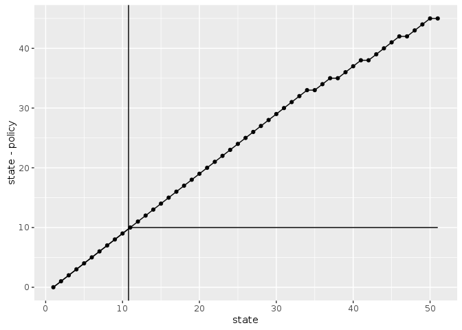
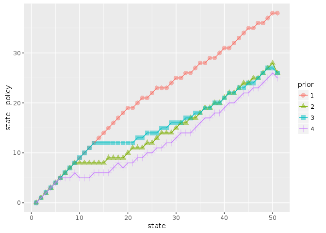
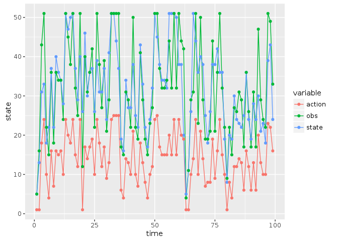
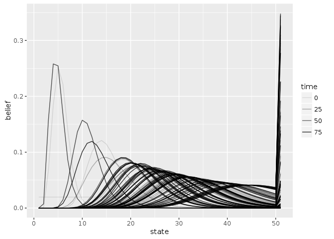

```r
library("appl")
library("ggplot2")
library("tidyr")
library("dplyr")
```

```
## 
## Attaching package: 'dplyr'
```

```
## The following objects are masked from 'package:stats':
## 
##     filter, lag
```

```
## The following objects are masked from 'package:base':
## 
##     intersect, setdiff, setequal, union
```


```r
log = "../library"
meta <- meta_from_log(data.frame(model = "ricker", r = 1.1), log = log)
meta
```

```
##                                     id load_time_sec init_time_sec
## 9 75ee70a6-6033-462e-bddb-a3e7245550de          0.64         28.86
##   run_time_sec final_precision end_condition n_states n_obs n_actions
## 9      2106.44         7.09157          <NA>       51    51        51
##   discount                date  model   r  K    C   sigma_g   sigma_m
## 9     0.95 2016-08-15 05:59:44 ricker 1.1 40 <NA> 0.2829182 0.2829182
```

## Import a model solution from the library


```r
i <- 1 # just use first match from the log

alpha <- alphas_from_log(meta, log = log)[[i]]
f <- f_from_log(meta)[[i]]
m <- models_from_log(meta)[[i]]

n_states = meta$n_states[[i]]
discount = meta$discount[[i]]
```

Find the deterministic optimal solution for this model


```r
S_star <- round( optimize(function(x) -f(x,0) + x / discount, c(1, n_states) )$minimum)
det_policy <- function(x) if(x <= S_star) 1 else x - S_star # adjusted for index values, starting at 1
```


### Experiment 1:

if we believe the prior value was certainly s, we are then more conservative with anything above f(S), and less conservative with anything below f(S):


```r
s <- S_star
a0 <- 0 # action we took 
certain_prior <- numeric(length(m$observation[,1,1]))
certain_prior[s+1] <- 1

df <- compute_policy(alpha, m$transition, m$observation, m$reward, certain_prior, a0+1) # action as index
```


```r
df %>% rowwise() %>% mutate(det = det_policy(state)) %>%
ggplot(aes(state, state - policy)) + geom_line() + geom_point() + geom_line(aes(state, state - det)) + geom_vline(xintercept = f(s,a0))
```

<!-- -->

## Experiment 2

Role of different prior beliefs on the optimal policy:


```r
low <-  compute_policy(alpha, m$transition, m$observation, m$reward, m$observation[,4,1])
ave <-  compute_policy(alpha, m$transition, m$observation, m$reward, m$observation[,20,1])
unif <- compute_policy(alpha, m$transition, m$observation, m$reward)
high <- compute_policy(alpha, m$transition, m$observation, m$reward, m$observation[,35,1])
df <- dplyr::bind_rows(low, ave, unif, high, .id = "prior")


ggplot(df, aes(state, state - policy, col = prior, pch = prior)) + 
  geom_point(alpha = 0.5, size = 3) + 
  geom_line()
```

<!-- -->


## Experiment 3: 

Simulate dynamics under the policy


```r
set.seed(1234)
sim <- sim_pomdp(m$transition, m$observation, m$reward, discount, x0 = 5, Tmax = 100, alpha = alpha)
sim$df %>% select(-value) %>% gather(variable, state, -time) %>%
ggplot(aes(time, state, color = variable)) + geom_line() + geom_point() 
```

<!-- -->

Posterior is not stationary:


```r
Tmax <- length(sim$df$time)
data.frame(time = 0:Tmax, sim$state_posterior) %>%
  gather(state, belief, -time, factor_key = TRUE) %>%
  mutate(state = as.numeric(state)) %>%
  ggplot(aes(state, belief, group = time, alpha = time)) + geom_line() 
```

<!-- -->

## Experiment 4:

Do replicate simulations avoid crashes?


```r
reps <- function(n){
  data.frame(sim = n, 
    sim_pomdp(m$transition, m$observation, m$reward, discount, 
              alpha = alpha, x0 = round(n_states/2), Tmax=20)$df)
}

set.seed(12345)
sim_df <- purrr::map_df(1:100, reps)

ggplot(sim_df, aes(time, state, group = sim)) + geom_line()
```

<!-- -->


```r
#ggplot(sim_df, aes(time, action, group = sim)) + geom_line()
```
