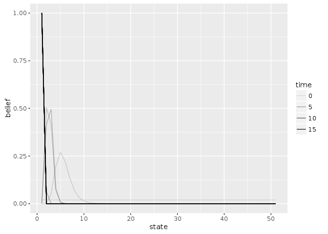

```r
library("appl")
library("ggplot2")
library("tidyr")
library("dplyr")
```

```
## 
## Attaching package: 'dplyr'
```

```
## The following objects are masked from 'package:stats':
## 
##     filter, lag
```

```
## The following objects are masked from 'package:base':
## 
##     intersect, setdiff, setequal, union
```


```r
log = ".."
meta_from_log(data.frame(model = "ricker", K = 40), log = log)
```

```
##                                      id load_time_sec init_time_sec
## 7  ac32345d-5edc-4b61-933d-5937af69f56c          0.68         12.81
## 8  3360e2b2-e04e-4536-829c-336a0ba534d9          0.62         22.87
## 9  75ee70a6-6033-462e-bddb-a3e7245550de          0.64         28.86
## 10 3fca83f7-86e8-44e7-8300-55875a5ec048          0.65         31.15
## 14 d6f4fed0-8f47-486d-8af7-6d363b088cca          0.61         23.16
##    run_time_sec final_precision end_condition n_states n_obs n_actions
## 7       1524.38        0.324543          <NA>       51    51        51
## 8       1843.07        2.570020          <NA>       51    51        51
## 9       2106.44        7.091570          <NA>       51    51        51
## 10      2352.25       12.725500          <NA>       51    51        51
## 14      1926.75        2.570020          <NA>       51    51        51
##    discount                date  model   r  K    C   sigma_g   sigma_m
## 7      0.95 2016-08-15 04:52:52 ricker 0.1 40 <NA> 0.2829182 0.2829182
## 8      0.95 2016-08-15 05:24:08 ricker 0.6 40 <NA> 0.2829182 0.2829182
## 9      0.95 2016-08-15 05:59:44 ricker 1.1 40 <NA> 0.2829182 0.2829182
## 10     0.95 2016-08-15 06:39:24 ricker 1.6 40 <NA> 0.2829182 0.2829182
## 14     0.95 2016-08-15 08:52:30 ricker 0.6 40 <NA> 0.2829182 0.2829182
```

## Import a model solution from the library


```r
meta <- meta_from_log(data.frame(model = "ricker", r = .1, K = 40), log = log)[1,]
meta
```

```
##                                     id load_time_sec init_time_sec
## 7 ac32345d-5edc-4b61-933d-5937af69f56c          0.68         12.81
##   run_time_sec final_precision end_condition n_states n_obs n_actions
## 7      1524.38        0.324543          <NA>       51    51        51
##   discount                date  model   r  K    C   sigma_g   sigma_m
## 7     0.95 2016-08-15 04:52:52 ricker 0.1 40 <NA> 0.2829182 0.2829182
```

```r
alpha <- alphas_from_log(meta, log = log)[[1]]
f <- f_from_log(meta)[[1]]
m <- models_from_log(meta)[[1]]

n_states = meta$n_states
discount = meta$discount
```

Find the deterministic optimal solution for this model


```r
S_star <- round( optimize(function(x) -f(x,0) + x / discount, c(1, n_states) )$minimum)
det_policy <- function(x) if(x <= S_star) 1 else x - S_star # adjusted for index values, starting at 1
```


### Experiment 1:

if we believe the prior value was certainly s, we are then more conservative with anything above f(S), and less conservative with anything below f(S):


```r
s <- S_star
a0 <- 0 # action we took 
certain_prior <- numeric(length(m$observation[,1,1]))
certain_prior[s+1] <- 1

df <- compute_policy(alpha, m$transition, m$observation, m$reward, certain_prior, a0+1) # action as index
```


```r
df %>% rowwise() %>% mutate(det = det_policy(state)) %>%
ggplot(aes(state, state - policy)) + geom_line() + geom_point() + geom_line(aes(state, state - det)) + geom_vline(xintercept = f(s,a0))
```

<!-- -->


```r
set.seed(1234)
sim <- sim_pomdp(m$transition, m$observation, m$reward, discount, x0 = 5, Tmax = 20, alpha = alpha)

sim$df %>% select(-value) %>% gather(variable, state, -time) %>%
ggplot(aes(time, state, color = variable)) + geom_line() + geom_point() 
```

<!-- -->

```r
Tmax <- length(sim$df$time)
data.frame(time = 0:Tmax, sim$state_posterior) %>%
  gather(state, belief, -time, factor_key = TRUE) %>%
  mutate(state = as.numeric(state)) %>%
  ggplot(aes(state, belief, group = time, alpha = time)) + geom_line() 
```

<!-- -->
