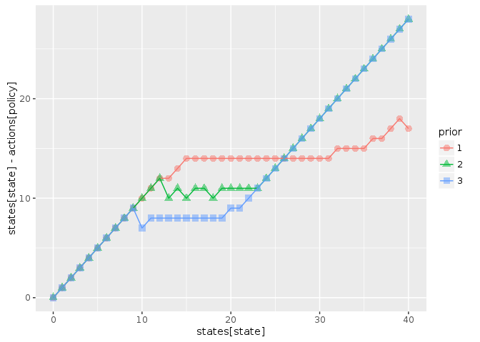

```r
library("MDPtoolbox")
library("appl")
library("ggplot2")
library("dplyr")
knitr::opts_chunk$set(cache = TRUE)
```


```r
source("pomdp_learning.R")
```


## Problem definition


```r
states <- 0:40
actions <- states
obs <- states

sigma_g <- sqrt(log(1 + 0.1 / 6)) # Scale the log-standard-deviation to result in similar variance to a uniform distribution of width 0.5
sigma_m <- sigma_g

reward_fn <- function(x,h) pmin(x,h)
discount <- 0.95


K1 <- function(x, h, r = 1, K = 35){
  s <- pmax(x - h, 0)
  s * exp(r * (1 - s / K) )
}


K2 <- function(x, h, r = 1, K = 20){
  s <- pmax(x - h, 0)
  s * exp(r * (1 - s / K) )
}

Ks <- list(K1, K2)
```


```r
models <- lapply(Ks, function(f) fisheries_matrices(states, actions, obs, reward_fn, f, sigma_g, sigma_m))
```


## Planning solution

Compute Q matrices using pomdpsol for each model (intensive).  Since we do not specify a prior belief over states, uses default assumption of uniform belief over states.


```r
alphas <- init_models(models, discount, precision = 0.75)
```

```
## load time: 0.3 sec, init time: 3.21 sec, run time: 63152.9 sec, final precision: 0.749001 end_condition:   target precision reached
```

```
## load time: 0.3 sec, init time: 2.59 sec, run time: 45.62 sec, final precision: 0.732812 end_condition:   target precision reached
```


Use Qs to compute policy given model priors, for comparison:


```r
compare_policies <- function(alphas, models){
  low <- compute_policy(alphas, models, c(1, 0))
  unif <- compute_policy(alphas, models, c(1/2, 1/2))
  high <- compute_policy(alphas, models, c(0, 1))
  
  dplyr::bind_rows(low, unif, high, .id = "prior")
}
```


```r
df <- compare_policies(alphas, models)

ggplot(df, aes(states[state], states[state] - actions[policy], col = prior, pch = prior)) + 
  geom_point(alpha = 0.5, size = 3) + 
  geom_line()
```

<!-- -->

