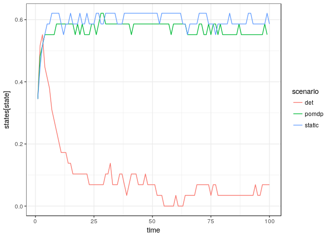

```r
library(purrr)
library(ggplot2)
library(dplyr)
library(appl)
library(printr)
options(knitr.table.format = 'markdown')
theme_set(theme_bw())
```


```r
log_dir = "sethi-100"

# alphas <- original_alphas
# models <- original_models

meta <- meta_from_log(data.frame(cost = "none"), log_dir = log_dir)

alphas <- alphas_from_log(meta, log_dir = log_dir)
models <- models_from_log(meta)

states <- seq(meta[1,]$min_state, meta[1,]$max_state, len=meta[1,]$n_states)
actions <- seq(meta[1,]$min_action, meta[1,]$max_action, len=meta[1,]$n_action)
discount <- meta[1,]$discount

meta
```


|    |id           | load_time_sec| init_time_sec| run_time_sec| final_precision|end_condition          | n_states| n_obs| n_actions| discount|date                |   r| sigma_m| sigma_g|noise     |model  |    K|   C| precision| timeout| timeInterval| max_state| max_obs| max_action| min_state| min_obs| min_action|cost | beta|
|:---|:------------|-------------:|-------------:|------------:|---------------:|:----------------------|--------:|-----:|---------:|--------:|:-------------------|---:|-------:|-------:|:---------|:------|----:|---:|---------:|-------:|------------:|---------:|-------:|----------:|---------:|-------:|----------:|:----|----:|
|1   |2aa133ad0633 |          4.81|        728.17|      10320.1|       0.0897410|Preset timeout reached |      100|   100|       100|     0.95|2016-10-24 07:27:22 | 0.5|     0.5|     0.1|lognormal |ricker | 0.66| 0.1|     1e-07|   10000|         2000|         1|       1|          1|         0|       0|          0|none |    0|
|2   |2a9e33ad0633 |          4.70|        655.07|      11026.1|       0.0025102|Preset timeout reached |      100|   100|       100|     0.95|2016-10-24 07:39:11 | 0.5|     0.1|     0.1|lognormal |ricker | 0.66| 0.1|     1e-07|   10000|         2000|         1|       1|          1|         0|       0|          0|none |    0|
|3   |2a9f33ad0633 |          4.89|        778.28|      11599.5|       0.0089467|Preset timeout reached |      100|   100|       100|     0.95|2016-10-24 07:48:27 | 1.0|     0.1|     0.1|lognormal |ricker | 0.66| 0.1|     1e-07|   10000|         2000|         1|       1|          1|         0|       0|          0|none |    0|
|4   |2aa033ad0633 |          4.81|        922.71|      12156.0|       0.0245163|Preset timeout reached |      100|   100|       100|     0.95|2016-10-24 07:58:02 | 1.5|     0.1|     0.1|lognormal |ricker | 0.66| 0.1|     1e-07|   10000|         2000|         1|       1|          1|         0|       0|          0|none |    0|
|5   |2aa233ad0633 |          4.77|        838.82|      12259.9|       0.2886450|Preset timeout reached |      100|   100|       100|     0.95|2016-10-24 07:59:43 | 1.0|     0.5|     0.1|lognormal |ricker | 0.66| 0.1|     1e-07|   10000|         2000|         1|       1|          1|         0|       0|          0|none |    0|
|6   |2aa333ad0633 |          4.69|        974.45|      12987.8|       0.5845230|Preset timeout reached |      100|   100|       100|     0.95|2016-10-24 08:11:51 | 1.5|     0.5|     0.1|lognormal |ricker | 0.66| 0.1|     1e-07|   10000|         2000|         1|       1|          1|         0|       0|          0|none |    0|
|7   |2a9f594a021a |          5.37|       1547.40|      10363.0|       0.0103553|Preset timeout reached |      100|   100|       100|     0.95|2016-10-24 10:52:13 | 1.0|     0.1|     0.3|lognormal |ricker | 0.66| 0.1|     1e-07|   10000|         2000|         1|       1|          1|         0|       0|          0|none |    0|
|8   |2aa2594a021a |          4.92|       1779.32|      10743.6|       0.8805800|Preset timeout reached |      100|   100|       100|     0.95|2016-10-24 11:09:32 | 1.0|     0.5|     0.3|lognormal |ricker | 0.66| 0.1|     1e-07|   10000|         2000|         1|       1|          1|         0|       0|          0|none |    0|
|9   |2aa3594a021a |          5.14|       1800.99|      10104.9|       1.3057200|Preset timeout reached |      100|   100|       100|     0.95|2016-10-24 11:10:41 | 1.5|     0.5|     0.3|lognormal |ricker | 0.66| 0.1|     1e-07|   10000|         2000|         1|       1|          1|         0|       0|          0|none |    0|
|10  |2a9e594a021a |          4.99|       1462.43|      12118.9|       0.0012062|Preset timeout reached |      100|   100|       100|     0.95|2016-10-24 11:12:07 | 0.5|     0.1|     0.3|lognormal |ricker | 0.66| 0.1|     1e-07|   10000|         2000|         1|       1|          1|         0|       0|          0|none |    0|
|11  |2aa0594a021a |          5.09|       1586.71|      11076.7|       0.0560076|Preset timeout reached |      100|   100|       100|     0.95|2016-10-24 11:13:22 | 1.5|     0.1|     0.3|lognormal |ricker | 0.66| 0.1|     1e-07|   10000|         2000|         1|       1|          1|         0|       0|          0|none |    0|
|12  |2aa1594a021a |          5.29|       1684.08|      14461.7|       0.4594240|Preset timeout reached |      100|   100|       100|     0.95|2016-10-24 11:39:23 | 0.5|     0.5|     0.3|lognormal |ricker | 0.66| 0.1|     1e-07|   10000|         2000|         1|       1|          1|         0|       0|          0|none |    0|
|13  |2a9f70588e3f |          5.29|       1681.54|      10411.9|       0.0159498|Preset timeout reached |      100|   100|       100|     0.95|2016-10-24 13:57:08 | 1.0|     0.1|     0.5|lognormal |ricker | 0.66| 0.1|     1e-07|   10000|         2000|         1|       1|          1|         0|       0|          0|none |    0|
|14  |2aa270588e3f |          4.89|       1981.70|      10085.7|       0.7707050|Preset timeout reached |      100|   100|       100|     0.95|2016-10-24 14:08:55 | 1.0|     0.5|     0.5|lognormal |ricker | 0.66| 0.1|     1e-07|   10000|         2000|         1|       1|          1|         0|       0|          0|none |    0|
|15  |2a9e70588e3f |          5.35|       1595.17|      10219.7|       0.0028565|Preset timeout reached |      100|   100|       100|     0.95|2016-10-24 14:13:39 | 0.5|     0.1|     0.5|lognormal |ricker | 0.66| 0.1|     1e-07|   10000|         2000|         1|       1|          1|         0|       0|          0|none |    0|
|16  |2aa070588e3f |          5.13|       1748.96|      11939.6|       0.0089105|Preset timeout reached |      100|   100|       100|     0.95|2016-10-24 14:43:28 | 1.5|     0.1|     0.5|lognormal |ricker | 0.66| 0.1|     1e-07|   10000|         2000|         1|       1|          1|         0|       0|          0|none |    0|
|17  |2aa370588e3f |          5.21|       2025.17|      12385.8|       0.9024580|Preset timeout reached |      100|   100|       100|     0.95|2016-10-24 14:48:08 | 1.5|     0.5|     0.5|lognormal |ricker | 0.66| 0.1|     1e-07|   10000|         2000|         1|       1|          1|         0|       0|          0|none |    0|
|18  |2aa170588e3f |          5.10|       1886.75|      13430.2|       0.4268320|Preset timeout reached |      100|   100|       100|     0.95|2016-10-24 15:33:34 | 0.5|     0.5|     0.5|lognormal |ricker | 0.66| 0.1|     1e-07|   10000|         2000|         1|       1|          1|         0|       0|          0|none |    0|
|19  |2a9fd75444c  |          3.46|        299.47|      10392.3|       0.0056777|Preset timeout reached |      100|   100|       100|     0.95|2016-10-24 16:53:02 | 1.0|     0.1|     0.1|uniform   |ricker | 0.66| 0.1|     1e-07|   10000|         2000|         1|       1|          1|         0|       0|          0|none |    0|
|20  |2a9ed75444c  |          3.34|        274.45|      10350.4|       0.0044170|Preset timeout reached |      100|   100|       100|     0.95|2016-10-24 17:08:47 | 0.5|     0.1|     0.1|uniform   |ricker | 0.66| 0.1|     1e-07|   10000|         2000|         1|       1|          1|         0|       0|          0|none |    0|
|21  |2aa2d75444c  |          4.14|        321.42|      10704.8|       0.1212000|Preset timeout reached |      100|   100|       100|     0.95|2016-10-24 17:11:35 | 1.0|     0.5|     0.1|uniform   |ricker | 0.66| 0.1|     1e-07|   10000|         2000|         1|       1|          1|         0|       0|          0|none |    0|
|22  |2aa0d75444c  |          3.45|        362.69|      10614.9|       0.0110164|Preset timeout reached |      100|   100|       100|     0.95|2016-10-24 17:43:02 | 1.5|     0.1|     0.1|uniform   |ricker | 0.66| 0.1|     1e-07|   10000|         2000|         1|       1|          1|         0|       0|          0|none |    0|
|23  |2aa3d75444c  |          3.70|        383.76|      10824.9|       0.3163890|Preset timeout reached |      100|   100|       100|     0.95|2016-10-24 17:52:49 | 1.5|     0.5|     0.1|uniform   |ricker | 0.66| 0.1|     1e-07|   10000|         2000|         1|       1|          1|         0|       0|          0|none |    0|
|24  |2aa1d75444c  |          3.54|        291.66|      10577.0|       0.0447812|Preset timeout reached |      100|   100|       100|     0.95|2016-10-24 18:34:00 | 0.5|     0.5|     0.1|uniform   |ricker | 0.66| 0.1|     1e-07|   10000|         2000|         1|       1|          1|         0|       0|          0|none |    0|
|25  |2a9f404b0f02 |          3.85|        611.30|      10710.8|       0.0013664|Preset timeout reached |      100|   100|       100|     0.95|2016-10-24 19:54:51 | 1.0|     0.1|     0.3|uniform   |ricker | 0.66| 0.1|     1e-07|   10000|         2000|         1|       1|          1|         0|       0|          0|none |    0|
|26  |2a9e404b0f02 |          3.63|        561.53|      10627.9|       0.0008900|Preset timeout reached |      100|   100|       100|     0.95|2016-10-24 20:09:02 | 0.5|     0.1|     0.3|uniform   |ricker | 0.66| 0.1|     1e-07|   10000|         2000|         1|       1|          1|         0|       0|          0|none |    0|
|27  |2aa2404b0f02 |          3.89|        701.97|      11262.6|       0.1532360|Preset timeout reached |      100|   100|       100|     0.95|2016-10-24 20:24:06 | 1.0|     0.5|     0.3|uniform   |ricker | 0.66| 0.1|     1e-07|   10000|         2000|         1|       1|          1|         0|       0|          0|none |    0|
|28  |2aa0404b0f02 |          3.60|        790.77|      10923.0|       0.0066371|Preset timeout reached |      100|   100|       100|     0.95|2016-10-24 20:48:26 | 1.5|     0.1|     0.3|uniform   |ricker | 0.66| 0.1|     1e-07|   10000|         2000|         1|       1|          1|         0|       0|          0|none |    0|
|29  |2aa3404b0f02 |          4.08|        879.72|      11733.0|       0.4802810|Preset timeout reached |      100|   100|       100|     0.95|2016-10-24 21:13:16 | 1.5|     0.5|     0.3|uniform   |ricker | 0.66| 0.1|     1e-07|   10000|         2000|         1|       1|          1|         0|       0|          0|none |    0|
|30  |2aa1404b0f02 |          3.74|        612.15|      11182.8|       0.0527408|Preset timeout reached |      100|   100|       100|     0.95|2016-10-24 21:45:00 | 0.5|     0.5|     0.3|uniform   |ricker | 0.66| 0.1|     1e-07|   10000|         2000|         1|       1|          1|         0|       0|          0|none |    0|
|31  |2a9f72e9e89  |          3.56|        920.11|      11094.3|       0.0012397|Preset timeout reached |      100|   100|       100|     0.95|2016-10-24 23:03:27 | 1.0|     0.1|     0.5|uniform   |ricker | 0.66| 0.1|     1e-07|   10000|         2000|         1|       1|          1|         0|       0|          0|none |    0|
|32  |2a9e72e9e89  |          3.76|        804.73|      10947.4|       0.0004400|Preset timeout reached |      100|   100|       100|     0.95|2016-10-24 23:15:04 | 0.5|     0.1|     0.5|uniform   |ricker | 0.66| 0.1|     1e-07|   10000|         2000|         1|       1|          1|         0|       0|          0|none |    0|
|33  |2aa272e9e89  |          4.09|       1061.25|      11843.0|       0.0976499|Preset timeout reached |      100|   100|       100|     0.95|2016-10-24 23:46:37 | 1.0|     0.5|     0.5|uniform   |ricker | 0.66| 0.1|     1e-07|   10000|         2000|         1|       1|          1|         0|       0|          0|none |    0|
|34  |2aa072e9e89  |          3.91|       1136.06|      11374.1|       0.0067794|Preset timeout reached |      100|   100|       100|     0.95|2016-10-25 00:02:02 | 1.5|     0.1|     0.5|uniform   |ricker | 0.66| 0.1|     1e-07|   10000|         2000|         1|       1|          1|         0|       0|          0|none |    0|
|35  |2aa372e9e89  |          4.15|       1274.28|      10630.9|       0.6165300|Preset timeout reached |      100|   100|       100|     0.95|2016-10-25 00:16:07 | 1.5|     0.5|     0.5|uniform   |ricker | 0.66| 0.1|     1e-07|   10000|         2000|         1|       1|          1|         0|       0|          0|none |    0|
|36  |2aa172e9e89  |          4.13|        876.53|      11417.7|       0.0364015|Preset timeout reached |      100|   100|       100|     0.95|2016-10-25 01:00:29 | 0.5|     0.5|     0.5|uniform   |ricker | 0.66| 0.1|     1e-07|   10000|         2000|         1|       1|          1|         0|       0|          0|none |    0|
|37  |2a9f7cafdc4c |          5.14|        685.05|      11063.8|       0.0055267|Preset timeout reached |      100|   100|       100|     0.95|2016-10-25 02:19:00 | 1.0|     0.1|     0.1|lognormal |allen  | 0.66| 0.1|     1e-07|   10000|         2000|         1|       1|          1|         0|       0|          0|none |    0|
|38  |2a9e7cafdc4c |          4.74|        624.80|      11185.8|       0.0021413|Preset timeout reached |      100|   100|       100|     0.95|2016-10-25 02:32:27 | 0.5|     0.1|     0.1|lognormal |allen  | 0.66| 0.1|     1e-07|   10000|         2000|         1|       1|          1|         0|       0|          0|none |    0|
|39  |2aa27cafdc4c |          5.23|        739.82|      11545.9|       0.1647460|Preset timeout reached |      100|   100|       100|     0.95|2016-10-25 03:10:13 | 1.0|     0.5|     0.1|lognormal |allen  | 0.66| 0.1|     1e-07|   10000|         2000|         1|       1|          1|         0|       0|          0|none |    0|
|40  |2aa07cafdc4c |          4.71|        724.48|      11396.5|       0.0103287|Preset timeout reached |      100|   100|       100|     0.95|2016-10-25 03:22:59 | 1.5|     0.1|     0.1|lognormal |allen  | 0.66| 0.1|     1e-07|   10000|         2000|         1|       1|          1|         0|       0|          0|none |    0|
|41  |2aa37cafdc4c |          4.89|        773.30|      12491.9|       0.2771340|Preset timeout reached |      100|   100|       100|     0.95|2016-10-25 03:55:21 | 1.5|     0.5|     0.1|lognormal |allen  | 0.66| 0.1|     1e-07|   10000|         2000|         1|       1|          1|         0|       0|          0|none |    0|
|42  |2aa17cafdc4c |          5.06|        683.79|      11414.7|       0.0624717|Preset timeout reached |      100|   100|       100|     0.95|2016-10-25 04:21:47 | 0.5|     0.5|     0.1|lognormal |allen  | 0.66| 0.1|     1e-07|   10000|         2000|         1|       1|          1|         0|       0|          0|none |    0|
|43  |2a9f4b52578a |          5.20|       1534.83|      10434.6|       0.0068495|Preset timeout reached |      100|   100|       100|     0.95|2016-10-25 05:24:06 | 1.0|     0.1|     0.3|lognormal |allen  | 0.66| 0.1|     1e-07|   10000|         2000|         1|       1|          1|         0|       0|          0|none |    0|
|44  |2a9e4b52578a |          5.28|       1494.87|      11781.8|       0.0010592|Preset timeout reached |      100|   100|       100|     0.95|2016-10-25 05:59:52 | 0.5|     0.1|     0.3|lognormal |allen  | 0.66| 0.1|     1e-07|   10000|         2000|         1|       1|          1|         0|       0|          0|none |    0|
|45  |2aa24b52578a |          5.28|       1699.52|      10700.9|       0.2414840|Preset timeout reached |      100|   100|       100|     0.95|2016-10-25 06:19:30 | 1.0|     0.5|     0.3|lognormal |allen  | 0.66| 0.1|     1e-07|   10000|         2000|         1|       1|          1|         0|       0|          0|none |    0|
|46  |2aa04b52578a |          4.69|       1540.34|      10417.9|       0.0184706|Preset timeout reached |      100|   100|       100|     0.95|2016-10-25 06:27:34 | 1.5|     0.1|     0.3|lognormal |allen  | 0.66| 0.1|     1e-07|   10000|         2000|         1|       1|          1|         0|       0|          0|none |    0|
|47  |2aa34b52578a |          4.81|       1783.41|      11839.9|       0.4369300|Preset timeout reached |      100|   100|       100|     0.95|2016-10-25 07:23:55 | 1.5|     0.5|     0.3|lognormal |allen  | 0.66| 0.1|     1e-07|   10000|         2000|         1|       1|          1|         0|       0|          0|none |    0|
|48  |2aa14b52578a |          5.14|       1618.43|      12213.2|       0.0540076|Preset timeout reached |      100|   100|       100|     0.95|2016-10-25 07:56:06 | 0.5|     0.5|     0.3|lognormal |allen  | 0.66| 0.1|     1e-07|   10000|         2000|         1|       1|          1|         0|       0|          0|none |    0|
|49  |2a9f1375043d |          5.17|       1664.81|      12276.4|       0.0010630|Preset timeout reached |      100|   100|       100|     0.95|2016-10-25 08:59:17 | 1.0|     0.1|     0.5|lognormal |allen  | 0.66| 0.1|     1e-07|   10000|         2000|         1|       1|          1|         0|       0|          0|none |    0|
|50  |2a9e1375043d |          4.61|       1743.58|      10412.5|       0.0044038|Preset timeout reached |      100|   100|       100|     0.95|2016-10-25 09:03:54 | 0.5|     0.1|     0.5|lognormal |allen  | 0.66| 0.1|     1e-07|   10000|         2000|         1|       1|          1|         0|       0|          0|none |    0|
|51  |2aa01375043d |          5.30|       1706.48|      11915.2|       0.0012020|Preset timeout reached |      100|   100|       100|     0.95|2016-10-25 09:57:13 | 1.5|     0.1|     0.5|lognormal |allen  | 0.66| 0.1|     1e-07|   10000|         2000|         1|       1|          1|         0|       0|          0|none |    0|
|52  |2aa21375043d |          4.70|       1825.33|      13114.0|       0.1005420|Preset timeout reached |      100|   100|       100|     0.95|2016-10-25 10:08:12 | 1.0|     0.5|     0.5|lognormal |allen  | 0.66| 0.1|     1e-07|   10000|         2000|         1|       1|          1|         0|       0|          0|none |    0|
|53  |2aa31375043d |          5.25|       1952.11|      12054.9|       0.1980710|Preset timeout reached |      100|   100|       100|     0.95|2016-10-25 10:55:19 | 1.5|     0.5|     0.5|lognormal |allen  | 0.66| 0.1|     1e-07|   10000|         2000|         1|       1|          1|         0|       0|          0|none |    0|
|54  |2aa11375043d |          5.06|       1805.09|      12832.6|       0.0450290|Preset timeout reached |      100|   100|       100|     0.95|2016-10-25 11:40:20 | 0.5|     0.5|     0.5|lognormal |allen  | 0.66| 0.1|     1e-07|   10000|         2000|         1|       1|          1|         0|       0|          0|none |    0|
|55  |2a9f6c51d11c |          3.11|        273.42|      10404.8|       0.0056818|Preset timeout reached |      100|   100|       100|     0.95|2016-10-25 11:55:11 | 1.0|     0.1|     0.1|uniform   |allen  | 0.66| 0.1|     1e-07|   10000|         2000|         1|       1|          1|         0|       0|          0|none |    0|
|56  |2a9e6c51d11c |          3.58|        262.17|      10346.8|       0.0039315|Preset timeout reached |      100|   100|       100|     0.95|2016-10-25 11:58:56 | 0.5|     0.1|     0.1|uniform   |allen  | 0.66| 0.1|     1e-07|   10000|         2000|         1|       1|          1|         0|       0|          0|none |    0|
|57  |2aa06c51d11c |          3.02|        279.15|      10345.5|       0.0072010|Preset timeout reached |      100|   100|       100|     0.95|2016-10-25 12:52:15 | 1.5|     0.1|     0.1|uniform   |allen  | 0.66| 0.1|     1e-07|   10000|         2000|         1|       1|          1|         0|       0|          0|none |    0|
|58  |2aa26c51d11c |          3.88|        291.84|      10946.9|       0.1021640|Preset timeout reached |      100|   100|       100|     0.95|2016-10-25 13:14:50 | 1.0|     0.5|     0.1|uniform   |allen  | 0.66| 0.1|     1e-07|   10000|         2000|         1|       1|          1|         0|       0|          0|none |    0|
|59  |2aa36c51d11c |          3.40|        287.48|      11074.0|       0.1921060|Preset timeout reached |      100|   100|       100|     0.95|2016-10-25 14:03:59 | 1.5|     0.5|     0.1|uniform   |allen  | 0.66| 0.1|     1e-07|   10000|         2000|         1|       1|          1|         0|       0|          0|none |    0|
|60  |2aa16c51d11c |          3.76|        268.32|      10953.7|       0.0341487|Preset timeout reached |      100|   100|       100|     0.95|2016-10-25 14:46:46 | 0.5|     0.5|     0.1|uniform   |allen  | 0.66| 0.1|     1e-07|   10000|         2000|         1|       1|          1|         0|       0|          0|none |    0|
|61  |2a9f453f2f43 |          3.65|        525.92|      10633.7|       0.0010648|Preset timeout reached |      100|   100|       100|     0.95|2016-10-25 14:55:24 | 1.0|     0.1|     0.3|uniform   |allen  | 0.66| 0.1|     1e-07|   10000|         2000|         1|       1|          1|         0|       0|          0|none |    0|
|62  |2a9e453f2f43 |          3.39|        484.63|      10596.5|       0.0005722|Preset timeout reached |      100|   100|       100|     0.95|2016-10-25 14:58:26 | 0.5|     0.1|     0.3|uniform   |allen  | 0.66| 0.1|     1e-07|   10000|         2000|         1|       1|          1|         0|       0|          0|none |    0|
|63  |2aa0453f2f43 |          3.70|        547.98|      10689.1|       0.0020510|Preset timeout reached |      100|   100|       100|     0.95|2016-10-25 15:53:15 | 1.5|     0.1|     0.3|uniform   |allen  | 0.66| 0.1|     1e-07|   10000|         2000|         1|       1|          1|         0|       0|          0|none |    0|
|64  |2aa2453f2f43 |          3.80|        567.65|      11063.9|       0.0860717|Preset timeout reached |      100|   100|       100|     0.95|2016-10-25 16:23:47 | 1.0|     0.5|     0.3|uniform   |allen  | 0.66| 0.1|     1e-07|   10000|         2000|         1|       1|          1|         0|       0|          0|none |    0|
|65  |2aa3453f2f43 |          3.69|        598.62|      11148.2|       0.1558590|Preset timeout reached |      100|   100|       100|     0.95|2016-10-25 17:14:14 | 1.5|     0.5|     0.3|uniform   |allen  | 0.66| 0.1|     1e-07|   10000|         2000|         1|       1|          1|         0|       0|          0|none |    0|
|66  |2aa1453f2f43 |          3.52|        516.79|      11122.7|       0.0287475|Preset timeout reached |      100|   100|       100|     0.95|2016-10-25 17:56:34 | 0.5|     0.5|     0.3|uniform   |allen  | 0.66| 0.1|     1e-07|   10000|         2000|         1|       1|          1|         0|       0|          0|none |    0|
|67  |2a9e2b9c8d62 |          3.96|        493.54|      10652.9|       0.0003331|Preset timeout reached |      100|   100|       100|     0.95|2016-10-25 17:59:25 | 0.5|     0.1|     0.5|uniform   |allen  | 0.66| 0.1|     1e-07|   10000|         2000|         1|       1|          1|         0|       0|          0|none |    0|
|68  |2a9f2b9c8d62 |          3.69|        675.39|      10884.9|       0.0011709|Preset timeout reached |      100|   100|       100|     0.95|2016-10-25 18:00:06 | 1.0|     0.1|     0.5|uniform   |allen  | 0.66| 0.1|     1e-07|   10000|         2000|         1|       1|          1|         0|       0|          0|none |    0|
|69  |2aa02b9c8d62 |          3.73|        790.54|      11116.8|       0.0019010|Preset timeout reached |      100|   100|       100|     0.95|2016-10-25 19:01:50 | 1.5|     0.1|     0.5|uniform   |allen  | 0.66| 0.1|     1e-07|   10000|         2000|         1|       1|          1|         0|       0|          0|none |    0|
|70  |2aa22b9c8d62 |          4.02|        723.35|      11308.0|       0.0719177|Preset timeout reached |      100|   100|       100|     0.95|2016-10-25 19:37:19 | 1.0|     0.5|     0.5|uniform   |allen  | 0.66| 0.1|     1e-07|   10000|         2000|         1|       1|          1|         0|       0|          0|none |    0|
|71  |2aa32b9c8d62 |          3.68|        839.51|      11135.9|       0.1081000|Preset timeout reached |      100|   100|       100|     0.95|2016-10-25 20:24:48 | 1.5|     0.5|     0.5|uniform   |allen  | 0.66| 0.1|     1e-07|   10000|         2000|         1|       1|          1|         0|       0|          0|none |    0|
|72  |2aa12b9c8d62 |          3.95|        480.39|      11511.6|       0.0114415|Preset timeout reached |      100|   100|       100|     0.95|2016-10-25 21:13:34 | 0.5|     0.5|     0.5|uniform   |allen  | 0.66| 0.1|     1e-07|   10000|         2000|         1|       1|          1|         0|       0|          0|none |    0|
|73  |2a9e69275b76 |          5.00|        648.15|      11111.3|       0.0015310|Preset timeout reached |      100|   100|       100|     0.95|2016-10-25 21:15:43 | 0.5|     0.1|     0.1|lognormal |bh     | 0.66| 0.1|     1e-07|   10000|         2000|         1|       1|          1|         0|       0|          0|none |    0|
|74  |2a9f69275b76 |          4.39|        697.85|      11280.7|       0.0032558|Preset timeout reached |      100|   100|       100|     0.95|2016-10-25 21:19:27 | 1.0|     0.1|     0.1|lognormal |bh     | 0.66| 0.1|     1e-07|   10000|         2000|         1|       1|          1|         0|       0|          0|none |    0|
|75  |2aa069275b76 |          5.05|        712.16|      11142.3|       0.0047114|Preset timeout reached |      100|   100|       100|     0.95|2016-10-25 22:19:11 | 1.5|     0.1|     0.1|lognormal |bh     | 0.66| 0.1|     1e-07|   10000|         2000|         1|       1|          1|         0|       0|          0|none |    0|
|76  |2aa269275b76 |          4.31|        734.48|      12467.3|       0.1145880|Preset timeout reached |      100|   100|       100|     0.95|2016-10-25 23:15:58 | 1.0|     0.5|     0.1|lognormal |bh     | 0.66| 0.1|     1e-07|   10000|         2000|         1|       1|          1|         0|       0|          0|none |    0|
|77  |2aa369275b76 |          4.82|        782.05|      10046.5|       0.1851450|Preset timeout reached |      100|   100|       100|     0.95|2016-10-25 23:23:35 | 1.5|     0.5|     0.1|lognormal |bh     | 0.66| 0.1|     1e-07|   10000|         2000|         1|       1|          1|         0|       0|          0|none |    0|
|78  |2a9e1510445b |          4.73|       1381.95|      10389.2|       0.0011145|Preset timeout reached |      100|   100|       100|     0.95|2016-10-26 00:19:37 | 0.5|     0.1|     0.3|lognormal |bh     | 0.66| 0.1|     1e-07|   10000|         2000|         1|       1|          1|         0|       0|          0|none |    0|
|79  |2a9f1510445b |          5.27|       1483.91|      10233.0|       0.0029289|Preset timeout reached |      100|   100|       100|     0.95|2016-10-26 00:21:21 | 1.0|     0.1|     0.3|lognormal |bh     | 0.66| 0.1|     1e-07|   10000|         2000|         1|       1|          1|         0|       0|          0|none |    0|
|80  |2aa169275b76 |          4.74|        717.64|      11909.8|       0.0645053|Preset timeout reached |      100|   100|       100|     0.95|2016-10-26 00:43:09 | 0.5|     0.5|     0.1|lognormal |bh     | 0.66| 0.1|     1e-07|   10000|         2000|         1|       1|          1|         0|       0|          0|none |    0|
|81  |2aa01510445b |          4.62|       1514.43|      10269.9|       0.0035110|Preset timeout reached |      100|   100|       100|     0.95|2016-10-26 01:21:08 | 1.5|     0.1|     0.3|lognormal |bh     | 0.66| 0.1|     1e-07|   10000|         2000|         1|       1|          1|         0|       0|          0|none |    0|
|82  |2aa31510445b |          5.38|       1692.20|      10495.2|       0.7864950|Preset timeout reached |      100|   100|       100|     0.95|2016-10-26 02:29:52 | 1.5|     0.5|     0.3|lognormal |bh     | 0.66| 0.1|     1e-07|   10000|         2000|         1|       1|          1|         0|       0|          0|none |    0|
|83  |2aa21510445b |          4.72|       1664.95|      13444.4|       0.6011070|Preset timeout reached |      100|   100|       100|     0.95|2016-10-26 03:10:45 | 1.0|     0.5|     0.3|lognormal |bh     | 0.66| 0.1|     1e-07|   10000|         2000|         1|       1|          1|         0|       0|          0|none |    0|
|84  |2a9e1ea7739f |          5.22|       1478.03|      10108.2|       0.0005418|Preset timeout reached |      100|   100|       100|     0.95|2016-10-26 03:18:52 | 0.5|     0.1|     0.5|lognormal |bh     | 0.66| 0.1|     1e-07|   10000|         2000|         1|       1|          1|         0|       0|          0|none |    0|
|85  |2a9f1ea7739f |          5.25|       1618.03|      10000.8|       0.0030462|Preset timeout reached |      100|   100|       100|     0.95|2016-10-26 03:19:24 | 1.0|     0.1|     0.5|lognormal |bh     | 0.66| 0.1|     1e-07|   10000|         2000|         1|       1|          1|         0|       0|          0|none |    0|
|86  |2aa11510445b |          5.19|       1627.86|      11442.6|       0.4049860|Preset timeout reached |      100|   100|       100|     0.95|2016-10-26 04:05:00 | 0.5|     0.5|     0.3|lognormal |bh     | 0.66| 0.1|     1e-07|   10000|         2000|         1|       1|          1|         0|       0|          0|none |    0|
|87  |2aa01ea7739f |          5.28|       1649.68|      12176.7|       0.0037006|Preset timeout reached |      100|   100|       100|     0.95|2016-10-26 04:55:45 | 1.5|     0.1|     0.5|lognormal |bh     | 0.66| 0.1|     1e-07|   10000|         2000|         1|       1|          1|         0|       0|          0|none |    0|
|88  |2a9e295f003  |          3.62|        278.66|      10307.6|       0.0036938|Preset timeout reached |      100|   100|       100|     0.95|2016-10-26 06:13:19 | 0.5|     0.1|     0.1|uniform   |bh     | 0.66| 0.1|     1e-07|   10000|         2000|         1|       1|          1|         0|       0|          0|none |    0|
|89  |2a9f295f003  |          3.16|        280.80|      10382.2|       0.0046784|Preset timeout reached |      100|   100|       100|     0.95|2016-10-26 06:15:08 | 1.0|     0.1|     0.1|uniform   |bh     | 0.66| 0.1|     1e-07|   10000|         2000|         1|       1|          1|         0|       0|          0|none |    0|
|90  |2aa21ea7739f |          4.96|       1918.82|      10975.2|       0.6003490|Preset timeout reached |      100|   100|       100|     0.95|2016-10-26 06:25:32 | 1.0|     0.5|     0.5|lognormal |bh     | 0.66| 0.1|     1e-07|   10000|         2000|         1|       1|          1|         0|       0|          0|none |    0|
|91  |2aa31ea7739f |          5.02|       1935.86|      16818.8|       0.6867720|Preset timeout reached |      100|   100|       100|     0.95|2016-10-26 07:21:35 | 1.5|     0.5|     0.5|lognormal |bh     | 0.66| 0.1|     1e-07|   10000|         2000|         1|       1|          1|         0|       0|          0|none |    0|
|92  |2aa11ea7739f |          5.30|       1804.55|      12594.8|       0.3076550|Preset timeout reached |      100|   100|       100|     0.95|2016-10-26 07:45:31 | 0.5|     0.5|     0.5|lognormal |bh     | 0.66| 0.1|     1e-07|   10000|         2000|         1|       1|          1|         0|       0|          0|none |    0|
|93  |2aa0295f003  |          3.51|        285.28|      10330.4|       0.0028179|Preset timeout reached |      100|   100|       100|     0.95|2016-10-26 07:50:39 | 1.5|     0.1|     0.1|uniform   |bh     | 0.66| 0.1|     1e-07|   10000|         2000|         1|       1|          1|         0|       0|          0|none |    0|
|94  |2a9e5b9973ea |          3.22|        507.54|      10581.3|       0.0001550|Preset timeout reached |      100|   100|       100|     0.95|2016-10-26 09:12:36 | 0.5|     0.1|     0.3|uniform   |bh     | 0.66| 0.1|     1e-07|   10000|         2000|         1|       1|          1|         0|       0|          0|none |    0|
|95  |2a9f5b9973ea |          3.51|        590.49|      10752.0|       0.0009144|Preset timeout reached |      100|   100|       100|     0.95|2016-10-26 09:17:31 | 1.0|     0.1|     0.3|uniform   |bh     | 0.66| 0.1|     1e-07|   10000|         2000|         1|       1|          1|         0|       0|          0|none |    0|
|96  |2aa2295f003  |          3.93|        312.55|      10574.6|       0.0547340|Preset timeout reached |      100|   100|       100|     0.95|2016-10-26 09:25:50 | 1.0|     0.5|     0.1|uniform   |bh     | 0.66| 0.1|     1e-07|   10000|         2000|         1|       1|          1|         0|       0|          0|none |    0|
|97  |2aa3295f003  |          3.87|        301.42|      10762.8|       0.0607230|Preset timeout reached |      100|   100|       100|     0.95|2016-10-26 10:24:59 | 1.5|     0.5|     0.1|uniform   |bh     | 0.66| 0.1|     1e-07|   10000|         2000|         1|       1|          1|         0|       0|          0|none |    0|
|98  |2aa1295f003  |          3.58|        293.42|      10394.3|       0.0343898|Preset timeout reached |      100|   100|       100|     0.95|2016-10-26 10:42:43 | 0.5|     0.5|     0.1|uniform   |bh     | 0.66| 0.1|     1e-07|   10000|         2000|         1|       1|          1|         0|       0|          0|none |    0|
|99  |2aa05b9973ea |          3.32|        613.98|      10749.5|       0.0012692|Preset timeout reached |      100|   100|       100|     0.95|2016-10-26 10:52:58 | 1.5|     0.1|     0.3|uniform   |bh     | 0.66| 0.1|     1e-07|   10000|         2000|         1|       1|          1|         0|       0|          0|none |    0|
|100 |2a9e6f7e45e1 |          3.37|        701.05|      10825.6|       0.0000665|Preset timeout reached |      100|   100|       100|     0.95|2016-10-26 12:16:20 | 0.5|     0.1|     0.5|uniform   |bh     | 0.66| 0.1|     1e-07|   10000|         2000|         1|       1|          1|         0|       0|          0|none |    0|
|101 |2a9f6f7e45e1 |          3.91|        830.38|      10941.7|       0.0005707|Preset timeout reached |      100|   100|       100|     0.95|2016-10-26 12:23:29 | 1.0|     0.1|     0.5|uniform   |bh     | 0.66| 0.1|     1e-07|   10000|         2000|         1|       1|          1|         0|       0|          0|none |    0|
|103 |2aa25b9973ea |          3.50|        594.89|      11083.8|       0.0624998|Preset timeout reached |      100|   100|       100|     0.95|2016-10-26 12:35:10 | 1.0|     0.5|     0.3|uniform   |bh     | 0.66| 0.1|     1e-07|   10000|         2000|         1|       1|          1|         0|       0|          0|none |    0|
|104 |2aa35b9973ea |          3.74|        665.59|      11012.5|       0.0843300|Preset timeout reached |      100|   100|       100|     0.95|2016-10-26 13:33:17 | 1.5|     0.5|     0.3|uniform   |bh     | 0.66| 0.1|     1e-07|   10000|         2000|         1|       1|          1|         0|       0|          0|none |    0|
|105 |2aa15b9973ea |          3.86|        553.20|      10899.8|       0.0291512|Preset timeout reached |      100|   100|       100|     0.95|2016-10-26 13:48:43 | 0.5|     0.5|     0.3|uniform   |bh     | 0.66| 0.1|     1e-07|   10000|         2000|         1|       1|          1|         0|       0|          0|none |    0|
|106 |2aa06f7e45e1 |          3.59|        852.88|      11120.2|       0.0006875|Preset timeout reached |      100|   100|       100|     0.95|2016-10-26 14:02:01 | 1.5|     0.1|     0.5|uniform   |bh     | 0.66| 0.1|     1e-07|   10000|         2000|         1|       1|          1|         0|       0|          0|none |    0|
|107 |2aa26f7e45e1 |          3.76|        883.98|      11273.1|       0.0419235|Preset timeout reached |      100|   100|       100|     0.95|2016-10-26 15:48:12 | 1.0|     0.5|     0.5|uniform   |bh     | 0.66| 0.1|     1e-07|   10000|         2000|         1|       1|          1|         0|       0|          0|none |    0|
|108 |2aa36f7e45e1 |          4.29|        943.67|      11394.1|       0.0564011|Preset timeout reached |      100|   100|       100|     0.95|2016-10-26 16:48:28 | 1.5|     0.5|     0.5|uniform   |bh     | 0.66| 0.1|     1e-07|   10000|         2000|         1|       1|          1|         0|       0|          0|none |    0|
|109 |2aa16f7e45e1 |          3.89|        765.94|      11263.4|       0.0203259|Preset timeout reached |      100|   100|       100|     0.95|2016-10-26 17:01:20 | 0.5|     0.5|     0.5|uniform   |bh     | 0.66| 0.1|     1e-07|   10000|         2000|         1|       1|          1|         0|       0|          0|none |    0|


## Det policy


```r
fs <- f_from_log(meta)

dets <- purrr::map_df(1:dim(meta)[[1]], function(i){ 
  f <- fs[[i]]
  S_star <- optimize(function(x) x / discount - f(x,0), c(min(states),max(states)))$minimum
  h <- pmax(states - S_star,  0)
  policy <- sapply(h, function(h) which.min((abs(h - actions))))
  det <- data.frame(policy, value = 1:length(states), state = 1:length(states))
}, .id = "model_id"
)
```


## Convergence testing


```r
inter <- appl:::intermediates_from_log(meta, log_dir = log_dir)

df1 <- 
purrr::map_df(1:length(models), function(j){
  alphas <- inter[[j]]
  m <- models[[j]]
  purrr::map_df(1:length(alphas), function(i)
    compute_policy(alphas[[i]], m$transition, m$observation, m$reward),
    .id = "intermediate") 
}, .id = "model_id")

df1 %>% 
  ggplot(aes(states[state], states[state] - actions[policy], col=intermediate)) + 
  geom_line() + 
  facet_wrap(~model_id, scales = "free") + 
  coord_cartesian(ylim = c(0,0.5))
```

<!-- -->

## Explore POMDP policy


```r
df <- purrr::map_df(1:length(models), function(i)
  compute_policy(alphas[[i]], models[[i]]$transition, models[[i]]$observation, models[[i]]$reward),
  .id = "model_id")

## Join to metadata table
meta$model_id <- as.character(1:length(models))

## Join to deterministic case
df2 <- bind_rows(
  left_join(df, meta, by = "model_id"),
  left_join(dets, meta, by = "model_id") %>% mutate(sigma_m = 0))
```


## Lognormal noise


```r
df2 %>% filter(r == 1, noise == "lognormal") %>% 
  ggplot(aes(states[state], states[state] - actions[policy], col = as.character(sigma_m))) +
  geom_line() +
  facet_grid(model ~ sigma_g, scales = "free") +
  coord_cartesian(ylim = c(0,0.8))
```

<!-- -->


## Uniform


```r
df2 %>% filter(r == 1, noise == "uniform") %>% 
  ggplot(aes(states[state], states[state] - actions[policy], col = as.character(sigma_m))) +
  geom_line() +
  facet_grid(model ~ sigma_g, scales = "free") +
  coord_cartesian(ylim = c(0,0.8))
```

<!-- -->


## Simulation


```r
x0 <- which.min(abs(0.33 - states))


get_det <- function(meta){
  f <- f_from_log(meta)[[1]]
  S_star <- optimize(function(x) x / discount - f(x,0), c(min(states),max(states)))$minimum
  h <- pmax(states - S_star,  0)
  sapply(h, function(h) which.min((abs(h - actions))))
}
```


```r
s1 <-  meta %>% filter(r == 1, sigma_m == 0.5, sigma_g == 0.5, model == "ricker", noise == "lognormal")
alpha <- alphas_from_log(s1, log_dir)[[1]]
m <- models_from_log(s1)[[1]]
det_policy <- get_det(meta)
```

Simulation in which belief over states is updated in each time step, used to determine a new policy, which is then used to choose the best action given the most recent observation.


```r
sim <- purrr::map_df(1:50, function(i) appl::sim_pomdp(m$transition, m$observation, m$reward, discount, x0 = x0, Tmax = 100, alpha = alpha)$df, .id = "rep")
```


Simulation in which the policy is not updated based on the most recent belief over states, but remains the policy given a uniform prior over belief states. 


```r
s <- compute_policy(alpha,m$transition, m$observation, m$reward)
sim2 <- purrr::map_df(1:50, function(i) mdplearning::mdp_planning(m$transition, m$reward, discount, x0 = x0, Tmax = 100, observation = m$observation, policy = s$policy), .id = "rep")
```


```r
sim3 <- purrr::map_df(1:50, function(i) mdplearning::mdp_planning(m$transition, m$reward, discount, x0 = x0, Tmax = 100, observation = m$observation, policy = det_policy), .id = "rep")
```


```r
df <- bind_rows(pomdp = sim, static = sim2, det = sim3, .id = "scenario")
df %>% group_by(scenario, rep) %>% summarise(value = sum(value)) %>%  group_by(scenario) %>% summarise(mean(value))
```


|scenario | mean(value)|
|:--------|-----------:|
|det      |    1.781245|
|pomdp    |    2.597614|
|static   |    2.759776|

```r
df %>% group_by(scenario, time) %>% summarise(value = mean(value), state = mean(state)) %>%
ggplot(aes(time, states[state], col = scenario)) + geom_line()
```

<!-- -->


## Small growth noise


```r
s1 <-  meta %>% filter(r == 1, sigma_m == 0.5, sigma_g == 0.1, model == "ricker", noise == "lognormal")
alpha <- alphas_from_log(s1, log_dir)[[1]]
m <- models_from_log(s1)[[1]]
det_policy <- get_det(meta)


sim <- purrr::map_df(1:50, function(i) appl::sim_pomdp(m$transition, m$observation, m$reward, discount, x0 = x0, Tmax = 100, alpha = alpha)$df, .id = "rep")
s <- compute_policy(alpha,m$transition, m$observation, m$reward)
sim2 <- purrr::map_df(1:50, function(i) mdplearning::mdp_planning(m$transition, m$reward, discount, x0 = x0, Tmax = 100, observation = m$observation, policy = s$policy), .id = "rep")
sim3 <- purrr::map_df(1:50, function(i) mdplearning::mdp_planning(m$transition, m$reward, discount, x0 = x0, Tmax = 100, observation = m$observation, policy = det_policy), .id = "rep")

df <- bind_rows(pomdp = sim, static = sim2, det = sim3, .id = "scenario")
df %>% group_by(scenario, rep) %>% summarise(value = sum(value)) %>%  group_by(scenario) %>% summarise(mean(value))
```


|scenario | mean(value)|
|:--------|-----------:|
|det      |    1.324002|
|pomdp    |    3.643967|
|static   |    3.502093|

```r
df %>% group_by(scenario, time) %>% summarise(value = mean(value), state = mean(state)) %>%
ggplot(aes(time, states[state], col = scenario)) + geom_line()
```

<!-- -->


------

## Policy as a function of prior:

Policy is much more conservative when the prior belief is skewed towards small stock sizes, and more aggressive when the policy is skewed towards larger ones:


```r
K_i <- which.min(abs(.66 - states))

s1 <-  meta %>% filter(r == 1, sigma_m == 0.1, sigma_g == 0.1, model == "ricker", noise == "lognormal")
alpha <- alphas_from_log(s1, log_dir)[[1]]
m <- models_from_log(s1)[[1]]


unif <- compute_policy(alpha, m$transition, m$observation, m$reward)
low <- compute_policy(alpha, m$transition, m$observation, m$reward, state_prior = m$observation[,5,1])
high <- compute_policy(alpha, m$transition, m$observation, m$reward, state_prior = m$observation[,K_i,1])

bind_rows(unif = unif, low = low, high = high, .id = "prior") %>% 
  ggplot(aes(states[state], states[state] - actions[policy], col = prior)) + 
  geom_line() +
  coord_cartesian(ylim = c(0,0.8))
```

<!-- -->

Priors:


```r
bind_rows(unif = data.frame(state = states, probability = rep(1, length(states))/length(states)),
          low = data.frame(state = states, probability = m$observation[,5,1]),
          high = data.frame(state = states, probability = m$observation[,K_i,1]),
          .id = "prior") %>%
  ggplot(aes(state,probability, col=prior)) + geom_line()
```

<!-- -->


