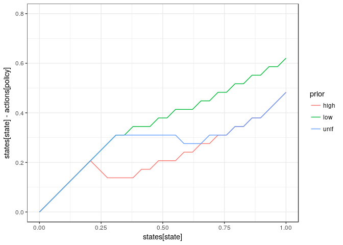
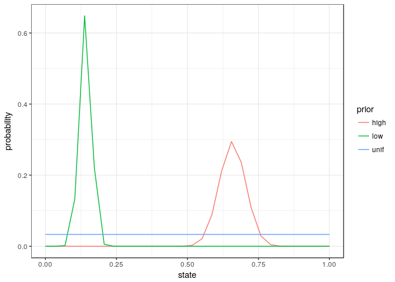

```r
library(purrr)
library(ggplot2)
library(dplyr)
library(sarsop)
#library(printr)
options(knitr.table.format = 'markdown')
theme_set(theme_bw())
```


```r
log_dir = "sethi-30"

# alphas <- original_alphas
# models <- original_models

meta <- meta_from_log(data.frame(cost = "none"), log_dir = log_dir)

alphas <- alphas_from_log(meta, log_dir = log_dir)
models <- models_from_log(meta)

states <- seq(meta[1,]$min_state, meta[1,]$max_state, len=meta[1,]$n_states)
actions <- seq(meta[1,]$min_action, meta[1,]$max_action, len=meta[1,]$n_action)
discount <- meta[1,]$discount

meta
```

```
##               id load_time_sec init_time_sec run_time_sec final_precision
## 1   4d896a6fe1df          0.13          5.48     10009.10     7.85987e-06
## 2   4d8b6a6fe1df          0.17          6.07     10026.50     5.66614e-04
## 3   4d846a6fe1df          0.13          5.64     10034.20     6.40179e-04
## 4   4d836a6fe1df          0.17          5.15     10037.10     1.55041e-04
## 5   4d8a6a6fe1df          0.16          5.88     10040.00     2.14625e-04
## 6   4d7e6a6fe1df          0.20          3.71     10078.20     3.70337e-03
## 7   4d7d6a6fe1df          0.15          3.21     10085.30     1.10213e-03
## 8   4d7f6a6fe1df          0.12          3.84     10102.20     9.09974e-03
## 9   4d856a6fe1df          0.17          5.57     10137.30     1.95207e-03
## 10  4d816a6fe1df          0.16          3.88     10218.00     2.20407e-01
## 11  4d8e6a6fe1df          0.12          7.09     10225.80     2.97447e-01
## 12  4d826a6fe1df          0.16          4.17     10291.30     4.73088e-01
## 13  4d806a6fe1df          0.16          3.24     10353.40     6.38755e-02
## 14  4d8c6a6fe1df          0.17          6.62     10386.80     7.99298e-02
## 15  4d866a6fe1df          0.16          6.16     10492.10     1.06937e-01
## 16  4d8d6a6fe1df          0.12          7.00     10592.10     2.11406e-01
## 17  4d876a6fe1df          0.13          6.40     10793.50     3.36847e-01
## 18  4d886a6fe1df          0.13          6.39     11079.20     5.81891e-01
## 19  4d891c136b14          0.12          3.64      5534.65     9.91909e-08
## 20  4d8b1c136b14          0.14          4.70     10035.00     1.55949e-05
## 21  4d831c136b14          0.17          3.21     10024.60     2.51173e-07
## 22  4d841c136b14          0.15          3.29     10040.80     3.65166e-05
## 23  4d8a1c136b14          0.16          4.29     10042.90     5.29019e-05
## 24  4d7e1c136b14          0.15          1.99     10009.80     2.53257e-05
## 25  4d7d1c136b14          0.14          1.95     10007.90     1.24844e-05
## 26  4d7f1c136b14          0.15          2.31     10035.10     1.40736e-03
## 27  4d851c136b14          0.15          3.87     10052.80     1.90353e-04
## 28  4d8e1c136b14          0.19          5.24     10053.10     9.46918e-02
## 29  4d811c136b14          0.11          2.14     10072.80     6.64524e-02
## 30  4d821c136b14          0.14          2.55     10024.50     2.27053e-01
## 31  4d801c136b14          0.11          2.13     10082.50     4.64885e-02
## 32  4d8c1c136b14          0.12          4.04     10053.70     3.50276e-02
## 33  4d861c136b14          0.11          3.24     10047.90     4.88994e-02
## 34  4d8d1c136b14          0.15          4.71     10103.40     7.23819e-02
## 35  4d871c136b14          0.15          3.75     10125.30     1.43466e-01
## 36  4d881c136b14          0.18          4.48     10099.90     3.02228e-01
## 37  4d897c90b237          0.13          6.20     10072.70     6.74893e-04
## 38  4d837c90b237          0.17          5.45     10057.00     5.90401e-05
## 39  4d7e7c90b237          0.15          3.15     10032.70     2.32182e-03
## 40  4d7d7c90b237          0.15          2.96     10043.50     7.71373e-04
## 41  4d847c90b237          0.19          5.56     10078.90     1.97405e-04
## 42  4d8a7c90b237          0.14          5.95     10104.70     1.10554e-04
## 43  4d7f7c90b237          0.17          3.31     10051.10     4.60349e-03
## 44  4d857c90b237          0.21          5.88     10060.10     5.79350e-04
## 45  4d8b7c90b237          0.20          6.00     10272.00     1.41815e-05
## 46  4d817c90b237          0.19          3.41     10150.50     1.15294e-01
## 47  4d8e7c90b237          0.21          6.98     10277.50     7.40243e-02
## 48  4d827c90b237          0.17          3.57     10304.20     1.96956e-01
## 49  4d8c7c90b237          0.21          6.62     10382.80     3.30723e-02
## 50  4d807c90b237          0.12          3.10     10392.40     4.46747e-02
## 51  4d867c90b237          0.15          6.04     10350.90     2.69805e-02
## 52  4d8d7c90b237          0.18          6.67     10253.00     3.06691e-02
## 53  4d877c90b237          0.14          6.45     10298.90     1.20206e-01
## 54  4d887c90b237          0.20          6.62     10661.60     2.20379e-01
## 55   4d891f98703          0.12          2.80     10071.40     1.67356e-06
## 56   4d7e1f98703          0.15          1.97     10008.00     2.61974e-05
## 57   4d831f98703          0.17          2.78     10019.90     3.64295e-05
## 58   4d7d1f98703          0.15          2.07     10004.80     4.23561e-05
## 59   4d841f98703          0.14          2.94     10012.10     3.01572e-05
## 60   4d7f1f98703          0.09          2.18     10007.00     1.17361e-04
## 61   4d8a1f98703          0.14          3.22     10069.90     3.40400e-05
## 62   4d851f98703          0.16          3.07     10047.20     3.01706e-05
## 63   4d8b1f98703          0.17          3.53     10033.60     5.32889e-06
## 64   4d811f98703          0.15          2.25     10066.70     1.17005e-01
## 65   4d8e1f98703          0.16          3.91     10091.20     4.83267e-02
## 66   4d821f98703          0.15          2.59     10089.90     1.20872e-01
## 67   4d8c1f98703          0.16          3.20     10043.30     1.19133e-02
## 68   4d801f98703          0.14          2.85     10043.10     5.94553e-02
## 69   4d861f98703          0.18          2.94     10036.90     2.84785e-02
## 70   4d8d1f98703          0.16          3.42     10075.20     3.47156e-02
## 71   4d871f98703          0.14          3.12     10142.40     7.52120e-02
## 72   4d881f98703          0.17          3.33     10076.00     1.44349e-01
## 73  4d8974e760d7          0.13          5.35     10005.80     4.13652e-05
## 74  4d8947401d01          0.10          3.49      2081.02     9.93512e-08
## 75  4d8374e760d7          0.18          5.24     10010.60     4.68056e-05
## 76  4d7d74e760d7          0.19          2.91     10030.50     5.70132e-04
## 77  4d8474e760d7          0.18          5.26     10014.10     1.63078e-04
## 78  4d7e74e760d7          0.19          3.14     10076.00     1.23548e-03
## 79  4d7f74e760d7          0.18          3.50     10044.70     1.85410e-03
## 80  4d8a74e760d7          0.20          5.64     10011.20     7.50889e-05
## 81  4d8574e760d7          0.19          5.53     10039.70     3.00600e-04
## 82  4d8b74e760d7          0.18          5.73     10051.50     3.17088e-05
## 83  4d8347401d01          0.16          2.95       267.91     9.91241e-08
## 84  4d8174e760d7          0.17          3.36     10272.70     8.32854e-02
## 85  4d8074e760d7          0.14          3.13     10126.20     4.23500e-02
## 86  4d8e74e760d7          0.20          6.93     10357.30     1.65319e-01
## 87  4d8274e760d7          0.13          3.55     10296.60     1.27001e-01
## 88  4d8d74e760d7          0.20          6.72     10380.20     1.18058e-01
## 89  4d8c74e760d7          0.22          6.36     10541.20     5.17109e-02
## 90  4d8774e760d7          0.13          6.15     10484.60     1.42737e-01
## 91  4d8447401d01          0.12          3.13      1689.78     9.97585e-08
## 92  4d8674e760d7          0.15          6.15     11057.30     7.11317e-02
## 93  4d8874e760d7          0.20          6.43     10683.50     2.19159e-01
## 94  4d8547401d01          0.16          2.99      2513.28     9.95972e-08
## 95  4d8a47401d01          0.14          3.93      5357.78     9.99913e-08
## 96  4d7d47401d01          0.13          1.98     10007.00     3.31293e-06
## 98  4d7e47401d01          0.15          2.01     10011.80     2.51652e-05
## 99  4d7f47401d01          0.09          2.00     10010.90     2.09695e-05
## 100 4d8b47401d01          0.15          3.97     10041.10     1.22225e-07
## 101 4d8147401d01          0.16          2.16     10046.80     1.01059e-01
## 102 4d8047401d01          0.17          2.01     10026.30     8.58943e-02
## 103 4d8e47401d01          0.18          4.23     10050.80     4.06577e-02
## 104 4d8247401d01          0.14          2.19     10075.80     7.27492e-02
## 105 4d8c47401d01          0.20          3.88     10025.50     2.26760e-02
## 106 4d8d47401d01          0.17          4.06     10033.70     1.99901e-02
## 107 4d8747401d01          0.14          3.27     10030.70     5.37964e-02
## 108 4d8647401d01          0.13          3.76     10039.80     3.60409e-02
## 109 4d8847401d01          0.10          3.29     10039.20     6.93843e-02
##                  end_condition n_states n_obs n_actions discount
## 1       Preset timeout reached       30    30        30     0.95
## 2       Preset timeout reached       30    30        30     0.95
## 3       Preset timeout reached       30    30        30     0.95
## 4       Preset timeout reached       30    30        30     0.95
## 5       Preset timeout reached       30    30        30     0.95
## 6       Preset timeout reached       30    30        30     0.95
## 7       Preset timeout reached       30    30        30     0.95
## 8       Preset timeout reached       30    30        30     0.95
## 9       Preset timeout reached       30    30        30     0.95
## 10      Preset timeout reached       30    30        30     0.95
## 11      Preset timeout reached       30    30        30     0.95
## 12      Preset timeout reached       30    30        30     0.95
## 13      Preset timeout reached       30    30        30     0.95
## 14      Preset timeout reached       30    30        30     0.95
## 15      Preset timeout reached       30    30        30     0.95
## 16      Preset timeout reached       30    30        30     0.95
## 17      Preset timeout reached       30    30        30     0.95
## 18      Preset timeout reached       30    30        30     0.95
## 19    target precision reached       30    30        30     0.95
## 20      Preset timeout reached       30    30        30     0.95
## 21      Preset timeout reached       30    30        30     0.95
## 22      Preset timeout reached       30    30        30     0.95
## 23      Preset timeout reached       30    30        30     0.95
## 24      Preset timeout reached       30    30        30     0.95
## 25      Preset timeout reached       30    30        30     0.95
## 26      Preset timeout reached       30    30        30     0.95
## 27      Preset timeout reached       30    30        30     0.95
## 28      Preset timeout reached       30    30        30     0.95
## 29      Preset timeout reached       30    30        30     0.95
## 30      Preset timeout reached       30    30        30     0.95
## 31      Preset timeout reached       30    30        30     0.95
## 32      Preset timeout reached       30    30        30     0.95
## 33      Preset timeout reached       30    30        30     0.95
## 34      Preset timeout reached       30    30        30     0.95
## 35      Preset timeout reached       30    30        30     0.95
## 36      Preset timeout reached       30    30        30     0.95
## 37      Preset timeout reached       30    30        30     0.95
## 38      Preset timeout reached       30    30        30     0.95
## 39      Preset timeout reached       30    30        30     0.95
## 40      Preset timeout reached       30    30        30     0.95
## 41      Preset timeout reached       30    30        30     0.95
## 42      Preset timeout reached       30    30        30     0.95
## 43      Preset timeout reached       30    30        30     0.95
## 44      Preset timeout reached       30    30        30     0.95
## 45      Preset timeout reached       30    30        30     0.95
## 46      Preset timeout reached       30    30        30     0.95
## 47      Preset timeout reached       30    30        30     0.95
## 48      Preset timeout reached       30    30        30     0.95
## 49      Preset timeout reached       30    30        30     0.95
## 50      Preset timeout reached       30    30        30     0.95
## 51      Preset timeout reached       30    30        30     0.95
## 52      Preset timeout reached       30    30        30     0.95
## 53      Preset timeout reached       30    30        30     0.95
## 54      Preset timeout reached       30    30        30     0.95
## 55      Preset timeout reached       30    30        30     0.95
## 56      Preset timeout reached       30    30        30     0.95
## 57      Preset timeout reached       30    30        30     0.95
## 58      Preset timeout reached       30    30        30     0.95
## 59      Preset timeout reached       30    30        30     0.95
## 60      Preset timeout reached       30    30        30     0.95
## 61      Preset timeout reached       30    30        30     0.95
## 62      Preset timeout reached       30    30        30     0.95
## 63      Preset timeout reached       30    30        30     0.95
## 64      Preset timeout reached       30    30        30     0.95
## 65      Preset timeout reached       30    30        30     0.95
## 66      Preset timeout reached       30    30        30     0.95
## 67      Preset timeout reached       30    30        30     0.95
## 68      Preset timeout reached       30    30        30     0.95
## 69      Preset timeout reached       30    30        30     0.95
## 70      Preset timeout reached       30    30        30     0.95
## 71      Preset timeout reached       30    30        30     0.95
## 72      Preset timeout reached       30    30        30     0.95
## 73      Preset timeout reached       30    30        30     0.95
## 74    target precision reached       30    30        30     0.95
## 75      Preset timeout reached       30    30        30     0.95
## 76      Preset timeout reached       30    30        30     0.95
## 77      Preset timeout reached       30    30        30     0.95
## 78      Preset timeout reached       30    30        30     0.95
## 79      Preset timeout reached       30    30        30     0.95
## 80      Preset timeout reached       30    30        30     0.95
## 81      Preset timeout reached       30    30        30     0.95
## 82      Preset timeout reached       30    30        30     0.95
## 83    target precision reached       30    30        30     0.95
## 84      Preset timeout reached       30    30        30     0.95
## 85      Preset timeout reached       30    30        30     0.95
## 86      Preset timeout reached       30    30        30     0.95
## 87      Preset timeout reached       30    30        30     0.95
## 88      Preset timeout reached       30    30        30     0.95
## 89      Preset timeout reached       30    30        30     0.95
## 90      Preset timeout reached       30    30        30     0.95
## 91    target precision reached       30    30        30     0.95
## 92      Preset timeout reached       30    30        30     0.95
## 93      Preset timeout reached       30    30        30     0.95
## 94    target precision reached       30    30        30     0.95
## 95    target precision reached       30    30        30     0.95
## 96      Preset timeout reached       30    30        30     0.95
## 98      Preset timeout reached       30    30        30     0.95
## 99      Preset timeout reached       30    30        30     0.95
## 100     Preset timeout reached       30    30        30     0.95
## 101     Preset timeout reached       30    30        30     0.95
## 102     Preset timeout reached       30    30        30     0.95
## 103     Preset timeout reached       30    30        30     0.95
## 104     Preset timeout reached       30    30        30     0.95
## 105     Preset timeout reached       30    30        30     0.95
## 106     Preset timeout reached       30    30        30     0.95
## 107     Preset timeout reached       30    30        30     0.95
## 108     Preset timeout reached       30    30        30     0.95
## 109     Preset timeout reached       30    30        30     0.95
##                    date   r sigma_m sigma_g     noise  model    K   C
## 1   2016-10-27 08:27:14 0.5     0.1     0.5 lognormal ricker 0.75 0.1
## 2   2016-10-27 08:27:31 1.5     0.1     0.5 lognormal ricker 0.75 0.1
## 3   2016-10-27 08:27:38 1.0     0.1     0.3 lognormal ricker 0.75 0.1
## 4   2016-10-27 08:27:41 0.5     0.1     0.3 lognormal ricker 0.75 0.1
## 5   2016-10-27 08:27:45 1.0     0.1     0.5 lognormal ricker 0.75 0.1
## 6   2016-10-27 08:28:24 1.0     0.1     0.1 lognormal ricker 0.75 0.1
## 7   2016-10-27 08:28:30 0.5     0.1     0.1 lognormal ricker 0.75 0.1
## 8   2016-10-27 08:28:46 1.5     0.1     0.1 lognormal ricker 0.75 0.1
## 9   2016-10-27 08:29:21 1.5     0.1     0.3 lognormal ricker 0.75 0.1
## 10  2016-10-27 08:30:42 1.0     0.5     0.1 lognormal ricker 0.75 0.1
## 11  2016-10-27 08:30:50 1.5     0.5     0.5 lognormal ricker 0.75 0.1
## 12  2016-10-27 08:31:55 1.5     0.5     0.1 lognormal ricker 0.75 0.1
## 13  2016-10-27 08:32:57 0.5     0.5     0.1 lognormal ricker 0.75 0.1
## 14  2016-10-27 08:33:31 0.5     0.5     0.5 lognormal ricker 0.75 0.1
## 15  2016-10-27 08:35:16 0.5     0.5     0.3 lognormal ricker 0.75 0.1
## 16  2016-10-27 08:36:56 1.0     0.5     0.5 lognormal ricker 0.75 0.1
## 17  2016-10-27 08:40:17 1.0     0.5     0.3 lognormal ricker 0.75 0.1
## 18  2016-10-27 08:45:03 1.5     0.5     0.3 lognormal ricker 0.75 0.1
## 19  2016-10-27 09:59:27 0.5     0.1     0.5   uniform ricker 0.75 0.1
## 20  2016-10-27 11:14:43 1.5     0.1     0.5   uniform ricker 0.75 0.1
## 21  2016-10-27 11:14:44 0.5     0.1     0.3   uniform ricker 0.75 0.1
## 22  2016-10-27 11:14:56 1.0     0.1     0.3   uniform ricker 0.75 0.1
## 23  2016-10-27 11:15:05 1.0     0.1     0.5   uniform ricker 0.75 0.1
## 24  2016-10-27 11:15:10 1.0     0.1     0.1   uniform ricker 0.75 0.1
## 25  2016-10-27 11:15:15 0.5     0.1     0.1   uniform ricker 0.75 0.1
## 26  2016-10-27 11:15:58 1.5     0.1     0.1   uniform ricker 0.75 0.1
## 27  2016-10-27 11:16:51 1.5     0.1     0.3   uniform ricker 0.75 0.1
## 28  2016-10-27 11:18:20 1.5     0.5     0.5   uniform ricker 0.75 0.1
## 29  2016-10-27 11:18:32 1.0     0.5     0.1   uniform ricker 0.75 0.1
## 30  2016-10-27 11:18:57 1.5     0.5     0.1   uniform ricker 0.75 0.1
## 31  2016-10-27 11:20:57 0.5     0.5     0.1   uniform ricker 0.75 0.1
## 32  2016-10-27 11:21:03 0.5     0.5     0.5   uniform ricker 0.75 0.1
## 33  2016-10-27 11:22:41 0.5     0.5     0.3   uniform ricker 0.75 0.1
## 34  2016-10-27 11:25:17 1.0     0.5     0.5   uniform ricker 0.75 0.1
## 35  2016-10-27 11:29:00 1.0     0.5     0.3   uniform ricker 0.75 0.1
## 36  2016-10-27 11:33:20 1.5     0.5     0.3   uniform ricker 0.75 0.1
## 37  2016-10-27 12:47:19 0.5     0.1     0.5 lognormal  allen 0.75 0.1
## 38  2016-10-27 14:02:22 0.5     0.1     0.3 lognormal  allen 0.75 0.1
## 39  2016-10-27 14:02:25 1.0     0.1     0.1 lognormal  allen 0.75 0.1
## 40  2016-10-27 14:02:40 0.5     0.1     0.1 lognormal  allen 0.75 0.1
## 41  2016-10-27 14:02:56 1.0     0.1     0.3 lognormal  allen 0.75 0.1
## 42  2016-10-27 14:03:30 1.0     0.1     0.5 lognormal  allen 0.75 0.1
## 43  2016-10-27 14:03:31 1.5     0.1     0.1 lognormal  allen 0.75 0.1
## 44  2016-10-27 14:04:33 1.5     0.1     0.3 lognormal  allen 0.75 0.1
## 45  2016-10-27 14:05:56 1.5     0.1     0.5 lognormal  allen 0.75 0.1
## 46  2016-10-27 14:07:44 1.0     0.5     0.1 lognormal  allen 0.75 0.1
## 47  2016-10-27 14:09:39 1.5     0.5     0.5 lognormal  allen 0.75 0.1
## 48  2016-10-27 14:10:43 1.5     0.5     0.1 lognormal  allen 0.75 0.1
## 49  2016-10-27 14:14:07 0.5     0.5     0.5 lognormal  allen 0.75 0.1
## 50  2016-10-27 14:14:11 0.5     0.5     0.1 lognormal  allen 0.75 0.1
## 51  2016-10-27 14:15:13 0.5     0.5     0.3 lognormal  allen 0.75 0.1
## 52  2016-10-27 14:16:11 1.0     0.5     0.5 lognormal  allen 0.75 0.1
## 53  2016-10-27 14:20:40 1.0     0.5     0.3 lognormal  allen 0.75 0.1
## 54  2016-10-27 14:31:03 1.5     0.5     0.3 lognormal  allen 0.75 0.1
## 55  2016-10-27 15:35:12 0.5     0.1     0.5   uniform  allen 0.75 0.1
## 56  2016-10-27 16:49:14 1.0     0.1     0.1   uniform  allen 0.75 0.1
## 57  2016-10-27 16:49:24 0.5     0.1     0.3   uniform  allen 0.75 0.1
## 58  2016-10-27 16:49:26 0.5     0.1     0.1   uniform  allen 0.75 0.1
## 59  2016-10-27 16:49:50 1.0     0.1     0.3   uniform  allen 0.75 0.1
## 60  2016-10-27 16:50:19 1.5     0.1     0.1   uniform  allen 0.75 0.1
## 61  2016-10-27 16:51:22 1.0     0.1     0.5   uniform  allen 0.75 0.1
## 62  2016-10-27 16:52:01 1.5     0.1     0.3   uniform  allen 0.75 0.1
## 63  2016-10-27 16:53:12 1.5     0.1     0.5   uniform  allen 0.75 0.1
## 64  2016-10-27 16:55:33 1.0     0.5     0.1   uniform  allen 0.75 0.1
## 65  2016-10-27 16:57:53 1.5     0.5     0.5   uniform  allen 0.75 0.1
## 66  2016-10-27 16:58:56 1.5     0.5     0.1   uniform  allen 0.75 0.1
## 67  2016-10-27 17:01:33 0.5     0.5     0.5   uniform  allen 0.75 0.1
## 68  2016-10-27 17:01:36 0.5     0.5     0.1   uniform  allen 0.75 0.1
## 69  2016-10-27 17:02:32 0.5     0.5     0.3   uniform  allen 0.75 0.1
## 70  2016-10-27 17:04:11 1.0     0.5     0.5   uniform  allen 0.75 0.1
## 71  2016-10-27 17:09:47 1.0     0.5     0.3   uniform  allen 0.75 0.1
## 72  2016-10-27 17:19:03 1.5     0.5     0.3   uniform  allen 0.75 0.1
## 73  2016-10-27 18:22:00 0.5     0.1     0.5 lognormal     bh 0.75 0.1
## 74  2016-10-27 18:56:41 0.5     0.1     0.5   uniform     bh 0.75 0.1
## 75  2016-10-27 19:36:15 0.5     0.1     0.3 lognormal     bh 0.75 0.1
## 76  2016-10-27 19:36:39 0.5     0.1     0.1 lognormal     bh 0.75 0.1
## 77  2016-10-27 19:36:43 1.0     0.1     0.3 lognormal     bh 0.75 0.1
## 78  2016-10-27 19:37:11 1.0     0.1     0.1 lognormal     bh 0.75 0.1
## 79  2016-10-27 19:37:45 1.5     0.1     0.1 lognormal     bh 0.75 0.1
## 80  2016-10-27 19:38:12 1.0     0.1     0.5 lognormal     bh 0.75 0.1
## 81  2016-10-27 19:39:19 1.5     0.1     0.3 lognormal     bh 0.75 0.1
## 82  2016-10-27 19:40:41 1.5     0.1     0.5 lognormal     bh 0.75 0.1
## 83  2016-10-27 19:40:44 0.5     0.1     0.3   uniform     bh 0.75 0.1
## 84  2016-10-27 19:46:44 1.0     0.5     0.1 lognormal     bh 0.75 0.1
## 85  2016-10-27 19:50:21 0.5     0.5     0.1 lognormal     bh 0.75 0.1
## 86  2016-10-27 19:50:29 1.5     0.5     0.5 lognormal     bh 0.75 0.1
## 87  2016-10-27 19:50:31 1.5     0.5     0.1 lognormal     bh 0.75 0.1
## 88  2016-10-27 19:57:09 1.0     0.5     0.5 lognormal     bh 0.75 0.1
## 89  2016-10-27 19:57:12 0.5     0.5     0.5 lognormal     bh 0.75 0.1
## 90  2016-10-27 20:04:29 1.0     0.5     0.3 lognormal     bh 0.75 0.1
## 91  2016-10-27 20:04:54 1.0     0.1     0.3   uniform     bh 0.75 0.1
## 92  2016-10-27 20:06:48 0.5     0.5     0.3 lognormal     bh 0.75 0.1
## 93  2016-10-27 20:17:04 1.5     0.5     0.3 lognormal     bh 0.75 0.1
## 94  2016-10-27 20:21:13 1.5     0.1     0.3   uniform     bh 0.75 0.1
## 95  2016-10-27 21:07:29 1.0     0.1     0.5   uniform     bh 0.75 0.1
## 96  2016-10-27 22:23:24 0.5     0.1     0.1   uniform     bh 0.75 0.1
## 98  2016-10-27 22:24:00 1.0     0.1     0.1   uniform     bh 0.75 0.1
## 99  2016-10-27 22:24:33 1.5     0.1     0.1   uniform     bh 0.75 0.1
## 100 2016-10-27 22:28:00 1.5     0.1     0.5   uniform     bh 0.75 0.1
## 101 2016-10-27 22:34:10 1.0     0.5     0.1   uniform     bh 0.75 0.1
## 102 2016-10-27 22:37:26 0.5     0.5     0.1   uniform     bh 0.75 0.1
## 103 2016-10-27 22:37:58 1.5     0.5     0.5   uniform     bh 0.75 0.1
## 104 2016-10-27 22:38:26 1.5     0.5     0.1   uniform     bh 0.75 0.1
## 105 2016-10-27 22:44:16 0.5     0.5     0.5   uniform     bh 0.75 0.1
## 106 2016-10-27 22:44:21 1.0     0.5     0.5   uniform     bh 0.75 0.1
## 107 2016-10-27 22:51:37 1.0     0.5     0.3   uniform     bh 0.75 0.1
## 108 2016-10-27 22:54:05 0.5     0.5     0.3   uniform     bh 0.75 0.1
## 109 2016-10-27 23:04:21 1.5     0.5     0.3   uniform     bh 0.75 0.1
##     precision timeout timeInterval max_state max_obs max_action min_state
## 1       1e-07   10000         2000         1       1          1         0
## 2       1e-07   10000         2000         1       1          1         0
## 3       1e-07   10000         2000         1       1          1         0
## 4       1e-07   10000         2000         1       1          1         0
## 5       1e-07   10000         2000         1       1          1         0
## 6       1e-07   10000         2000         1       1          1         0
## 7       1e-07   10000         2000         1       1          1         0
## 8       1e-07   10000         2000         1       1          1         0
## 9       1e-07   10000         2000         1       1          1         0
## 10      1e-07   10000         2000         1       1          1         0
## 11      1e-07   10000         2000         1       1          1         0
## 12      1e-07   10000         2000         1       1          1         0
## 13      1e-07   10000         2000         1       1          1         0
## 14      1e-07   10000         2000         1       1          1         0
## 15      1e-07   10000         2000         1       1          1         0
## 16      1e-07   10000         2000         1       1          1         0
## 17      1e-07   10000         2000         1       1          1         0
## 18      1e-07   10000         2000         1       1          1         0
## 19      1e-07   10000         2000         1       1          1         0
## 20      1e-07   10000         2000         1       1          1         0
## 21      1e-07   10000         2000         1       1          1         0
## 22      1e-07   10000         2000         1       1          1         0
## 23      1e-07   10000         2000         1       1          1         0
## 24      1e-07   10000         2000         1       1          1         0
## 25      1e-07   10000         2000         1       1          1         0
## 26      1e-07   10000         2000         1       1          1         0
## 27      1e-07   10000         2000         1       1          1         0
## 28      1e-07   10000         2000         1       1          1         0
## 29      1e-07   10000         2000         1       1          1         0
## 30      1e-07   10000         2000         1       1          1         0
## 31      1e-07   10000         2000         1       1          1         0
## 32      1e-07   10000         2000         1       1          1         0
## 33      1e-07   10000         2000         1       1          1         0
## 34      1e-07   10000         2000         1       1          1         0
## 35      1e-07   10000         2000         1       1          1         0
## 36      1e-07   10000         2000         1       1          1         0
## 37      1e-07   10000         2000         1       1          1         0
## 38      1e-07   10000         2000         1       1          1         0
## 39      1e-07   10000         2000         1       1          1         0
## 40      1e-07   10000         2000         1       1          1         0
## 41      1e-07   10000         2000         1       1          1         0
## 42      1e-07   10000         2000         1       1          1         0
## 43      1e-07   10000         2000         1       1          1         0
## 44      1e-07   10000         2000         1       1          1         0
## 45      1e-07   10000         2000         1       1          1         0
## 46      1e-07   10000         2000         1       1          1         0
## 47      1e-07   10000         2000         1       1          1         0
## 48      1e-07   10000         2000         1       1          1         0
## 49      1e-07   10000         2000         1       1          1         0
## 50      1e-07   10000         2000         1       1          1         0
## 51      1e-07   10000         2000         1       1          1         0
## 52      1e-07   10000         2000         1       1          1         0
## 53      1e-07   10000         2000         1       1          1         0
## 54      1e-07   10000         2000         1       1          1         0
## 55      1e-07   10000         2000         1       1          1         0
## 56      1e-07   10000         2000         1       1          1         0
## 57      1e-07   10000         2000         1       1          1         0
## 58      1e-07   10000         2000         1       1          1         0
## 59      1e-07   10000         2000         1       1          1         0
## 60      1e-07   10000         2000         1       1          1         0
## 61      1e-07   10000         2000         1       1          1         0
## 62      1e-07   10000         2000         1       1          1         0
## 63      1e-07   10000         2000         1       1          1         0
## 64      1e-07   10000         2000         1       1          1         0
## 65      1e-07   10000         2000         1       1          1         0
## 66      1e-07   10000         2000         1       1          1         0
## 67      1e-07   10000         2000         1       1          1         0
## 68      1e-07   10000         2000         1       1          1         0
## 69      1e-07   10000         2000         1       1          1         0
## 70      1e-07   10000         2000         1       1          1         0
## 71      1e-07   10000         2000         1       1          1         0
## 72      1e-07   10000         2000         1       1          1         0
## 73      1e-07   10000         2000         1       1          1         0
## 74      1e-07   10000         2000         1       1          1         0
## 75      1e-07   10000         2000         1       1          1         0
## 76      1e-07   10000         2000         1       1          1         0
## 77      1e-07   10000         2000         1       1          1         0
## 78      1e-07   10000         2000         1       1          1         0
## 79      1e-07   10000         2000         1       1          1         0
## 80      1e-07   10000         2000         1       1          1         0
## 81      1e-07   10000         2000         1       1          1         0
## 82      1e-07   10000         2000         1       1          1         0
## 83      1e-07   10000         2000         1       1          1         0
## 84      1e-07   10000         2000         1       1          1         0
## 85      1e-07   10000         2000         1       1          1         0
## 86      1e-07   10000         2000         1       1          1         0
## 87      1e-07   10000         2000         1       1          1         0
## 88      1e-07   10000         2000         1       1          1         0
## 89      1e-07   10000         2000         1       1          1         0
## 90      1e-07   10000         2000         1       1          1         0
## 91      1e-07   10000         2000         1       1          1         0
## 92      1e-07   10000         2000         1       1          1         0
## 93      1e-07   10000         2000         1       1          1         0
## 94      1e-07   10000         2000         1       1          1         0
## 95      1e-07   10000         2000         1       1          1         0
## 96      1e-07   10000         2000         1       1          1         0
## 98      1e-07   10000         2000         1       1          1         0
## 99      1e-07   10000         2000         1       1          1         0
## 100     1e-07   10000         2000         1       1          1         0
## 101     1e-07   10000         2000         1       1          1         0
## 102     1e-07   10000         2000         1       1          1         0
## 103     1e-07   10000         2000         1       1          1         0
## 104     1e-07   10000         2000         1       1          1         0
## 105     1e-07   10000         2000         1       1          1         0
## 106     1e-07   10000         2000         1       1          1         0
## 107     1e-07   10000         2000         1       1          1         0
## 108     1e-07   10000         2000         1       1          1         0
## 109     1e-07   10000         2000         1       1          1         0
##     min_obs min_action cost beta
## 1         0          0 none    0
## 2         0          0 none    0
## 3         0          0 none    0
## 4         0          0 none    0
## 5         0          0 none    0
## 6         0          0 none    0
## 7         0          0 none    0
## 8         0          0 none    0
## 9         0          0 none    0
## 10        0          0 none    0
## 11        0          0 none    0
## 12        0          0 none    0
## 13        0          0 none    0
## 14        0          0 none    0
## 15        0          0 none    0
## 16        0          0 none    0
## 17        0          0 none    0
## 18        0          0 none    0
## 19        0          0 none    0
## 20        0          0 none    0
## 21        0          0 none    0
## 22        0          0 none    0
## 23        0          0 none    0
## 24        0          0 none    0
## 25        0          0 none    0
## 26        0          0 none    0
## 27        0          0 none    0
## 28        0          0 none    0
## 29        0          0 none    0
## 30        0          0 none    0
## 31        0          0 none    0
## 32        0          0 none    0
## 33        0          0 none    0
## 34        0          0 none    0
## 35        0          0 none    0
## 36        0          0 none    0
## 37        0          0 none    0
## 38        0          0 none    0
## 39        0          0 none    0
## 40        0          0 none    0
## 41        0          0 none    0
## 42        0          0 none    0
## 43        0          0 none    0
## 44        0          0 none    0
## 45        0          0 none    0
## 46        0          0 none    0
## 47        0          0 none    0
## 48        0          0 none    0
## 49        0          0 none    0
## 50        0          0 none    0
## 51        0          0 none    0
## 52        0          0 none    0
## 53        0          0 none    0
## 54        0          0 none    0
## 55        0          0 none    0
## 56        0          0 none    0
## 57        0          0 none    0
## 58        0          0 none    0
## 59        0          0 none    0
## 60        0          0 none    0
## 61        0          0 none    0
## 62        0          0 none    0
## 63        0          0 none    0
## 64        0          0 none    0
## 65        0          0 none    0
## 66        0          0 none    0
## 67        0          0 none    0
## 68        0          0 none    0
## 69        0          0 none    0
## 70        0          0 none    0
## 71        0          0 none    0
## 72        0          0 none    0
## 73        0          0 none    0
## 74        0          0 none    0
## 75        0          0 none    0
## 76        0          0 none    0
## 77        0          0 none    0
## 78        0          0 none    0
## 79        0          0 none    0
## 80        0          0 none    0
## 81        0          0 none    0
## 82        0          0 none    0
## 83        0          0 none    0
## 84        0          0 none    0
## 85        0          0 none    0
## 86        0          0 none    0
## 87        0          0 none    0
## 88        0          0 none    0
## 89        0          0 none    0
## 90        0          0 none    0
## 91        0          0 none    0
## 92        0          0 none    0
## 93        0          0 none    0
## 94        0          0 none    0
## 95        0          0 none    0
## 96        0          0 none    0
## 98        0          0 none    0
## 99        0          0 none    0
## 100       0          0 none    0
## 101       0          0 none    0
## 102       0          0 none    0
## 103       0          0 none    0
## 104       0          0 none    0
## 105       0          0 none    0
## 106       0          0 none    0
## 107       0          0 none    0
## 108       0          0 none    0
## 109       0          0 none    0
```


## Det policy


```r
fs <- f_from_log(meta)

dets <- purrr::map_df(1:dim(meta)[[1]], function(i){ 
  f <- fs[[i]]
  S_star <- optimize(function(x) x / discount - f(x,0), c(min(states),max(states)))$minimum
  h <- pmax(states - S_star,  0)
  policy <- sapply(h, function(h) which.min((abs(h - actions))))
  det <- data.frame(policy, value = 1:length(states), state = 1:length(states))
}, .id = "model_id"
)
```


## Convergence testing


```r
inter <- sarsop:::intermediates_from_log(meta, log_dir = log_dir)

df1 <- 
purrr::map_df(1:length(models), function(j){
  alphas <- inter[[j]]
  m <- models[[j]]
  purrr::map_df(1:length(alphas), function(i)
    compute_policy(alphas[[i]], m$transition, m$observation, m$reward),
    .id = "intermediate") 
}, .id = "model_id")

df1 %>% 
  ggplot(aes(states[state], states[state] - actions[policy], col=intermediate)) + 
  geom_line() + 
  facet_wrap(~model_id, scales = "free") + 
  coord_cartesian(ylim = c(0,0.5))
```

<!-- -->

## Explore POMDP policy


```r
df <- purrr::map_df(1:length(models), function(i)
  compute_policy(alphas[[i]], models[[i]]$transition, models[[i]]$observation, models[[i]]$reward),
  .id = "model_id")

## Join to metadata table
meta$model_id <- as.character(1:length(models))

## Join to deterministic case
df2 <- bind_rows(
  left_join(df, meta, by = "model_id"),
  left_join(dets, meta, by = "model_id") %>% mutate(sigma_m = 0))
```


## Lognormal noise


```r
df2 %>% filter(r == 1, noise == "lognormal") %>% 
  ggplot(aes(states[state], states[state] - actions[policy], col = as.character(sigma_m))) +
  geom_line() +
  facet_grid(model ~ sigma_g, scales = "free") +
  coord_cartesian(ylim = c(0,0.8))
```

<!-- -->


## Uniform


```r
df2 %>% filter(r == 1, noise == "uniform") %>% 
  ggplot(aes(states[state], states[state] - actions[policy], col = as.character(sigma_m))) +
  geom_line() +
  facet_grid(model ~ sigma_g, scales = "free") +
  coord_cartesian(ylim = c(0,0.8))
```

<!-- -->


## Simulation


```r
x0 <- which.min(abs(0.33 - states))


get_det <- function(meta){
  f <- f_from_log(meta)[[1]]
  S_star <- optimize(function(x) x / discount - f(x,0), c(min(states),max(states)))$minimum
  h <- pmax(states - S_star,  0)
  sapply(h, function(h) which.min((abs(h - actions))))
}
```


```r
s1 <-  meta %>% filter(r == 1, sigma_m == 0.5, sigma_g == 0.5, model == "ricker", noise == "lognormal")
alpha <- alphas_from_log(s1, log_dir)[[1]]
m <- models_from_log(s1)[[1]]
det_policy <- get_det(meta)
```

Simulation in which belief over states is updated in each time step, used to determine a new policy, which is then used to choose the best action given the most recent observation.


```r
sim <- purrr::map_df(1:50, function(i) sarsop::sim_pomdp(m$transition, m$observation, m$reward, discount, x0 = x0, Tmax = 100, alpha = alpha)$df, .id = "rep")
```


Simulation in which the policy is not updated based on the most recent belief over states, but remains the policy given a uniform prior over belief states. 


```r
s <- compute_policy(alpha,m$transition, m$observation, m$reward)
sim2 <- purrr::map_df(1:50, function(i) mdplearning::mdp_planning(m$transition, m$reward, discount, x0 = x0, Tmax = 100, observation = m$observation, policy = s$policy), .id = "rep")
```


```r
sim3 <- purrr::map_df(1:50, function(i) mdplearning::mdp_planning(m$transition, m$reward, discount, x0 = x0, Tmax = 100, observation = m$observation, policy = det_policy), .id = "rep")
```


```r
df <- bind_rows(pomdp = sim, static = sim2, det = sim3, .id = "scenario")
df %>% group_by(scenario, rep) %>% summarise(value = sum(value)) %>%  group_by(scenario) %>% summarise(mean(value))
```

```
## # A tibble: 3 x 2
##   scenario `mean(value)`
##      <chr>         <dbl>
## 1      det      1.926316
## 2    pomdp      3.124024
## 3   static      3.185103
```

```r
df %>% group_by(scenario, time) %>% summarise(value = mean(value), state = mean(state)) %>%
ggplot(aes(time, states[state], col = scenario)) + geom_line()
```

<!-- -->


## Small growth noise


```r
s1 <-  meta %>% filter(r == 1, sigma_m == 0.5, sigma_g == 0.1, model == "ricker", noise == "lognormal")
alpha <- alphas_from_log(s1, log_dir)[[1]]
m <- models_from_log(s1)[[1]]
det_policy <- get_det(meta)


sim <- purrr::map_df(1:50, function(i) sarsop::sim_pomdp(m$transition, m$observation, m$reward, discount, x0 = x0, Tmax = 100, alpha = alpha)$df, .id = "rep")
s <- compute_policy(alpha,m$transition, m$observation, m$reward)
sim2 <- purrr::map_df(1:50, function(i) mdplearning::mdp_planning(m$transition, m$reward, discount, x0 = x0, Tmax = 100, observation = m$observation, policy = s$policy), .id = "rep")
sim3 <- purrr::map_df(1:50, function(i) mdplearning::mdp_planning(m$transition, m$reward, discount, x0 = x0, Tmax = 100, observation = m$observation, policy = det_policy), .id = "rep")

df <- bind_rows(pomdp = sim, static = sim2, det = sim3, .id = "scenario")
df %>% group_by(scenario, rep) %>% summarise(value = sum(value)) %>%  group_by(scenario) %>% summarise(mean(value))
```

```
## # A tibble: 3 x 2
##   scenario `mean(value)`
##      <chr>         <dbl>
## 1      det      1.806414
## 2    pomdp      4.199188
## 3   static      3.866847
```

```r
df %>% group_by(scenario, time) %>% summarise(value = mean(value), state = mean(state)) %>%
ggplot(aes(time, states[state], col = scenario)) + geom_line()
```

<!-- -->


------

## Policy as a function of prior:

Policy is much more conservative when the prior belief is skewed towards small stock sizes, and more aggressive when the policy is skewed towards larger ones:


```r
K_i <- which.min(abs(.66 - states))

s1 <-  meta %>% filter(r == 1, sigma_m == 0.1, sigma_g == 0.1, model == "ricker", noise == "lognormal")
alpha <- alphas_from_log(s1, log_dir)[[1]]
m <- models_from_log(s1)[[1]]


unif <- compute_policy(alpha, m$transition, m$observation, m$reward)
low <- compute_policy(alpha, m$transition, m$observation, m$reward, state_prior = m$observation[,5,1])
high <- compute_policy(alpha, m$transition, m$observation, m$reward, state_prior = m$observation[,K_i,1])

bind_rows(unif = unif, low = low, high = high, .id = "prior") %>% 
  ggplot(aes(states[state], states[state] - actions[policy], col = prior)) + 
  geom_line() +
  coord_cartesian(ylim = c(0,0.8))
```

<!-- -->

Priors:


```r
bind_rows(unif = data.frame(state = states, probability = rep(1, length(states))/length(states)),
          low = data.frame(state = states, probability = m$observation[,5,1]),
          high = data.frame(state = states, probability = m$observation[,K_i,1]),
          .id = "prior") %>%
  ggplot(aes(state,probability, col=prior)) + geom_line()
```

<!-- -->


