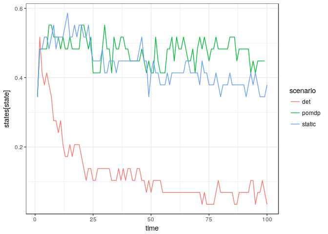

```r
library(purrr)
library(ggplot2)
library(dplyr)
library(appl)
library(printr)
options(knitr.table.format = 'markdown')
```


```r
log_dir = "sethi-50-states"

# alphas <- original_alphas
# models <- original_models

meta <- meta_from_log(data.frame(model = "ricker", cost = "none"), log_dir = log_dir)

alphas <- alphas_from_log(meta, log_dir = log_dir)
#meta$sigma_g <- as.numeric(meta$sigma_g)
models <- models_from_log(meta)

states <- seq(meta[1,]$min_state, meta[1,]$max_state, len=meta[1,]$n_states)
actions <- seq(meta[1,]$min_action, meta[1,]$max_action, len=meta[1,]$n_action)
discount <- meta[1,]$discount

meta
```


|   |id          | load_time_sec| init_time_sec| run_time_sec| final_precision|end_condition          | n_states| n_obs| n_actions| discount|date                |   r| sigma_m| sigma_g|noise     |    K|  C|model  | precision| timeout| timeInterval| max_state| max_obs| max_action| min_state| min_obs| min_action|cost | beta|
|:--|:-----------|-------------:|-------------:|------------:|---------------:|:----------------------|--------:|-----:|---------:|--------:|:-------------------|---:|-------:|-------:|:---------|----:|--:|:------|---------:|-------:|------------:|---------:|-------:|----------:|---------:|-------:|----------:|:----|----:|
|1  |c673cac26e8 |          0.63|         16.46|      20038.0|       0.0000345|Preset timeout reached |       50|    50|        50|     0.95|2016-10-10 09:05:42 | 0.5|     0.1|     0.1|uniform   | 0.66| NA|ricker |     1e-07|   20000|         5000|         1|       1|          1|         0|       0|          0|none |   NA|
|2  |c683cac26e8 |          0.50|         16.49|      20046.8|       0.0024503|Preset timeout reached |       50|    50|        50|     0.95|2016-10-10 09:05:50 | 1.0|     0.1|     0.1|uniform   | 0.66| NA|ricker |     1e-07|   20000|         5000|         1|       1|          1|         0|       0|          0|none |   NA|
|3  |c6b3cac26e8 |          0.58|         33.19|      20072.9|       0.0000081|Preset timeout reached |       50|    50|        50|     0.95|2016-10-10 09:06:09 | 0.5|     0.1|     0.5|uniform   | 0.66| NA|ricker |     1e-07|   20000|         5000|         1|       1|          1|         0|       0|          0|none |   NA|
|4  |c693cac26e8 |          0.78|         17.42|      20114.8|       0.0400375|Preset timeout reached |       50|    50|        50|     0.95|2016-10-10 09:06:55 | 0.5|     0.5|     0.1|uniform   | 0.66| NA|ricker |     1e-07|   20000|         5000|         1|       1|          1|         0|       0|          0|none |   NA|
|6  |c6a3cac26e8 |          0.56|         21.20|      20143.7|       0.1518690|Preset timeout reached |       50|    50|        50|     0.95|2016-10-10 09:07:21 | 1.0|     0.5|     0.1|uniform   | 0.66| NA|ricker |     1e-07|   20000|         5000|         1|       1|          1|         0|       0|          0|none |   NA|
|8  |c6d3cac26e8 |          0.92|         36.68|      20144.8|       0.0230153|Preset timeout reached |       50|    50|        50|     0.95|2016-10-10 09:07:28 | 0.5|     0.5|     0.5|uniform   | 0.66| NA|ricker |     1e-07|   20000|         5000|         1|       1|          1|         0|       0|          0|none |   NA|
|9  |c6c3cac26e8 |          1.00|         46.69|      20154.0|       0.0004433|Preset timeout reached |       50|    50|        50|     0.95|2016-10-10 09:07:33 | 1.0|     0.1|     0.5|uniform   | 0.66| NA|ricker |     1e-07|   20000|         5000|         1|       1|          1|         0|       0|          0|none |   NA|
|10 |c5f3cac26e8 |          0.94|         26.60|      20176.0|       0.0013190|Preset timeout reached |       50|    50|        50|     0.95|2016-10-10 09:08:02 | 0.5|     0.1|     0.1|lognormal | 0.66| NA|ricker |     1e-07|   20000|         5000|         1|       1|          1|         0|       0|          0|none |   NA|
|12 |c6e3cac26e8 |          0.55|         51.25|      20214.9|       0.0736340|Preset timeout reached |       50|    50|        50|     0.95|2016-10-10 09:08:35 | 1.0|     0.5|     0.5|uniform   | 0.66| NA|ricker |     1e-07|   20000|         5000|         1|       1|          1|         0|       0|          0|none |   NA|
|13 |c603cac26e8 |          0.50|         30.92|      20213.7|       0.0046996|Preset timeout reached |       50|    50|        50|     0.95|2016-10-10 09:08:36 | 1.0|     0.1|     0.1|lognormal | 0.66| NA|ricker |     1e-07|   20000|         5000|         1|       1|          1|         0|       0|          0|none |   NA|
|14 |c633cac26e8 |          0.60|         80.13|      20322.1|       0.0000327|Preset timeout reached |       50|    50|        50|     0.95|2016-10-10 09:10:19 | 0.5|     0.1|     0.5|lognormal | 0.66| NA|ricker |     1e-07|   20000|         5000|         1|       1|          1|         0|       0|          0|none |   NA|
|15 |c643cac26e8 |          0.58|         74.87|      20370.2|       0.0002617|Preset timeout reached |       50|    50|        50|     0.95|2016-10-10 09:11:10 | 1.0|     0.1|     0.5|lognormal | 0.66| NA|ricker |     1e-07|   20000|         5000|         1|       1|          1|         0|       0|          0|none |   NA|
|17 |c623cac26e8 |          0.53|         34.87|      20407.4|       0.2403810|Preset timeout reached |       50|    50|        50|     0.95|2016-10-10 09:11:52 | 1.0|     0.5|     0.1|lognormal | 0.66| NA|ricker |     1e-07|   20000|         5000|         1|       1|          1|         0|       0|          0|none |   NA|
|19 |c613cac26e8 |          0.66|         27.90|      20611.2|       0.0730887|Preset timeout reached |       50|    50|        50|     0.95|2016-10-10 09:15:13 | 0.5|     0.5|     0.1|lognormal | 0.66| NA|ricker |     1e-07|   20000|         5000|         1|       1|          1|         0|       0|          0|none |   NA|
|20 |c663cac26e8 |          1.09|         74.88|      20642.7|       0.2498110|Preset timeout reached |       50|    50|        50|     0.95|2016-10-10 09:15:47 | 1.0|     0.5|     0.5|lognormal | 0.66| NA|ricker |     1e-07|   20000|         5000|         1|       1|          1|         0|       0|          0|none |   NA|
|25 |c653cac26e8 |          0.61|         76.06|      21394.2|       0.1135120|Preset timeout reached |       50|    50|        50|     0.95|2016-10-10 09:28:19 | 0.5|     0.5|     0.5|lognormal | 0.66| NA|ricker |     1e-07|   20000|         5000|         1|       1|          1|         0|       0|          0|none |   NA|


## Det policy


```r
f <- f_from_log(meta)[[1]]

S_star <- optimize(function(x) x / discount - f(x,0), c(min(states),max(states)))$minimum
h <- pmax(states - S_star,  0)
policy <- sapply(h, function(h) which.min((abs(h - actions))))
det <- data.frame(policy, value = 1:length(states), state = 1:length(states))
```


## Convergence testing


```r
inter <- appl:::intermediates_from_log(meta, log_dir = log_dir)

df1 <- 
purrr::map_df(1:length(models), function(j){
  alphas <- inter[[j]]
  m <- models[[j]]
  purrr::map_df(1:length(alphas), function(i)
    compute_policy(alphas[[i]], m$transition, m$observation, m$reward),
    .id = "intermediate") 
}, .id = "model")

df1 %>% 
  ggplot(aes(states[state], states[state] - actions[policy], col=intermediate)) + 
  geom_line() + 
  facet_wrap(~model, scales = "free") + 
  geom_line(data = det, col="black") + 
  coord_cartesian(ylim = c(0,0.5))
```

<!-- -->

## Explore POMDP policy


```r
df <- purrr::map_df(1:length(models), function(i)
  compute_policy(alphas[[i]], models[[i]]$transition, models[[i]]$observation, models[[i]]$reward),
  .id = "model")

## Join to metadata table
meta$model <- as.character(1:length(models))
df <- dplyr::left_join(df, meta, by = "model")
```

## Lognormal noise

Columns indicate growth noise `sigma_g`, rows indicate measurement error `sigma_m`.


```r
df %>% filter(noise == "lognormal") %>% 
  ggplot(aes(states[state], states[state] - actions[policy], col = as.factor(r))) +
  geom_line() +
  facet_grid(sigma_m ~ sigma_g, scales = "free") +
  geom_line(data = det, col="black") + 
  coord_cartesian(ylim = c(0,0.5))
```

<!-- -->

## Uniform

Columns indicate growth noise `sigma_g`, rows indicate measurement error `sigma_m`.


```r
df %>% filter(noise == "uniform") %>% 
  ggplot(aes(states[state], states[state] - actions[policy], col = as.factor(r))) +
  geom_line() +
  facet_grid(sigma_m ~ sigma_g, scales = "free") +
  geom_line(data = det, col="black") + 
  coord_cartesian(ylim = c(0,0.5))
```

<!-- -->


## Simulation


```r
s1 <- meta_from_log(data.frame(r = 1, sigma_m = 0.5, sigma_g = 0.5, noise = "lognormal"), log_dir = log_dir)
s1$sigma_g <- as.numeric(s1$sigma_g)
alpha <- alphas_from_log(s1, log_dir)[[1]]
m <- models_from_log(s1)[[1]]
```

Simulation in which belief over states is updated in each time step, used to determine a new policy, which is then used to choose the best action given the most recent observation.


```r
sim <- purrr::map_df(1:50, function(i) appl::sim_pomdp(m$transition, m$observation, m$reward, discount, x0 = 50, Tmax = 100, alpha = alpha)$df, .id = "rep")
```


Simulation in which the policy is not updated based on the most recent belief over states, but remains the policy given a uniform prior over belief states. 


```r
s <- compute_policy(alpha,m$transition, m$observation, m$reward)
sim2 <- purrr::map_df(1:50, function(i) mdplearning::mdp_planning(m$transition, m$reward, discount, x0 = 50, Tmax = 100, observation = m$observation, policy = s$policy), .id = "rep")
```


```r
sim3 <- purrr::map_df(1:50, function(i) mdplearning::mdp_planning(m$transition, m$reward, discount, x0 = 50, Tmax = 100, observation = m$observation, policy = det$policy), .id = "rep")
```


```r
df <- bind_rows(pomdp = sim, static = sim2, det = sim3, .id = "scenario")
df %>% group_by(scenario, rep) %>% summarise(value = sum(value)) %>%  group_by(scenario) %>% summarise(mean(value))
```


|scenario | mean(value)|
|:--------|-----------:|
|det      |    1.238773|
|pomdp    |    1.321328|
|static   |    1.136793|

```r
df %>% group_by(scenario, time) %>% summarise(value = mean(value), state = mean(state)) %>%
ggplot(aes(time, state, col = scenario)) + geom_line()
```

<!-- -->


## Small noise


```r
s1 <- meta_from_log(data.frame(r = 1, sigma_m = 0.5, sigma_g = 0.1, noise = "lognormal"),log_dir = log_dir)
alpha <- alphas_from_log(s1,log_dir = log_dir)[[1]]

s1$sigma_g <- as.numeric(s1$sigma_g)

m <- models_from_log(s1)[[1]]

sim <- purrr::map_df(1:50, function(i) appl::sim_pomdp(m$transition, m$observation, m$reward, discount, x0 = 50, Tmax = 100, alpha = alpha)$df, .id = "rep")
s <- compute_policy(alpha,m$transition, m$observation, m$reward)
sim2 <- purrr::map_df(1:50, function(i) mdplearning::mdp_planning(m$transition, m$reward, discount, x0 = 50, Tmax = 100, observation = m$observation, policy = s$policy), .id = "rep")
sim3 <- purrr::map_df(1:50, function(i) mdplearning::mdp_planning(m$transition, m$reward, discount, x0 = 50, Tmax = 100, observation = m$observation, policy = det$policy), .id = "rep")

df <- bind_rows(pomdp = sim, static = sim2, det = sim3, .id = "scenario")
df %>% group_by(scenario, rep) %>% summarise(value = sum(value)) %>%  group_by(scenario) %>% summarise(mean(value))
```


|scenario | mean(value)|
|:--------|-----------:|
|det      |    2.159892|
|pomdp    |    4.038167|
|static   |    3.809718|

```r
df %>% group_by(scenario, time) %>% summarise(value = mean(value), state = mean(state)) %>%
ggplot(aes(time, state, col = scenario)) + geom_line()
```

<!-- -->

