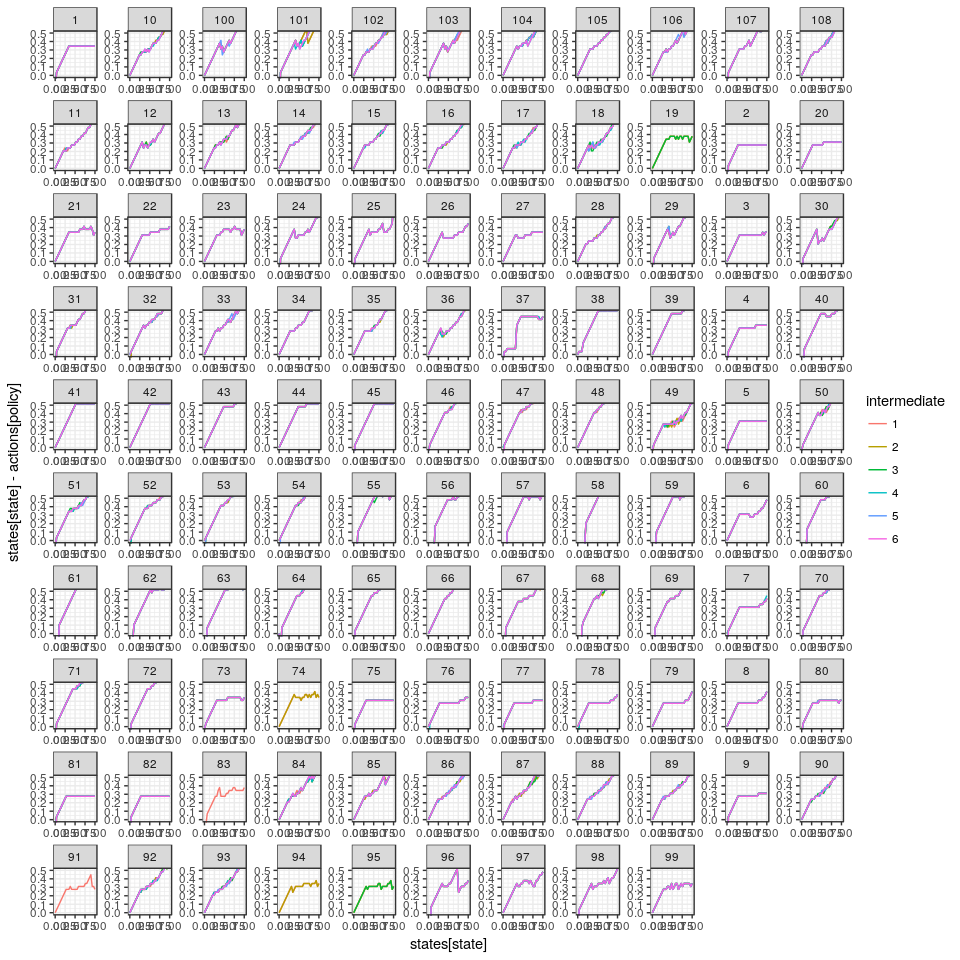

```r
library(purrr)
library(ggplot2)
library(dplyr)
library(appl)
library(printr)
options(knitr.table.format = 'markdown')
theme_set(theme_bw())
```


```r
log_dir = "sethi-30"

# alphas <- original_alphas
# models <- original_models

meta <- meta_from_log(data.frame(cost = "none"), log_dir = log_dir)

alphas <- alphas_from_log(meta, log_dir = log_dir)
models <- models_from_log(meta)

states <- seq(meta[1,]$min_state, meta[1,]$max_state, len=meta[1,]$n_states)
actions <- seq(meta[1,]$min_action, meta[1,]$max_action, len=meta[1,]$n_action)
discount <- meta[1,]$discount

meta
```


|    |id           | load_time_sec| init_time_sec| run_time_sec| final_precision|end_condition            | n_states| n_obs| n_actions| discount|date                |   r| sigma_m| sigma_g|noise     |model  |    K|   C| precision| timeout| timeInterval| max_state| max_obs| max_action| min_state| min_obs| min_action|cost | beta|
|:---|:------------|-------------:|-------------:|------------:|---------------:|:------------------------|--------:|-----:|---------:|--------:|:-------------------|---:|-------:|-------:|:---------|:------|----:|---:|---------:|-------:|------------:|---------:|-------:|----------:|---------:|-------:|----------:|:----|----:|
|1   |4d896a6fe1df |          0.13|          5.48|     10009.10|       0.0000079|Preset timeout reached   |       30|    30|        30|     0.95|2016-10-27 08:27:14 | 0.5|     0.1|     0.5|lognormal |ricker | 0.75| 0.1|     1e-07|   10000|         2000|         1|       1|          1|         0|       0|          0|none |    0|
|2   |4d8b6a6fe1df |          0.17|          6.07|     10026.50|       0.0005666|Preset timeout reached   |       30|    30|        30|     0.95|2016-10-27 08:27:31 | 1.5|     0.1|     0.5|lognormal |ricker | 0.75| 0.1|     1e-07|   10000|         2000|         1|       1|          1|         0|       0|          0|none |    0|
|3   |4d846a6fe1df |          0.13|          5.64|     10034.20|       0.0006402|Preset timeout reached   |       30|    30|        30|     0.95|2016-10-27 08:27:38 | 1.0|     0.1|     0.3|lognormal |ricker | 0.75| 0.1|     1e-07|   10000|         2000|         1|       1|          1|         0|       0|          0|none |    0|
|4   |4d836a6fe1df |          0.17|          5.15|     10037.10|       0.0001550|Preset timeout reached   |       30|    30|        30|     0.95|2016-10-27 08:27:41 | 0.5|     0.1|     0.3|lognormal |ricker | 0.75| 0.1|     1e-07|   10000|         2000|         1|       1|          1|         0|       0|          0|none |    0|
|5   |4d8a6a6fe1df |          0.16|          5.88|     10040.00|       0.0002146|Preset timeout reached   |       30|    30|        30|     0.95|2016-10-27 08:27:45 | 1.0|     0.1|     0.5|lognormal |ricker | 0.75| 0.1|     1e-07|   10000|         2000|         1|       1|          1|         0|       0|          0|none |    0|
|6   |4d7e6a6fe1df |          0.20|          3.71|     10078.20|       0.0037034|Preset timeout reached   |       30|    30|        30|     0.95|2016-10-27 08:28:24 | 1.0|     0.1|     0.1|lognormal |ricker | 0.75| 0.1|     1e-07|   10000|         2000|         1|       1|          1|         0|       0|          0|none |    0|
|7   |4d7d6a6fe1df |          0.15|          3.21|     10085.30|       0.0011021|Preset timeout reached   |       30|    30|        30|     0.95|2016-10-27 08:28:30 | 0.5|     0.1|     0.1|lognormal |ricker | 0.75| 0.1|     1e-07|   10000|         2000|         1|       1|          1|         0|       0|          0|none |    0|
|8   |4d7f6a6fe1df |          0.12|          3.84|     10102.20|       0.0090997|Preset timeout reached   |       30|    30|        30|     0.95|2016-10-27 08:28:46 | 1.5|     0.1|     0.1|lognormal |ricker | 0.75| 0.1|     1e-07|   10000|         2000|         1|       1|          1|         0|       0|          0|none |    0|
|9   |4d856a6fe1df |          0.17|          5.57|     10137.30|       0.0019521|Preset timeout reached   |       30|    30|        30|     0.95|2016-10-27 08:29:21 | 1.5|     0.1|     0.3|lognormal |ricker | 0.75| 0.1|     1e-07|   10000|         2000|         1|       1|          1|         0|       0|          0|none |    0|
|10  |4d816a6fe1df |          0.16|          3.88|     10218.00|       0.2204070|Preset timeout reached   |       30|    30|        30|     0.95|2016-10-27 08:30:42 | 1.0|     0.5|     0.1|lognormal |ricker | 0.75| 0.1|     1e-07|   10000|         2000|         1|       1|          1|         0|       0|          0|none |    0|
|11  |4d8e6a6fe1df |          0.12|          7.09|     10225.80|       0.2974470|Preset timeout reached   |       30|    30|        30|     0.95|2016-10-27 08:30:50 | 1.5|     0.5|     0.5|lognormal |ricker | 0.75| 0.1|     1e-07|   10000|         2000|         1|       1|          1|         0|       0|          0|none |    0|
|12  |4d826a6fe1df |          0.16|          4.17|     10291.30|       0.4730880|Preset timeout reached   |       30|    30|        30|     0.95|2016-10-27 08:31:55 | 1.5|     0.5|     0.1|lognormal |ricker | 0.75| 0.1|     1e-07|   10000|         2000|         1|       1|          1|         0|       0|          0|none |    0|
|13  |4d806a6fe1df |          0.16|          3.24|     10353.40|       0.0638755|Preset timeout reached   |       30|    30|        30|     0.95|2016-10-27 08:32:57 | 0.5|     0.5|     0.1|lognormal |ricker | 0.75| 0.1|     1e-07|   10000|         2000|         1|       1|          1|         0|       0|          0|none |    0|
|14  |4d8c6a6fe1df |          0.17|          6.62|     10386.80|       0.0799298|Preset timeout reached   |       30|    30|        30|     0.95|2016-10-27 08:33:31 | 0.5|     0.5|     0.5|lognormal |ricker | 0.75| 0.1|     1e-07|   10000|         2000|         1|       1|          1|         0|       0|          0|none |    0|
|15  |4d866a6fe1df |          0.16|          6.16|     10492.10|       0.1069370|Preset timeout reached   |       30|    30|        30|     0.95|2016-10-27 08:35:16 | 0.5|     0.5|     0.3|lognormal |ricker | 0.75| 0.1|     1e-07|   10000|         2000|         1|       1|          1|         0|       0|          0|none |    0|
|16  |4d8d6a6fe1df |          0.12|          7.00|     10592.10|       0.2114060|Preset timeout reached   |       30|    30|        30|     0.95|2016-10-27 08:36:56 | 1.0|     0.5|     0.5|lognormal |ricker | 0.75| 0.1|     1e-07|   10000|         2000|         1|       1|          1|         0|       0|          0|none |    0|
|17  |4d876a6fe1df |          0.13|          6.40|     10793.50|       0.3368470|Preset timeout reached   |       30|    30|        30|     0.95|2016-10-27 08:40:17 | 1.0|     0.5|     0.3|lognormal |ricker | 0.75| 0.1|     1e-07|   10000|         2000|         1|       1|          1|         0|       0|          0|none |    0|
|18  |4d886a6fe1df |          0.13|          6.39|     11079.20|       0.5818910|Preset timeout reached   |       30|    30|        30|     0.95|2016-10-27 08:45:03 | 1.5|     0.5|     0.3|lognormal |ricker | 0.75| 0.1|     1e-07|   10000|         2000|         1|       1|          1|         0|       0|          0|none |    0|
|19  |4d891c136b14 |          0.12|          3.64|      5534.65|       0.0000001|target precision reached |       30|    30|        30|     0.95|2016-10-27 09:59:27 | 0.5|     0.1|     0.5|uniform   |ricker | 0.75| 0.1|     1e-07|   10000|         2000|         1|       1|          1|         0|       0|          0|none |    0|
|20  |4d8b1c136b14 |          0.14|          4.70|     10035.00|       0.0000156|Preset timeout reached   |       30|    30|        30|     0.95|2016-10-27 11:14:43 | 1.5|     0.1|     0.5|uniform   |ricker | 0.75| 0.1|     1e-07|   10000|         2000|         1|       1|          1|         0|       0|          0|none |    0|
|21  |4d831c136b14 |          0.17|          3.21|     10024.60|       0.0000003|Preset timeout reached   |       30|    30|        30|     0.95|2016-10-27 11:14:44 | 0.5|     0.1|     0.3|uniform   |ricker | 0.75| 0.1|     1e-07|   10000|         2000|         1|       1|          1|         0|       0|          0|none |    0|
|22  |4d841c136b14 |          0.15|          3.29|     10040.80|       0.0000365|Preset timeout reached   |       30|    30|        30|     0.95|2016-10-27 11:14:56 | 1.0|     0.1|     0.3|uniform   |ricker | 0.75| 0.1|     1e-07|   10000|         2000|         1|       1|          1|         0|       0|          0|none |    0|
|23  |4d8a1c136b14 |          0.16|          4.29|     10042.90|       0.0000529|Preset timeout reached   |       30|    30|        30|     0.95|2016-10-27 11:15:05 | 1.0|     0.1|     0.5|uniform   |ricker | 0.75| 0.1|     1e-07|   10000|         2000|         1|       1|          1|         0|       0|          0|none |    0|
|24  |4d7e1c136b14 |          0.15|          1.99|     10009.80|       0.0000253|Preset timeout reached   |       30|    30|        30|     0.95|2016-10-27 11:15:10 | 1.0|     0.1|     0.1|uniform   |ricker | 0.75| 0.1|     1e-07|   10000|         2000|         1|       1|          1|         0|       0|          0|none |    0|
|25  |4d7d1c136b14 |          0.14|          1.95|     10007.90|       0.0000125|Preset timeout reached   |       30|    30|        30|     0.95|2016-10-27 11:15:15 | 0.5|     0.1|     0.1|uniform   |ricker | 0.75| 0.1|     1e-07|   10000|         2000|         1|       1|          1|         0|       0|          0|none |    0|
|26  |4d7f1c136b14 |          0.15|          2.31|     10035.10|       0.0014074|Preset timeout reached   |       30|    30|        30|     0.95|2016-10-27 11:15:58 | 1.5|     0.1|     0.1|uniform   |ricker | 0.75| 0.1|     1e-07|   10000|         2000|         1|       1|          1|         0|       0|          0|none |    0|
|27  |4d851c136b14 |          0.15|          3.87|     10052.80|       0.0001904|Preset timeout reached   |       30|    30|        30|     0.95|2016-10-27 11:16:51 | 1.5|     0.1|     0.3|uniform   |ricker | 0.75| 0.1|     1e-07|   10000|         2000|         1|       1|          1|         0|       0|          0|none |    0|
|28  |4d8e1c136b14 |          0.19|          5.24|     10053.10|       0.0946918|Preset timeout reached   |       30|    30|        30|     0.95|2016-10-27 11:18:20 | 1.5|     0.5|     0.5|uniform   |ricker | 0.75| 0.1|     1e-07|   10000|         2000|         1|       1|          1|         0|       0|          0|none |    0|
|29  |4d811c136b14 |          0.11|          2.14|     10072.80|       0.0664524|Preset timeout reached   |       30|    30|        30|     0.95|2016-10-27 11:18:32 | 1.0|     0.5|     0.1|uniform   |ricker | 0.75| 0.1|     1e-07|   10000|         2000|         1|       1|          1|         0|       0|          0|none |    0|
|30  |4d821c136b14 |          0.14|          2.55|     10024.50|       0.2270530|Preset timeout reached   |       30|    30|        30|     0.95|2016-10-27 11:18:57 | 1.5|     0.5|     0.1|uniform   |ricker | 0.75| 0.1|     1e-07|   10000|         2000|         1|       1|          1|         0|       0|          0|none |    0|
|31  |4d801c136b14 |          0.11|          2.13|     10082.50|       0.0464885|Preset timeout reached   |       30|    30|        30|     0.95|2016-10-27 11:20:57 | 0.5|     0.5|     0.1|uniform   |ricker | 0.75| 0.1|     1e-07|   10000|         2000|         1|       1|          1|         0|       0|          0|none |    0|
|32  |4d8c1c136b14 |          0.12|          4.04|     10053.70|       0.0350276|Preset timeout reached   |       30|    30|        30|     0.95|2016-10-27 11:21:03 | 0.5|     0.5|     0.5|uniform   |ricker | 0.75| 0.1|     1e-07|   10000|         2000|         1|       1|          1|         0|       0|          0|none |    0|
|33  |4d861c136b14 |          0.11|          3.24|     10047.90|       0.0488994|Preset timeout reached   |       30|    30|        30|     0.95|2016-10-27 11:22:41 | 0.5|     0.5|     0.3|uniform   |ricker | 0.75| 0.1|     1e-07|   10000|         2000|         1|       1|          1|         0|       0|          0|none |    0|
|34  |4d8d1c136b14 |          0.15|          4.71|     10103.40|       0.0723819|Preset timeout reached   |       30|    30|        30|     0.95|2016-10-27 11:25:17 | 1.0|     0.5|     0.5|uniform   |ricker | 0.75| 0.1|     1e-07|   10000|         2000|         1|       1|          1|         0|       0|          0|none |    0|
|35  |4d871c136b14 |          0.15|          3.75|     10125.30|       0.1434660|Preset timeout reached   |       30|    30|        30|     0.95|2016-10-27 11:29:00 | 1.0|     0.5|     0.3|uniform   |ricker | 0.75| 0.1|     1e-07|   10000|         2000|         1|       1|          1|         0|       0|          0|none |    0|
|36  |4d881c136b14 |          0.18|          4.48|     10099.90|       0.3022280|Preset timeout reached   |       30|    30|        30|     0.95|2016-10-27 11:33:20 | 1.5|     0.5|     0.3|uniform   |ricker | 0.75| 0.1|     1e-07|   10000|         2000|         1|       1|          1|         0|       0|          0|none |    0|
|37  |4d897c90b237 |          0.13|          6.20|     10072.70|       0.0006749|Preset timeout reached   |       30|    30|        30|     0.95|2016-10-27 12:47:19 | 0.5|     0.1|     0.5|lognormal |allen  | 0.75| 0.1|     1e-07|   10000|         2000|         1|       1|          1|         0|       0|          0|none |    0|
|38  |4d837c90b237 |          0.17|          5.45|     10057.00|       0.0000590|Preset timeout reached   |       30|    30|        30|     0.95|2016-10-27 14:02:22 | 0.5|     0.1|     0.3|lognormal |allen  | 0.75| 0.1|     1e-07|   10000|         2000|         1|       1|          1|         0|       0|          0|none |    0|
|39  |4d7e7c90b237 |          0.15|          3.15|     10032.70|       0.0023218|Preset timeout reached   |       30|    30|        30|     0.95|2016-10-27 14:02:25 | 1.0|     0.1|     0.1|lognormal |allen  | 0.75| 0.1|     1e-07|   10000|         2000|         1|       1|          1|         0|       0|          0|none |    0|
|40  |4d7d7c90b237 |          0.15|          2.96|     10043.50|       0.0007714|Preset timeout reached   |       30|    30|        30|     0.95|2016-10-27 14:02:40 | 0.5|     0.1|     0.1|lognormal |allen  | 0.75| 0.1|     1e-07|   10000|         2000|         1|       1|          1|         0|       0|          0|none |    0|
|41  |4d847c90b237 |          0.19|          5.56|     10078.90|       0.0001974|Preset timeout reached   |       30|    30|        30|     0.95|2016-10-27 14:02:56 | 1.0|     0.1|     0.3|lognormal |allen  | 0.75| 0.1|     1e-07|   10000|         2000|         1|       1|          1|         0|       0|          0|none |    0|
|42  |4d8a7c90b237 |          0.14|          5.95|     10104.70|       0.0001106|Preset timeout reached   |       30|    30|        30|     0.95|2016-10-27 14:03:30 | 1.0|     0.1|     0.5|lognormal |allen  | 0.75| 0.1|     1e-07|   10000|         2000|         1|       1|          1|         0|       0|          0|none |    0|
|43  |4d7f7c90b237 |          0.17|          3.31|     10051.10|       0.0046035|Preset timeout reached   |       30|    30|        30|     0.95|2016-10-27 14:03:31 | 1.5|     0.1|     0.1|lognormal |allen  | 0.75| 0.1|     1e-07|   10000|         2000|         1|       1|          1|         0|       0|          0|none |    0|
|44  |4d857c90b237 |          0.21|          5.88|     10060.10|       0.0005794|Preset timeout reached   |       30|    30|        30|     0.95|2016-10-27 14:04:33 | 1.5|     0.1|     0.3|lognormal |allen  | 0.75| 0.1|     1e-07|   10000|         2000|         1|       1|          1|         0|       0|          0|none |    0|
|45  |4d8b7c90b237 |          0.20|          6.00|     10272.00|       0.0000142|Preset timeout reached   |       30|    30|        30|     0.95|2016-10-27 14:05:56 | 1.5|     0.1|     0.5|lognormal |allen  | 0.75| 0.1|     1e-07|   10000|         2000|         1|       1|          1|         0|       0|          0|none |    0|
|46  |4d817c90b237 |          0.19|          3.41|     10150.50|       0.1152940|Preset timeout reached   |       30|    30|        30|     0.95|2016-10-27 14:07:44 | 1.0|     0.5|     0.1|lognormal |allen  | 0.75| 0.1|     1e-07|   10000|         2000|         1|       1|          1|         0|       0|          0|none |    0|
|47  |4d8e7c90b237 |          0.21|          6.98|     10277.50|       0.0740243|Preset timeout reached   |       30|    30|        30|     0.95|2016-10-27 14:09:39 | 1.5|     0.5|     0.5|lognormal |allen  | 0.75| 0.1|     1e-07|   10000|         2000|         1|       1|          1|         0|       0|          0|none |    0|
|48  |4d827c90b237 |          0.17|          3.57|     10304.20|       0.1969560|Preset timeout reached   |       30|    30|        30|     0.95|2016-10-27 14:10:43 | 1.5|     0.5|     0.1|lognormal |allen  | 0.75| 0.1|     1e-07|   10000|         2000|         1|       1|          1|         0|       0|          0|none |    0|
|49  |4d8c7c90b237 |          0.21|          6.62|     10382.80|       0.0330723|Preset timeout reached   |       30|    30|        30|     0.95|2016-10-27 14:14:07 | 0.5|     0.5|     0.5|lognormal |allen  | 0.75| 0.1|     1e-07|   10000|         2000|         1|       1|          1|         0|       0|          0|none |    0|
|50  |4d807c90b237 |          0.12|          3.10|     10392.40|       0.0446747|Preset timeout reached   |       30|    30|        30|     0.95|2016-10-27 14:14:11 | 0.5|     0.5|     0.1|lognormal |allen  | 0.75| 0.1|     1e-07|   10000|         2000|         1|       1|          1|         0|       0|          0|none |    0|
|51  |4d867c90b237 |          0.15|          6.04|     10350.90|       0.0269805|Preset timeout reached   |       30|    30|        30|     0.95|2016-10-27 14:15:13 | 0.5|     0.5|     0.3|lognormal |allen  | 0.75| 0.1|     1e-07|   10000|         2000|         1|       1|          1|         0|       0|          0|none |    0|
|52  |4d8d7c90b237 |          0.18|          6.67|     10253.00|       0.0306691|Preset timeout reached   |       30|    30|        30|     0.95|2016-10-27 14:16:11 | 1.0|     0.5|     0.5|lognormal |allen  | 0.75| 0.1|     1e-07|   10000|         2000|         1|       1|          1|         0|       0|          0|none |    0|
|53  |4d877c90b237 |          0.14|          6.45|     10298.90|       0.1202060|Preset timeout reached   |       30|    30|        30|     0.95|2016-10-27 14:20:40 | 1.0|     0.5|     0.3|lognormal |allen  | 0.75| 0.1|     1e-07|   10000|         2000|         1|       1|          1|         0|       0|          0|none |    0|
|54  |4d887c90b237 |          0.20|          6.62|     10661.60|       0.2203790|Preset timeout reached   |       30|    30|        30|     0.95|2016-10-27 14:31:03 | 1.5|     0.5|     0.3|lognormal |allen  | 0.75| 0.1|     1e-07|   10000|         2000|         1|       1|          1|         0|       0|          0|none |    0|
|55  |4d891f98703  |          0.12|          2.80|     10071.40|       0.0000017|Preset timeout reached   |       30|    30|        30|     0.95|2016-10-27 15:35:12 | 0.5|     0.1|     0.5|uniform   |allen  | 0.75| 0.1|     1e-07|   10000|         2000|         1|       1|          1|         0|       0|          0|none |    0|
|56  |4d7e1f98703  |          0.15|          1.97|     10008.00|       0.0000262|Preset timeout reached   |       30|    30|        30|     0.95|2016-10-27 16:49:14 | 1.0|     0.1|     0.1|uniform   |allen  | 0.75| 0.1|     1e-07|   10000|         2000|         1|       1|          1|         0|       0|          0|none |    0|
|57  |4d831f98703  |          0.17|          2.78|     10019.90|       0.0000364|Preset timeout reached   |       30|    30|        30|     0.95|2016-10-27 16:49:24 | 0.5|     0.1|     0.3|uniform   |allen  | 0.75| 0.1|     1e-07|   10000|         2000|         1|       1|          1|         0|       0|          0|none |    0|
|58  |4d7d1f98703  |          0.15|          2.07|     10004.80|       0.0000424|Preset timeout reached   |       30|    30|        30|     0.95|2016-10-27 16:49:26 | 0.5|     0.1|     0.1|uniform   |allen  | 0.75| 0.1|     1e-07|   10000|         2000|         1|       1|          1|         0|       0|          0|none |    0|
|59  |4d841f98703  |          0.14|          2.94|     10012.10|       0.0000302|Preset timeout reached   |       30|    30|        30|     0.95|2016-10-27 16:49:50 | 1.0|     0.1|     0.3|uniform   |allen  | 0.75| 0.1|     1e-07|   10000|         2000|         1|       1|          1|         0|       0|          0|none |    0|
|60  |4d7f1f98703  |          0.09|          2.18|     10007.00|       0.0001174|Preset timeout reached   |       30|    30|        30|     0.95|2016-10-27 16:50:19 | 1.5|     0.1|     0.1|uniform   |allen  | 0.75| 0.1|     1e-07|   10000|         2000|         1|       1|          1|         0|       0|          0|none |    0|
|61  |4d8a1f98703  |          0.14|          3.22|     10069.90|       0.0000340|Preset timeout reached   |       30|    30|        30|     0.95|2016-10-27 16:51:22 | 1.0|     0.1|     0.5|uniform   |allen  | 0.75| 0.1|     1e-07|   10000|         2000|         1|       1|          1|         0|       0|          0|none |    0|
|62  |4d851f98703  |          0.16|          3.07|     10047.20|       0.0000302|Preset timeout reached   |       30|    30|        30|     0.95|2016-10-27 16:52:01 | 1.5|     0.1|     0.3|uniform   |allen  | 0.75| 0.1|     1e-07|   10000|         2000|         1|       1|          1|         0|       0|          0|none |    0|
|63  |4d8b1f98703  |          0.17|          3.53|     10033.60|       0.0000053|Preset timeout reached   |       30|    30|        30|     0.95|2016-10-27 16:53:12 | 1.5|     0.1|     0.5|uniform   |allen  | 0.75| 0.1|     1e-07|   10000|         2000|         1|       1|          1|         0|       0|          0|none |    0|
|64  |4d811f98703  |          0.15|          2.25|     10066.70|       0.1170050|Preset timeout reached   |       30|    30|        30|     0.95|2016-10-27 16:55:33 | 1.0|     0.5|     0.1|uniform   |allen  | 0.75| 0.1|     1e-07|   10000|         2000|         1|       1|          1|         0|       0|          0|none |    0|
|65  |4d8e1f98703  |          0.16|          3.91|     10091.20|       0.0483267|Preset timeout reached   |       30|    30|        30|     0.95|2016-10-27 16:57:53 | 1.5|     0.5|     0.5|uniform   |allen  | 0.75| 0.1|     1e-07|   10000|         2000|         1|       1|          1|         0|       0|          0|none |    0|
|66  |4d821f98703  |          0.15|          2.59|     10089.90|       0.1208720|Preset timeout reached   |       30|    30|        30|     0.95|2016-10-27 16:58:56 | 1.5|     0.5|     0.1|uniform   |allen  | 0.75| 0.1|     1e-07|   10000|         2000|         1|       1|          1|         0|       0|          0|none |    0|
|67  |4d8c1f98703  |          0.16|          3.20|     10043.30|       0.0119133|Preset timeout reached   |       30|    30|        30|     0.95|2016-10-27 17:01:33 | 0.5|     0.5|     0.5|uniform   |allen  | 0.75| 0.1|     1e-07|   10000|         2000|         1|       1|          1|         0|       0|          0|none |    0|
|68  |4d801f98703  |          0.14|          2.85|     10043.10|       0.0594553|Preset timeout reached   |       30|    30|        30|     0.95|2016-10-27 17:01:36 | 0.5|     0.5|     0.1|uniform   |allen  | 0.75| 0.1|     1e-07|   10000|         2000|         1|       1|          1|         0|       0|          0|none |    0|
|69  |4d861f98703  |          0.18|          2.94|     10036.90|       0.0284785|Preset timeout reached   |       30|    30|        30|     0.95|2016-10-27 17:02:32 | 0.5|     0.5|     0.3|uniform   |allen  | 0.75| 0.1|     1e-07|   10000|         2000|         1|       1|          1|         0|       0|          0|none |    0|
|70  |4d8d1f98703  |          0.16|          3.42|     10075.20|       0.0347156|Preset timeout reached   |       30|    30|        30|     0.95|2016-10-27 17:04:11 | 1.0|     0.5|     0.5|uniform   |allen  | 0.75| 0.1|     1e-07|   10000|         2000|         1|       1|          1|         0|       0|          0|none |    0|
|71  |4d871f98703  |          0.14|          3.12|     10142.40|       0.0752120|Preset timeout reached   |       30|    30|        30|     0.95|2016-10-27 17:09:47 | 1.0|     0.5|     0.3|uniform   |allen  | 0.75| 0.1|     1e-07|   10000|         2000|         1|       1|          1|         0|       0|          0|none |    0|
|72  |4d881f98703  |          0.17|          3.33|     10076.00|       0.1443490|Preset timeout reached   |       30|    30|        30|     0.95|2016-10-27 17:19:03 | 1.5|     0.5|     0.3|uniform   |allen  | 0.75| 0.1|     1e-07|   10000|         2000|         1|       1|          1|         0|       0|          0|none |    0|
|73  |4d8974e760d7 |          0.13|          5.35|     10005.80|       0.0000414|Preset timeout reached   |       30|    30|        30|     0.95|2016-10-27 18:22:00 | 0.5|     0.1|     0.5|lognormal |bh     | 0.75| 0.1|     1e-07|   10000|         2000|         1|       1|          1|         0|       0|          0|none |    0|
|74  |4d8947401d01 |          0.10|          3.49|      2081.02|       0.0000001|target precision reached |       30|    30|        30|     0.95|2016-10-27 18:56:41 | 0.5|     0.1|     0.5|uniform   |bh     | 0.75| 0.1|     1e-07|   10000|         2000|         1|       1|          1|         0|       0|          0|none |    0|
|75  |4d8374e760d7 |          0.18|          5.24|     10010.60|       0.0000468|Preset timeout reached   |       30|    30|        30|     0.95|2016-10-27 19:36:15 | 0.5|     0.1|     0.3|lognormal |bh     | 0.75| 0.1|     1e-07|   10000|         2000|         1|       1|          1|         0|       0|          0|none |    0|
|76  |4d7d74e760d7 |          0.19|          2.91|     10030.50|       0.0005701|Preset timeout reached   |       30|    30|        30|     0.95|2016-10-27 19:36:39 | 0.5|     0.1|     0.1|lognormal |bh     | 0.75| 0.1|     1e-07|   10000|         2000|         1|       1|          1|         0|       0|          0|none |    0|
|77  |4d8474e760d7 |          0.18|          5.26|     10014.10|       0.0001631|Preset timeout reached   |       30|    30|        30|     0.95|2016-10-27 19:36:43 | 1.0|     0.1|     0.3|lognormal |bh     | 0.75| 0.1|     1e-07|   10000|         2000|         1|       1|          1|         0|       0|          0|none |    0|
|78  |4d7e74e760d7 |          0.19|          3.14|     10076.00|       0.0012355|Preset timeout reached   |       30|    30|        30|     0.95|2016-10-27 19:37:11 | 1.0|     0.1|     0.1|lognormal |bh     | 0.75| 0.1|     1e-07|   10000|         2000|         1|       1|          1|         0|       0|          0|none |    0|
|79  |4d7f74e760d7 |          0.18|          3.50|     10044.70|       0.0018541|Preset timeout reached   |       30|    30|        30|     0.95|2016-10-27 19:37:45 | 1.5|     0.1|     0.1|lognormal |bh     | 0.75| 0.1|     1e-07|   10000|         2000|         1|       1|          1|         0|       0|          0|none |    0|
|80  |4d8a74e760d7 |          0.20|          5.64|     10011.20|       0.0000751|Preset timeout reached   |       30|    30|        30|     0.95|2016-10-27 19:38:12 | 1.0|     0.1|     0.5|lognormal |bh     | 0.75| 0.1|     1e-07|   10000|         2000|         1|       1|          1|         0|       0|          0|none |    0|
|81  |4d8574e760d7 |          0.19|          5.53|     10039.70|       0.0003006|Preset timeout reached   |       30|    30|        30|     0.95|2016-10-27 19:39:19 | 1.5|     0.1|     0.3|lognormal |bh     | 0.75| 0.1|     1e-07|   10000|         2000|         1|       1|          1|         0|       0|          0|none |    0|
|82  |4d8b74e760d7 |          0.18|          5.73|     10051.50|       0.0000317|Preset timeout reached   |       30|    30|        30|     0.95|2016-10-27 19:40:41 | 1.5|     0.1|     0.5|lognormal |bh     | 0.75| 0.1|     1e-07|   10000|         2000|         1|       1|          1|         0|       0|          0|none |    0|
|83  |4d8347401d01 |          0.16|          2.95|       267.91|       0.0000001|target precision reached |       30|    30|        30|     0.95|2016-10-27 19:40:44 | 0.5|     0.1|     0.3|uniform   |bh     | 0.75| 0.1|     1e-07|   10000|         2000|         1|       1|          1|         0|       0|          0|none |    0|
|84  |4d8174e760d7 |          0.17|          3.36|     10272.70|       0.0832854|Preset timeout reached   |       30|    30|        30|     0.95|2016-10-27 19:46:44 | 1.0|     0.5|     0.1|lognormal |bh     | 0.75| 0.1|     1e-07|   10000|         2000|         1|       1|          1|         0|       0|          0|none |    0|
|85  |4d8074e760d7 |          0.14|          3.13|     10126.20|       0.0423500|Preset timeout reached   |       30|    30|        30|     0.95|2016-10-27 19:50:21 | 0.5|     0.5|     0.1|lognormal |bh     | 0.75| 0.1|     1e-07|   10000|         2000|         1|       1|          1|         0|       0|          0|none |    0|
|86  |4d8e74e760d7 |          0.20|          6.93|     10357.30|       0.1653190|Preset timeout reached   |       30|    30|        30|     0.95|2016-10-27 19:50:29 | 1.5|     0.5|     0.5|lognormal |bh     | 0.75| 0.1|     1e-07|   10000|         2000|         1|       1|          1|         0|       0|          0|none |    0|
|87  |4d8274e760d7 |          0.13|          3.55|     10296.60|       0.1270010|Preset timeout reached   |       30|    30|        30|     0.95|2016-10-27 19:50:31 | 1.5|     0.5|     0.1|lognormal |bh     | 0.75| 0.1|     1e-07|   10000|         2000|         1|       1|          1|         0|       0|          0|none |    0|
|88  |4d8d74e760d7 |          0.20|          6.72|     10380.20|       0.1180580|Preset timeout reached   |       30|    30|        30|     0.95|2016-10-27 19:57:09 | 1.0|     0.5|     0.5|lognormal |bh     | 0.75| 0.1|     1e-07|   10000|         2000|         1|       1|          1|         0|       0|          0|none |    0|
|89  |4d8c74e760d7 |          0.22|          6.36|     10541.20|       0.0517109|Preset timeout reached   |       30|    30|        30|     0.95|2016-10-27 19:57:12 | 0.5|     0.5|     0.5|lognormal |bh     | 0.75| 0.1|     1e-07|   10000|         2000|         1|       1|          1|         0|       0|          0|none |    0|
|90  |4d8774e760d7 |          0.13|          6.15|     10484.60|       0.1427370|Preset timeout reached   |       30|    30|        30|     0.95|2016-10-27 20:04:29 | 1.0|     0.5|     0.3|lognormal |bh     | 0.75| 0.1|     1e-07|   10000|         2000|         1|       1|          1|         0|       0|          0|none |    0|
|91  |4d8447401d01 |          0.12|          3.13|      1689.78|       0.0000001|target precision reached |       30|    30|        30|     0.95|2016-10-27 20:04:54 | 1.0|     0.1|     0.3|uniform   |bh     | 0.75| 0.1|     1e-07|   10000|         2000|         1|       1|          1|         0|       0|          0|none |    0|
|92  |4d8674e760d7 |          0.15|          6.15|     11057.30|       0.0711317|Preset timeout reached   |       30|    30|        30|     0.95|2016-10-27 20:06:48 | 0.5|     0.5|     0.3|lognormal |bh     | 0.75| 0.1|     1e-07|   10000|         2000|         1|       1|          1|         0|       0|          0|none |    0|
|93  |4d8874e760d7 |          0.20|          6.43|     10683.50|       0.2191590|Preset timeout reached   |       30|    30|        30|     0.95|2016-10-27 20:17:04 | 1.5|     0.5|     0.3|lognormal |bh     | 0.75| 0.1|     1e-07|   10000|         2000|         1|       1|          1|         0|       0|          0|none |    0|
|94  |4d8547401d01 |          0.16|          2.99|      2513.28|       0.0000001|target precision reached |       30|    30|        30|     0.95|2016-10-27 20:21:13 | 1.5|     0.1|     0.3|uniform   |bh     | 0.75| 0.1|     1e-07|   10000|         2000|         1|       1|          1|         0|       0|          0|none |    0|
|95  |4d8a47401d01 |          0.14|          3.93|      5357.78|       0.0000001|target precision reached |       30|    30|        30|     0.95|2016-10-27 21:07:29 | 1.0|     0.1|     0.5|uniform   |bh     | 0.75| 0.1|     1e-07|   10000|         2000|         1|       1|          1|         0|       0|          0|none |    0|
|96  |4d7d47401d01 |          0.13|          1.98|     10007.00|       0.0000033|Preset timeout reached   |       30|    30|        30|     0.95|2016-10-27 22:23:24 | 0.5|     0.1|     0.1|uniform   |bh     | 0.75| 0.1|     1e-07|   10000|         2000|         1|       1|          1|         0|       0|          0|none |    0|
|98  |4d7e47401d01 |          0.15|          2.01|     10011.80|       0.0000252|Preset timeout reached   |       30|    30|        30|     0.95|2016-10-27 22:24:00 | 1.0|     0.1|     0.1|uniform   |bh     | 0.75| 0.1|     1e-07|   10000|         2000|         1|       1|          1|         0|       0|          0|none |    0|
|99  |4d7f47401d01 |          0.09|          2.00|     10010.90|       0.0000210|Preset timeout reached   |       30|    30|        30|     0.95|2016-10-27 22:24:33 | 1.5|     0.1|     0.1|uniform   |bh     | 0.75| 0.1|     1e-07|   10000|         2000|         1|       1|          1|         0|       0|          0|none |    0|
|100 |4d8b47401d01 |          0.15|          3.97|     10041.10|       0.0000001|Preset timeout reached   |       30|    30|        30|     0.95|2016-10-27 22:28:00 | 1.5|     0.1|     0.5|uniform   |bh     | 0.75| 0.1|     1e-07|   10000|         2000|         1|       1|          1|         0|       0|          0|none |    0|
|101 |4d8147401d01 |          0.16|          2.16|     10046.80|       0.1010590|Preset timeout reached   |       30|    30|        30|     0.95|2016-10-27 22:34:10 | 1.0|     0.5|     0.1|uniform   |bh     | 0.75| 0.1|     1e-07|   10000|         2000|         1|       1|          1|         0|       0|          0|none |    0|
|102 |4d8047401d01 |          0.17|          2.01|     10026.30|       0.0858943|Preset timeout reached   |       30|    30|        30|     0.95|2016-10-27 22:37:26 | 0.5|     0.5|     0.1|uniform   |bh     | 0.75| 0.1|     1e-07|   10000|         2000|         1|       1|          1|         0|       0|          0|none |    0|
|103 |4d8e47401d01 |          0.18|          4.23|     10050.80|       0.0406577|Preset timeout reached   |       30|    30|        30|     0.95|2016-10-27 22:37:58 | 1.5|     0.5|     0.5|uniform   |bh     | 0.75| 0.1|     1e-07|   10000|         2000|         1|       1|          1|         0|       0|          0|none |    0|
|104 |4d8247401d01 |          0.14|          2.19|     10075.80|       0.0727492|Preset timeout reached   |       30|    30|        30|     0.95|2016-10-27 22:38:26 | 1.5|     0.5|     0.1|uniform   |bh     | 0.75| 0.1|     1e-07|   10000|         2000|         1|       1|          1|         0|       0|          0|none |    0|
|105 |4d8c47401d01 |          0.20|          3.88|     10025.50|       0.0226760|Preset timeout reached   |       30|    30|        30|     0.95|2016-10-27 22:44:16 | 0.5|     0.5|     0.5|uniform   |bh     | 0.75| 0.1|     1e-07|   10000|         2000|         1|       1|          1|         0|       0|          0|none |    0|
|106 |4d8d47401d01 |          0.17|          4.06|     10033.70|       0.0199901|Preset timeout reached   |       30|    30|        30|     0.95|2016-10-27 22:44:21 | 1.0|     0.5|     0.5|uniform   |bh     | 0.75| 0.1|     1e-07|   10000|         2000|         1|       1|          1|         0|       0|          0|none |    0|
|107 |4d8747401d01 |          0.14|          3.27|     10030.70|       0.0537964|Preset timeout reached   |       30|    30|        30|     0.95|2016-10-27 22:51:37 | 1.0|     0.5|     0.3|uniform   |bh     | 0.75| 0.1|     1e-07|   10000|         2000|         1|       1|          1|         0|       0|          0|none |    0|
|108 |4d8647401d01 |          0.13|          3.76|     10039.80|       0.0360409|Preset timeout reached   |       30|    30|        30|     0.95|2016-10-27 22:54:05 | 0.5|     0.5|     0.3|uniform   |bh     | 0.75| 0.1|     1e-07|   10000|         2000|         1|       1|          1|         0|       0|          0|none |    0|
|109 |4d8847401d01 |          0.10|          3.29|     10039.20|       0.0693843|Preset timeout reached   |       30|    30|        30|     0.95|2016-10-27 23:04:21 | 1.5|     0.5|     0.3|uniform   |bh     | 0.75| 0.1|     1e-07|   10000|         2000|         1|       1|          1|         0|       0|          0|none |    0|


## Det policy


```r
fs <- f_from_log(meta)

dets <- purrr::map_df(1:dim(meta)[[1]], function(i){ 
  f <- fs[[i]]
  S_star <- optimize(function(x) x / discount - f(x,0), c(min(states),max(states)))$minimum
  h <- pmax(states - S_star,  0)
  policy <- sapply(h, function(h) which.min((abs(h - actions))))
  det <- data.frame(policy, value = 1:length(states), state = 1:length(states))
}, .id = "model_id"
)
```


## Convergence testing


```r
inter <- appl:::intermediates_from_log(meta, log_dir = log_dir)

df1 <- 
purrr::map_df(1:length(models), function(j){
  alphas <- inter[[j]]
  m <- models[[j]]
  purrr::map_df(1:length(alphas), function(i)
    compute_policy(alphas[[i]], m$transition, m$observation, m$reward),
    .id = "intermediate") 
}, .id = "model_id")

df1 %>% 
  ggplot(aes(states[state], states[state] - actions[policy], col=intermediate)) + 
  geom_line() + 
  facet_wrap(~model_id, scales = "free") + 
  coord_cartesian(ylim = c(0,0.5))
```

<!-- -->

## Explore POMDP policy


```r
df <- purrr::map_df(1:length(models), function(i)
  compute_policy(alphas[[i]], models[[i]]$transition, models[[i]]$observation, models[[i]]$reward),
  .id = "model_id")

## Join to metadata table
meta$model_id <- as.character(1:length(models))

## Join to deterministic case
df2 <- bind_rows(
  left_join(df, meta, by = "model_id"),
  left_join(dets, meta, by = "model_id") %>% mutate(sigma_m = 0))
```


## Lognormal noise


```r
df2 %>% filter(r == 1, noise == "lognormal") %>% 
  ggplot(aes(states[state], states[state] - actions[policy], col = as.character(sigma_m))) +
  geom_line() +
  facet_grid(model ~ sigma_g, scales = "free") +
  coord_cartesian(ylim = c(0,0.8))
```

<!-- -->


## Uniform


```r
df2 %>% filter(r == 1, noise == "uniform") %>% 
  ggplot(aes(states[state], states[state] - actions[policy], col = as.character(sigma_m))) +
  geom_line() +
  facet_grid(model ~ sigma_g, scales = "free") +
  coord_cartesian(ylim = c(0,0.8))
```

<!-- -->


## Simulation


```r
x0 <- which.min(abs(0.33 - states))


get_det <- function(meta){
  f <- f_from_log(meta)[[1]]
  S_star <- optimize(function(x) x / discount - f(x,0), c(min(states),max(states)))$minimum
  h <- pmax(states - S_star,  0)
  sapply(h, function(h) which.min((abs(h - actions))))
}
```


```r
s1 <-  meta %>% filter(r == 1, sigma_m == 0.5, sigma_g == 0.5, model == "ricker", noise == "lognormal")
alpha <- alphas_from_log(s1, log_dir)[[1]]
m <- models_from_log(s1)[[1]]
det_policy <- get_det(meta)
```

Simulation in which belief over states is updated in each time step, used to determine a new policy, which is then used to choose the best action given the most recent observation.


```r
sim <- purrr::map_df(1:50, function(i) appl::sim_pomdp(m$transition, m$observation, m$reward, discount, x0 = x0, Tmax = 100, alpha = alpha)$df, .id = "rep")
```


Simulation in which the policy is not updated based on the most recent belief over states, but remains the policy given a uniform prior over belief states. 


```r
s <- compute_policy(alpha,m$transition, m$observation, m$reward)
sim2 <- purrr::map_df(1:50, function(i) mdplearning::mdp_planning(m$transition, m$reward, discount, x0 = x0, Tmax = 100, observation = m$observation, policy = s$policy), .id = "rep")
```


```r
sim3 <- purrr::map_df(1:50, function(i) mdplearning::mdp_planning(m$transition, m$reward, discount, x0 = x0, Tmax = 100, observation = m$observation, policy = det_policy), .id = "rep")
```


```r
df <- bind_rows(pomdp = sim, static = sim2, det = sim3, .id = "scenario")
df %>% group_by(scenario, rep) %>% summarise(value = sum(value)) %>%  group_by(scenario) %>% summarise(mean(value))
```


|scenario | mean(value)|
|:--------|-----------:|
|det      |    2.247820|
|pomdp    |    3.201206|
|static   |    3.296119|

```r
df %>% group_by(scenario, time) %>% summarise(value = mean(value), state = mean(state)) %>%
ggplot(aes(time, states[state], col = scenario)) + geom_line()
```

<!-- -->


## Small growth noise


```r
s1 <-  meta %>% filter(r == 1, sigma_m == 0.5, sigma_g == 0.1, model == "ricker", noise == "lognormal")
alpha <- alphas_from_log(s1, log_dir)[[1]]
m <- models_from_log(s1)[[1]]
det_policy <- get_det(meta)


sim <- purrr::map_df(1:50, function(i) appl::sim_pomdp(m$transition, m$observation, m$reward, discount, x0 = x0, Tmax = 100, alpha = alpha)$df, .id = "rep")
s <- compute_policy(alpha,m$transition, m$observation, m$reward)
sim2 <- purrr::map_df(1:50, function(i) mdplearning::mdp_planning(m$transition, m$reward, discount, x0 = x0, Tmax = 100, observation = m$observation, policy = s$policy), .id = "rep")
sim3 <- purrr::map_df(1:50, function(i) mdplearning::mdp_planning(m$transition, m$reward, discount, x0 = x0, Tmax = 100, observation = m$observation, policy = det_policy), .id = "rep")

df <- bind_rows(pomdp = sim, static = sim2, det = sim3, .id = "scenario")
df %>% group_by(scenario, rep) %>% summarise(value = sum(value)) %>%  group_by(scenario) %>% summarise(mean(value))
```


|scenario | mean(value)|
|:--------|-----------:|
|det      |    1.697230|
|pomdp    |    4.151997|
|static   |    3.833979|

```r
df %>% group_by(scenario, time) %>% summarise(value = mean(value), state = mean(state)) %>%
ggplot(aes(time, states[state], col = scenario)) + geom_line()
```

<!-- -->


------

## Policy as a function of prior:

Policy is much more conservative when the prior belief is skewed towards small stock sizes, and more aggressive when the policy is skewed towards larger ones:


```r
K_i <- which.min(abs(.66 - states))

s1 <-  meta %>% filter(r == 1, sigma_m == 0.1, sigma_g == 0.1, model == "ricker", noise == "lognormal")
alpha <- alphas_from_log(s1, log_dir)[[1]]
m <- models_from_log(s1)[[1]]


unif <- compute_policy(alpha, m$transition, m$observation, m$reward)
low <- compute_policy(alpha, m$transition, m$observation, m$reward, state_prior = m$observation[,5,1])
high <- compute_policy(alpha, m$transition, m$observation, m$reward, state_prior = m$observation[,K_i,1])

bind_rows(unif = unif, low = low, high = high, .id = "prior") %>% 
  ggplot(aes(states[state], states[state] - actions[policy], col = prior)) + 
  geom_line() +
  coord_cartesian(ylim = c(0,0.8))
```

<!-- -->

Priors:


```r
bind_rows(unif = data.frame(state = states, probability = rep(1, length(states))/length(states)),
          low = data.frame(state = states, probability = m$observation[,5,1]),
          high = data.frame(state = states, probability = m$observation[,K_i,1]),
          .id = "prior") %>%
  ggplot(aes(state,probability, col=prior)) + geom_line()
```

<!-- -->


