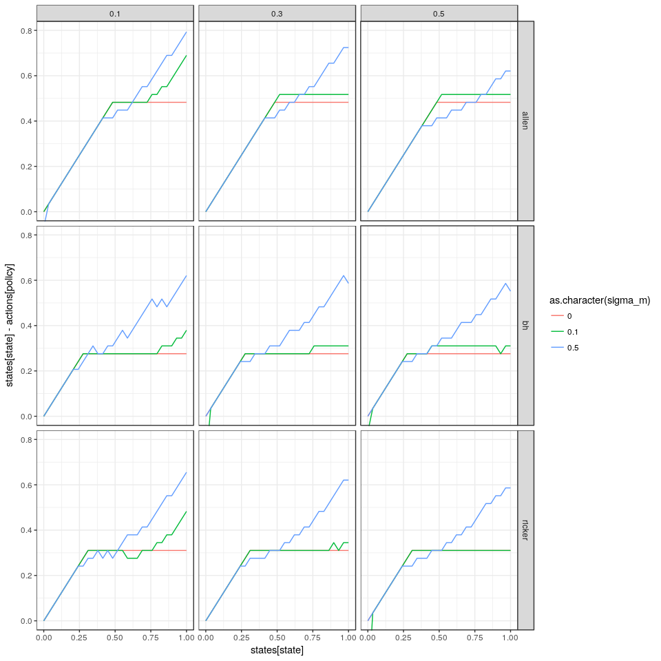

```r
library(purrr)
library(ggplot2)
library(dplyr)
library(appl)
library(printr)
options(knitr.table.format = 'markdown')
```


```r
log_dir = "sethi-50-states"

# alphas <- original_alphas
# models <- original_models

meta <- meta_from_log(data.frame(cost = "none"), log_dir = log_dir)

alphas <- alphas_from_log(meta, log_dir = log_dir)
models <- models_from_log(meta)

states <- seq(meta[1,]$min_state, meta[1,]$max_state, len=meta[1,]$n_states)
actions <- seq(meta[1,]$min_action, meta[1,]$max_action, len=meta[1,]$n_action)
discount <- meta[1,]$discount

meta
```


|    |id          | load_time_sec| init_time_sec| run_time_sec| final_precision|end_condition          | n_states| n_obs| n_actions| discount|date                |   r| sigma_m| sigma_g|noise     |model  |    K|   C| precision| timeout| timeInterval| max_state| max_obs| max_action| min_state| min_obs| min_action|cost | beta|
|:---|:-----------|-------------:|-------------:|------------:|---------------:|:----------------------|--------:|-----:|---------:|--------:|:-------------------|---:|-------:|-------:|:---------|:------|----:|---:|---------:|-------:|------------:|---------:|-------:|----------:|---------:|-------:|----------:|:----|----:|
|1   |28a2e9ec67  |          0.59|         29.99|      10142.0|       0.0015467|Preset timeout reached |       50|    50|        50|     0.95|2016-10-21 21:53:06 | 0.5|     0.1|     0.1|lognormal |ricker | 0.66| 0.1|     1e-07|   10000|         2000|         1|       1|          1|         0|       0|          0|none |    0|
|2   |28b2e9ec67  |          0.66|         32.82|      10140.4|       0.0052886|Preset timeout reached |       50|    50|        50|     0.95|2016-10-21 21:53:07 | 1.0|     0.1|     0.1|lognormal |ricker | 0.66| 0.1|     1e-07|   10000|         2000|         1|       1|          1|         0|       0|          0|none |    0|
|3   |2902e9ec67  |          0.62|         55.83|      10275.2|       0.0002285|Preset timeout reached |       50|    50|        50|     0.95|2016-10-21 21:55:21 | 0.5|     0.1|     0.3|lognormal |ricker | 0.66| 0.1|     1e-07|   10000|         2000|         1|       1|          1|         0|       0|          0|none |    0|
|4   |28c2e9ec67  |          0.63|         38.72|      10282.7|       0.0142952|Preset timeout reached |       50|    50|        50|     0.95|2016-10-21 21:55:26 | 1.5|     0.1|     0.1|lognormal |ricker | 0.66| 0.1|     1e-07|   10000|         2000|         1|       1|          1|         0|       0|          0|none |    0|
|5   |2922e9ec67  |          0.71|         60.17|      10312.5|       0.0047359|Preset timeout reached |       50|    50|        50|     0.95|2016-10-21 21:55:56 | 1.5|     0.1|     0.3|lognormal |ricker | 0.66| 0.1|     1e-07|   10000|         2000|         1|       1|          1|         0|       0|          0|none |    0|
|6   |2912e9ec67  |          0.67|         59.72|      10463.4|       0.0013595|Preset timeout reached |       50|    50|        50|     0.95|2016-10-21 21:58:27 | 1.0|     0.1|     0.3|lognormal |ricker | 0.66| 0.1|     1e-07|   10000|         2000|         1|       1|          1|         0|       0|          0|none |    0|
|7   |28f2e9ec67  |          0.65|         43.61|      10837.0|       0.5101650|Preset timeout reached |       50|    50|        50|     0.95|2016-10-21 22:04:41 | 1.5|     0.5|     0.1|lognormal |ricker | 0.66| 0.1|     1e-07|   10000|         2000|         1|       1|          1|         0|       0|          0|none |    0|
|8   |28e2e9ec67  |          0.64|         37.05|      11083.2|       0.2403960|Preset timeout reached |       50|    50|        50|     0.95|2016-10-21 22:08:47 | 1.0|     0.5|     0.1|lognormal |ricker | 0.66| 0.1|     1e-07|   10000|         2000|         1|       1|          1|         0|       0|          0|none |    0|
|9   |28d2e9ec67  |          0.65|         33.64|      11091.4|       0.0713715|Preset timeout reached |       50|    50|        50|     0.95|2016-10-21 22:08:55 | 0.5|     0.5|     0.1|lognormal |ricker | 0.66| 0.1|     1e-07|   10000|         2000|         1|       1|          1|         0|       0|          0|none |    0|
|10  |2952e9ec67  |          0.73|         71.87|      11148.3|       0.6265260|Preset timeout reached |       50|    50|        50|     0.95|2016-10-21 22:09:52 | 1.5|     0.5|     0.3|lognormal |ricker | 0.66| 0.1|     1e-07|   10000|         2000|         1|       1|          1|         0|       0|          0|none |    0|
|11  |2942e9ec67  |          0.67|         69.20|      11644.7|       0.4110120|Preset timeout reached |       50|    50|        50|     0.95|2016-10-21 22:18:07 | 1.0|     0.5|     0.3|lognormal |ricker | 0.66| 0.1|     1e-07|   10000|         2000|         1|       1|          1|         0|       0|          0|none |    0|
|12  |2932e9ec67  |          0.72|         66.23|      12149.1|       0.1683720|Preset timeout reached |       50|    50|        50|     0.95|2016-10-21 22:26:31 | 0.5|     0.5|     0.3|lognormal |ricker | 0.66| 0.1|     1e-07|   10000|         2000|         1|       1|          1|         0|       0|          0|none |    0|
|13  |2905e6b24dc |          0.49|         15.13|      10028.5|       0.0000418|Preset timeout reached |       50|    50|        50|     0.95|2016-10-22 00:42:33 | 0.5|     0.1|     0.1|uniform   |ricker | 0.66| 0.1|     1e-07|   10000|         2000|         1|       1|          1|         0|       0|          0|none |    0|
|14  |2925e6b24dc |          0.52|         19.40|      10091.4|       0.0074457|Preset timeout reached |       50|    50|        50|     0.95|2016-10-22 00:44:11 | 1.5|     0.1|     0.1|uniform   |ricker | 0.66| 0.1|     1e-07|   10000|         2000|         1|       1|          1|         0|       0|          0|none |    0|
|15  |28c5e6b24dc |          0.70|         65.15|      10111.8|       0.0012980|Preset timeout reached |       50|    50|        50|     0.95|2016-10-22 00:44:17 | 1.5|     0.1|     0.5|lognormal |ricker | 0.66| 0.1|     1e-07|   10000|         2000|         1|       1|          1|         0|       0|          0|none |    0|
|16  |28a5e6b24dc |          0.74|         59.59|      10276.4|       0.0000530|Preset timeout reached |       50|    50|        50|     0.95|2016-10-22 00:44:41 | 0.5|     0.1|     0.5|lognormal |ricker | 0.66| 0.1|     1e-07|   10000|         2000|         1|       1|          1|         0|       0|          0|none |    0|
|17  |28b5e6b24dc |          0.75|         64.82|      10310.8|       0.0003163|Preset timeout reached |       50|    50|        50|     0.95|2016-10-22 00:45:18 | 1.0|     0.1|     0.5|lognormal |ricker | 0.66| 0.1|     1e-07|   10000|         2000|         1|       1|          1|         0|       0|          0|none |    0|
|18  |2915e6b24dc |          0.45|         16.96|      10038.8|       0.0028595|Preset timeout reached |       50|    50|        50|     0.95|2016-10-22 00:45:51 | 1.0|     0.1|     0.1|uniform   |ricker | 0.66| 0.1|     1e-07|   10000|         2000|         1|       1|          1|         0|       0|          0|none |    0|
|19  |2955e6b24dc |          0.55|         20.38|      10166.5|       0.2541070|Preset timeout reached |       50|    50|        50|     0.95|2016-10-22 00:59:25 | 1.5|     0.5|     0.1|uniform   |ricker | 0.66| 0.1|     1e-07|   10000|         2000|         1|       1|          1|         0|       0|          0|none |    0|
|20  |28f5e6b24dc |          0.67|         73.43|      10583.6|       0.3557160|Preset timeout reached |       50|    50|        50|     0.95|2016-10-22 01:01:21 | 1.5|     0.5|     0.5|lognormal |ricker | 0.66| 0.1|     1e-07|   10000|         2000|         1|       1|          1|         0|       0|          0|none |    0|
|21  |2945e6b24dc |          0.51|         16.67|      10110.5|       0.1565580|Preset timeout reached |       50|    50|        50|     0.95|2016-10-22 01:06:45 | 1.0|     0.5|     0.1|uniform   |ricker | 0.66| 0.1|     1e-07|   10000|         2000|         1|       1|          1|         0|       0|          0|none |    0|
|22  |2935e6b24dc |          0.53|         15.77|      10070.1|       0.0391630|Preset timeout reached |       50|    50|        50|     0.95|2016-10-22 01:14:29 | 0.5|     0.5|     0.1|uniform   |ricker | 0.66| 0.1|     1e-07|   10000|         2000|         1|       1|          1|         0|       0|          0|none |    0|
|23  |28e5e6b24dc |          0.74|         76.43|      11252.9|       0.2736970|Preset timeout reached |       50|    50|        50|     0.95|2016-10-22 01:16:38 | 1.0|     0.5|     0.5|lognormal |ricker | 0.66| 0.1|     1e-07|   10000|         2000|         1|       1|          1|         0|       0|          0|none |    0|
|24  |28d5e6b24dc |          0.66|         71.48|      11633.8|       0.1239940|Preset timeout reached |       50|    50|        50|     0.95|2016-10-22 01:23:06 | 0.5|     0.5|     0.5|lognormal |ricker | 0.66| 0.1|     1e-07|   10000|         2000|         1|       1|          1|         0|       0|          0|none |    0|
|25  |29078313f9a |          0.54|         31.94|      10081.6|       0.0000120|Preset timeout reached |       50|    50|        50|     0.95|2016-10-22 03:30:39 | 0.5|     0.1|     0.5|uniform   |ricker | 0.66| 0.1|     1e-07|   10000|         2000|         1|       1|          1|         0|       0|          0|none |    0|
|26  |28a78313f9a |          0.54|         26.41|      10081.3|       0.0001309|Preset timeout reached |       50|    50|        50|     0.95|2016-10-22 03:32:47 | 0.5|     0.1|     0.3|uniform   |ricker | 0.66| 0.1|     1e-07|   10000|         2000|         1|       1|          1|         0|       0|          0|none |    0|
|27  |28c78313f9a |          0.53|         34.39|      10148.8|       0.0019422|Preset timeout reached |       50|    50|        50|     0.95|2016-10-22 03:33:30 | 1.5|     0.1|     0.3|uniform   |ricker | 0.66| 0.1|     1e-07|   10000|         2000|         1|       1|          1|         0|       0|          0|none |    0|
|28  |28b78313f9a |          0.58|         29.70|      10111.5|       0.0005513|Preset timeout reached |       50|    50|        50|     0.95|2016-10-22 03:33:54 | 1.0|     0.1|     0.3|uniform   |ricker | 0.66| 0.1|     1e-07|   10000|         2000|         1|       1|          1|         0|       0|          0|none |    0|
|29  |29278313f9a |          0.56|         45.44|      10177.4|       0.0008040|Preset timeout reached |       50|    50|        50|     0.95|2016-10-22 03:33:54 | 1.5|     0.1|     0.5|uniform   |ricker | 0.66| 0.1|     1e-07|   10000|         2000|         1|       1|          1|         0|       0|          0|none |    0|
|30  |29178313f9a |          0.56|         41.08|      10109.7|       0.0007169|Preset timeout reached |       50|    50|        50|     0.95|2016-10-22 03:34:26 | 1.0|     0.1|     0.5|uniform   |ricker | 0.66| 0.1|     1e-07|   10000|         2000|         1|       1|          1|         0|       0|          0|none |    0|
|31  |29578313f9a |          0.61|         52.36|      10302.9|       0.1999910|Preset timeout reached |       50|    50|        50|     0.95|2016-10-22 03:51:17 | 1.5|     0.5|     0.5|uniform   |ricker | 0.66| 0.1|     1e-07|   10000|         2000|         1|       1|          1|         0|       0|          0|none |    0|
|32  |28f78313f9a |          0.52|         37.44|      10207.1|       0.3065710|Preset timeout reached |       50|    50|        50|     0.95|2016-10-22 03:51:37 | 1.5|     0.5|     0.3|uniform   |ricker | 0.66| 0.1|     1e-07|   10000|         2000|         1|       1|          1|         0|       0|          0|none |    0|
|33  |29478313f9a |          0.48|         42.21|      10225.6|       0.0752927|Preset timeout reached |       50|    50|        50|     0.95|2016-10-22 03:57:19 | 1.0|     0.5|     0.5|uniform   |ricker | 0.66| 0.1|     1e-07|   10000|         2000|         1|       1|          1|         0|       0|          0|none |    0|
|34  |29378313f9a |          0.59|         34.83|      10138.9|       0.0230330|Preset timeout reached |       50|    50|        50|     0.95|2016-10-22 04:03:36 | 0.5|     0.5|     0.5|uniform   |ricker | 0.66| 0.1|     1e-07|   10000|         2000|         1|       1|          1|         0|       0|          0|none |    0|
|35  |28e78313f9a |          0.61|         31.78|      10372.5|       0.1302570|Preset timeout reached |       50|    50|        50|     0.95|2016-10-22 04:09:37 | 1.0|     0.5|     0.3|uniform   |ricker | 0.66| 0.1|     1e-07|   10000|         2000|         1|       1|          1|         0|       0|          0|none |    0|
|36  |28d78313f9a |          0.52|         28.25|      10136.3|       0.0440379|Preset timeout reached |       50|    50|        50|     0.95|2016-10-22 04:12:09 | 0.5|     0.5|     0.3|uniform   |ricker | 0.66| 0.1|     1e-07|   10000|         2000|         1|       1|          1|         0|       0|          0|none |    0|
|37  |290125d74c0 |          0.73|         58.50|      10139.2|       0.0005921|Preset timeout reached |       50|    50|        50|     0.95|2016-10-22 06:19:57 | 0.5|     0.1|     0.3|lognormal |allen  | 0.66| 0.1|     1e-07|   10000|         2000|         1|       1|          1|         0|       0|          0|none |    0|
|38  |28a125d74c0 |          0.67|         25.63|      10135.5|       0.0013346|Preset timeout reached |       50|    50|        50|     0.95|2016-10-22 06:22:03 | 0.5|     0.1|     0.1|lognormal |allen  | 0.66| 0.1|     1e-07|   10000|         2000|         1|       1|          1|         0|       0|          0|none |    0|
|39  |28c125d74c0 |          0.69|         30.77|      10116.1|       0.0063865|Preset timeout reached |       50|    50|        50|     0.95|2016-10-22 06:22:28 | 1.5|     0.1|     0.1|lognormal |allen  | 0.66| 0.1|     1e-07|   10000|         2000|         1|       1|          1|         0|       0|          0|none |    0|
|40  |28b125d74c0 |          0.66|         27.56|      10118.5|       0.0036932|Preset timeout reached |       50|    50|        50|     0.95|2016-10-22 06:22:52 | 1.0|     0.1|     0.1|lognormal |allen  | 0.66| 0.1|     1e-07|   10000|         2000|         1|       1|          1|         0|       0|          0|none |    0|
|41  |292125d74c0 |          0.68|         61.74|      10258.4|       0.0012014|Preset timeout reached |       50|    50|        50|     0.95|2016-10-22 06:25:10 | 1.5|     0.1|     0.3|lognormal |allen  | 0.66| 0.1|     1e-07|   10000|         2000|         1|       1|          1|         0|       0|          0|none |    0|
|42  |291125d74c0 |          0.69|         59.72|      10422.6|       0.0006109|Preset timeout reached |       50|    50|        50|     0.95|2016-10-22 06:28:26 | 1.0|     0.1|     0.3|lognormal |allen  | 0.66| 0.1|     1e-07|   10000|         2000|         1|       1|          1|         0|       0|          0|none |    0|
|43  |295125d74c0 |          0.65|         66.82|      10816.6|       0.2254380|Preset timeout reached |       50|    50|        50|     0.95|2016-10-22 06:51:51 | 1.5|     0.5|     0.3|lognormal |allen  | 0.66| 0.1|     1e-07|   10000|         2000|         1|       1|          1|         0|       0|          0|none |    0|
|44  |28f125d74c0 |          0.67|         33.08|      10938.8|       0.2057470|Preset timeout reached |       50|    50|        50|     0.95|2016-10-22 06:54:13 | 1.5|     0.5|     0.1|lognormal |allen  | 0.66| 0.1|     1e-07|   10000|         2000|         1|       1|          1|         0|       0|          0|none |    0|
|45  |293125d74c0 |          0.70|         64.05|      10442.6|       0.0250683|Preset timeout reached |       50|    50|        50|     0.95|2016-10-22 06:57:56 | 0.5|     0.5|     0.3|lognormal |allen  | 0.66| 0.1|     1e-07|   10000|         2000|         1|       1|          1|         0|       0|          0|none |    0|
|46  |28d125d74c0 |          0.70|         29.32|      10640.6|       0.0500706|Preset timeout reached |       50|    50|        50|     0.95|2016-10-22 07:09:47 | 0.5|     0.5|     0.1|lognormal |allen  | 0.66| 0.1|     1e-07|   10000|         2000|         1|       1|          1|         0|       0|          0|none |    0|
|47  |28e125d74c0 |          0.68|         31.68|      10955.1|       0.1235560|Preset timeout reached |       50|    50|        50|     0.95|2016-10-22 07:12:30 | 1.0|     0.5|     0.1|lognormal |allen  | 0.66| 0.1|     1e-07|   10000|         2000|         1|       1|          1|         0|       0|          0|none |    0|
|48  |294125d74c0 |          0.73|         67.90|      11695.9|       0.1335980|Preset timeout reached |       50|    50|        50|     0.95|2016-10-22 07:12:33 | 1.0|     0.5|     0.3|lognormal |allen  | 0.66| 0.1|     1e-07|   10000|         2000|         1|       1|          1|         0|       0|          0|none |    0|
|49  |29060fca97e |          0.49|         15.09|      10036.9|       0.0011420|Preset timeout reached |       50|    50|        50|     0.95|2016-10-22 09:07:18 | 0.5|     0.1|     0.1|uniform   |allen  | 0.66| 0.1|     1e-07|   10000|         2000|         1|       1|          1|         0|       0|          0|none |    0|
|50  |29260fca97e |          0.49|         15.56|      10027.7|       0.0032007|Preset timeout reached |       50|    50|        50|     0.95|2016-10-22 09:12:23 | 1.5|     0.1|     0.1|uniform   |allen  | 0.66| 0.1|     1e-07|   10000|         2000|         1|       1|          1|         0|       0|          0|none |    0|
|51  |28b60fca97e |          0.67|         65.70|      10198.4|       0.0002829|Preset timeout reached |       50|    50|        50|     0.95|2016-10-22 09:13:06 | 1.0|     0.1|     0.5|lognormal |allen  | 0.66| 0.1|     1e-07|   10000|         2000|         1|       1|          1|         0|       0|          0|none |    0|
|52  |28c60fca97e |          0.62|         61.46|      10254.2|       0.0000785|Preset timeout reached |       50|    50|        50|     0.95|2016-10-22 09:13:42 | 1.5|     0.1|     0.5|lognormal |allen  | 0.66| 0.1|     1e-07|   10000|         2000|         1|       1|          1|         0|       0|          0|none |    0|
|53  |28a60fca97e |          0.69|         67.23|      10368.7|       0.0044010|Preset timeout reached |       50|    50|        50|     0.95|2016-10-22 09:15:11 | 0.5|     0.1|     0.5|lognormal |allen  | 0.66| 0.1|     1e-07|   10000|         2000|         1|       1|          1|         0|       0|          0|none |    0|
|54  |29160fca97e |          0.46|         15.01|      10074.8|       0.0013932|Preset timeout reached |       50|    50|        50|     0.95|2016-10-22 09:16:25 | 1.0|     0.1|     0.1|uniform   |allen  | 0.66| 0.1|     1e-07|   10000|         2000|         1|       1|          1|         0|       0|          0|none |    0|
|55  |29560fca97e |          0.54|         16.80|      10248.3|       0.1798160|Preset timeout reached |       50|    50|        50|     0.95|2016-10-22 09:42:46 | 1.5|     0.5|     0.1|uniform   |allen  | 0.66| 0.1|     1e-07|   10000|         2000|         1|       1|          1|         0|       0|          0|none |    0|
|56  |29360fca97e |          0.51|         16.08|      10175.4|       0.0411634|Preset timeout reached |       50|    50|        50|     0.95|2016-10-22 09:47:37 | 0.5|     0.5|     0.1|uniform   |allen  | 0.66| 0.1|     1e-07|   10000|         2000|         1|       1|          1|         0|       0|          0|none |    0|
|57  |28f60fca97e |          0.65|         74.34|      10542.3|       0.0797948|Preset timeout reached |       50|    50|        50|     0.95|2016-10-22 09:50:14 | 1.5|     0.5|     0.5|lognormal |allen  | 0.66| 0.1|     1e-07|   10000|         2000|         1|       1|          1|         0|       0|          0|none |    0|
|58  |29460fca97e |          0.54|         16.08|      10215.2|       0.0833923|Preset timeout reached |       50|    50|        50|     0.95|2016-10-22 10:02:54 | 1.0|     0.5|     0.1|uniform   |allen  | 0.66| 0.1|     1e-07|   10000|         2000|         1|       1|          1|         0|       0|          0|none |    0|
|59  |28d60fca97e |          0.73|         70.80|      11516.3|       0.0372513|Preset timeout reached |       50|    50|        50|     0.95|2016-10-22 10:21:59 | 0.5|     0.5|     0.5|lognormal |allen  | 0.66| 0.1|     1e-07|   10000|         2000|         1|       1|          1|         0|       0|          0|none |    0|
|60  |28e60fca97e |          0.72|         70.92|      11402.3|       0.0336181|Preset timeout reached |       50|    50|        50|     0.95|2016-10-22 10:22:51 | 1.0|     0.5|     0.5|lognormal |allen  | 0.66| 0.1|     1e-07|   10000|         2000|         1|       1|          1|         0|       0|          0|none |    0|
|61  |29099c41e4  |          0.57|         20.60|      10056.0|       0.0000358|Preset timeout reached |       50|    50|        50|     0.95|2016-10-22 11:54:59 | 0.5|     0.1|     0.5|uniform   |allen  | 0.66| 0.1|     1e-07|   10000|         2000|         1|       1|          1|         0|       0|          0|none |    0|
|62  |29299c41e4  |          0.44|         32.55|      10066.6|       0.0005745|Preset timeout reached |       50|    50|        50|     0.95|2016-10-22 12:00:14 | 1.5|     0.1|     0.5|uniform   |allen  | 0.66| 0.1|     1e-07|   10000|         2000|         1|       1|          1|         0|       0|          0|none |    0|
|63  |28b99c41e4  |          0.53|         23.33|      10042.4|       0.0001130|Preset timeout reached |       50|    50|        50|     0.95|2016-10-22 12:00:33 | 1.0|     0.1|     0.3|uniform   |allen  | 0.66| 0.1|     1e-07|   10000|         2000|         1|       1|          1|         0|       0|          0|none |    0|
|64  |28c99c41e4  |          0.48|         25.24|      10080.2|       0.0005022|Preset timeout reached |       50|    50|        50|     0.95|2016-10-22 12:01:47 | 1.5|     0.1|     0.3|uniform   |allen  | 0.66| 0.1|     1e-07|   10000|         2000|         1|       1|          1|         0|       0|          0|none |    0|
|65  |28a99c41e4  |          0.55|         21.68|      10063.0|       0.0000128|Preset timeout reached |       50|    50|        50|     0.95|2016-10-22 12:02:58 | 0.5|     0.1|     0.3|uniform   |allen  | 0.66| 0.1|     1e-07|   10000|         2000|         1|       1|          1|         0|       0|          0|none |    0|
|66  |29199c41e4  |          0.47|         27.25|      10090.7|       0.0003549|Preset timeout reached |       50|    50|        50|     0.95|2016-10-22 12:04:41 | 1.0|     0.1|     0.5|uniform   |allen  | 0.66| 0.1|     1e-07|   10000|         2000|         1|       1|          1|         0|       0|          0|none |    0|
|67  |29599c41e4  |          0.57|         36.45|      10395.3|       0.0611927|Preset timeout reached |       50|    50|        50|     0.95|2016-10-22 12:36:10 | 1.5|     0.5|     0.5|uniform   |allen  | 0.66| 0.1|     1e-07|   10000|         2000|         1|       1|          1|         0|       0|          0|none |    0|
|68  |29399c41e4  |          0.61|         21.27|      10187.9|       0.0080882|Preset timeout reached |       50|    50|        50|     0.95|2016-10-22 12:37:34 | 0.5|     0.5|     0.5|uniform   |allen  | 0.66| 0.1|     1e-07|   10000|         2000|         1|       1|          1|         0|       0|          0|none |    0|
|69  |28f99c41e4  |          0.52|         26.72|      10237.7|       0.1252370|Preset timeout reached |       50|    50|        50|     0.95|2016-10-22 12:40:58 | 1.5|     0.5|     0.3|uniform   |allen  | 0.66| 0.1|     1e-07|   10000|         2000|         1|       1|          1|         0|       0|          0|none |    0|
|70  |29499c41e4  |          0.62|         30.19|      10124.4|       0.0364253|Preset timeout reached |       50|    50|        50|     0.95|2016-10-22 12:51:45 | 1.0|     0.5|     0.5|uniform   |allen  | 0.66| 0.1|     1e-07|   10000|         2000|         1|       1|          1|         0|       0|          0|none |    0|
|71  |28d99c41e4  |          0.63|         23.83|      10260.8|       0.0243969|Preset timeout reached |       50|    50|        50|     0.95|2016-10-22 13:13:07 | 0.5|     0.5|     0.3|uniform   |allen  | 0.66| 0.1|     1e-07|   10000|         2000|         1|       1|          1|         0|       0|          0|none |    0|
|72  |28e99c41e4  |          0.56|         26.25|      10266.9|       0.0729242|Preset timeout reached |       50|    50|        50|     0.95|2016-10-22 13:14:04 | 1.0|     0.5|     0.3|uniform   |allen  | 0.66| 0.1|     1e-07|   10000|         2000|         1|       1|          1|         0|       0|          0|none |    0|
|73  |290385f432  |          0.73|         54.39|      10140.0|       0.0001190|Preset timeout reached |       50|    50|        50|     0.95|2016-10-22 14:44:19 | 0.5|     0.1|     0.3|lognormal |bh     | 0.66| 0.1|     1e-07|   10000|         2000|         1|       1|          1|         0|       0|          0|none |    0|
|74  |28b385f432  |          0.70|         29.64|      10157.8|       0.0017983|Preset timeout reached |       50|    50|        50|     0.95|2016-10-22 14:50:10 | 1.0|     0.1|     0.1|lognormal |bh     | 0.66| 0.1|     1e-07|   10000|         2000|         1|       1|          1|         0|       0|          0|none |    0|
|75  |292385f432  |          0.68|         56.20|      10191.5|       0.0005414|Preset timeout reached |       50|    50|        50|     0.95|2016-10-22 14:50:26 | 1.5|     0.1|     0.3|lognormal |bh     | 0.66| 0.1|     1e-07|   10000|         2000|         1|       1|          1|         0|       0|          0|none |    0|
|76  |28a385f432  |          0.72|         27.09|      10064.7|       0.0008922|Preset timeout reached |       50|    50|        50|     0.95|2016-10-22 14:51:02 | 0.5|     0.1|     0.1|lognormal |bh     | 0.66| 0.1|     1e-07|   10000|         2000|         1|       1|          1|         0|       0|          0|none |    0|
|77  |28c385f432  |          0.64|         30.83|      10175.1|       0.0027859|Preset timeout reached |       50|    50|        50|     0.95|2016-10-22 14:51:41 | 1.5|     0.1|     0.1|lognormal |bh     | 0.66| 0.1|     1e-07|   10000|         2000|         1|       1|          1|         0|       0|          0|none |    0|
|78  |291385f432  |          0.72|         57.21|      10312.3|       0.0003437|Preset timeout reached |       50|    50|        50|     0.95|2016-10-22 14:56:50 | 1.0|     0.1|     0.3|lognormal |bh     | 0.66| 0.1|     1e-07|   10000|         2000|         1|       1|          1|         0|       0|          0|none |    0|
|79  |295385f432  |          0.72|         67.05|      10307.5|       0.3559000|Preset timeout reached |       50|    50|        50|     0.95|2016-10-22 15:28:15 | 1.5|     0.5|     0.3|lognormal |bh     | 0.66| 0.1|     1e-07|   10000|         2000|         1|       1|          1|         0|       0|          0|none |    0|
|80  |28f385f432  |          0.67|         33.17|      10556.6|       0.1521970|Preset timeout reached |       50|    50|        50|     0.95|2016-10-22 15:37:11 | 1.5|     0.5|     0.1|lognormal |bh     | 0.66| 0.1|     1e-07|   10000|         2000|         1|       1|          1|         0|       0|          0|none |    0|
|81  |294385f432  |          0.71|         65.79|      10411.2|       0.2357930|Preset timeout reached |       50|    50|        50|     0.95|2016-10-22 15:45:32 | 1.0|     0.5|     0.3|lognormal |bh     | 0.66| 0.1|     1e-07|   10000|         2000|         1|       1|          1|         0|       0|          0|none |    0|
|82  |293385f432  |          0.69|         63.47|      12558.3|       0.1048370|Preset timeout reached |       50|    50|        50|     0.95|2016-10-22 16:07:10 | 0.5|     0.5|     0.3|lognormal |bh     | 0.66| 0.1|     1e-07|   10000|         2000|         1|       1|          1|         0|       0|          0|none |    0|
|83  |28e385f432  |          0.72|         32.34|      10568.8|       0.1004480|Preset timeout reached |       50|    50|        50|     0.95|2016-10-22 16:10:31 | 1.0|     0.5|     0.1|lognormal |bh     | 0.66| 0.1|     1e-07|   10000|         2000|         1|       1|          1|         0|       0|          0|none |    0|
|84  |28d385f432  |          0.63|         29.25|      10741.6|       0.0505934|Preset timeout reached |       50|    50|        50|     0.95|2016-10-22 16:12:28 | 0.5|     0.5|     0.1|lognormal |bh     | 0.66| 0.1|     1e-07|   10000|         2000|         1|       1|          1|         0|       0|          0|none |    0|
|85  |2901788dd15 |          0.54|         14.24|      10033.1|       0.0001654|Preset timeout reached |       50|    50|        50|     0.95|2016-10-22 17:31:37 | 0.5|     0.1|     0.1|uniform   |bh     | 0.66| 0.1|     1e-07|   10000|         2000|         1|       1|          1|         0|       0|          0|none |    0|
|86  |2921788dd15 |          0.49|         15.46|      10027.2|       0.0002295|Preset timeout reached |       50|    50|        50|     0.95|2016-10-22 17:37:36 | 1.5|     0.1|     0.1|uniform   |bh     | 0.66| 0.1|     1e-07|   10000|         2000|         1|       1|          1|         0|       0|          0|none |    0|
|87  |28b1788dd15 |          0.68|         55.97|      10248.5|       0.0000632|Preset timeout reached |       50|    50|        50|     0.95|2016-10-22 17:41:19 | 1.0|     0.1|     0.5|lognormal |bh     | 0.66| 0.1|     1e-07|   10000|         2000|         1|       1|          1|         0|       0|          0|none |    0|
|88  |28a1788dd15 |          0.71|         57.93|      10250.7|       0.0000262|Preset timeout reached |       50|    50|        50|     0.95|2016-10-22 17:42:12 | 0.5|     0.1|     0.5|lognormal |bh     | 0.66| 0.1|     1e-07|   10000|         2000|         1|       1|          1|         0|       0|          0|none |    0|
|89  |2911788dd15 |          0.46|         15.47|      10031.8|       0.0000527|Preset timeout reached |       50|    50|        50|     0.95|2016-10-22 17:44:04 | 1.0|     0.1|     0.1|uniform   |bh     | 0.66| 0.1|     1e-07|   10000|         2000|         1|       1|          1|         0|       0|          0|none |    0|
|90  |28c1788dd15 |          0.66|         61.01|      10330.1|       0.0001358|Preset timeout reached |       50|    50|        50|     0.95|2016-10-22 17:44:10 | 1.5|     0.1|     0.5|lognormal |bh     | 0.66| 0.1|     1e-07|   10000|         2000|         1|       1|          1|         0|       0|          0|none |    0|
|91  |2951788dd15 |          0.47|         15.54|      10121.3|       0.0832670|Preset timeout reached |       50|    50|        50|     0.95|2016-10-22 18:17:02 | 1.5|     0.5|     0.1|uniform   |bh     | 0.66| 0.1|     1e-07|   10000|         2000|         1|       1|          1|         0|       0|          0|none |    0|
|92  |2941788dd15 |          0.54|         16.41|      10115.0|       0.0465923|Preset timeout reached |       50|    50|        50|     0.95|2016-10-22 18:34:13 | 1.0|     0.5|     0.1|uniform   |bh     | 0.66| 0.1|     1e-07|   10000|         2000|         1|       1|          1|         0|       0|          0|none |    0|
|93  |28f1788dd15 |          0.64|         70.03|      11209.1|       0.2530790|Preset timeout reached |       50|    50|        50|     0.95|2016-10-22 18:44:16 | 1.5|     0.5|     0.5|lognormal |bh     | 0.66| 0.1|     1e-07|   10000|         2000|         1|       1|          1|         0|       0|          0|none |    0|
|94  |2931788dd15 |          0.48|         15.35|      10139.6|       0.0619173|Preset timeout reached |       50|    50|        50|     0.95|2016-10-22 18:56:16 | 0.5|     0.5|     0.1|uniform   |bh     | 0.66| 0.1|     1e-07|   10000|         2000|         1|       1|          1|         0|       0|          0|none |    0|
|95  |28d1788dd15 |          0.64|         69.59|      10850.2|       0.0919692|Preset timeout reached |       50|    50|        50|     0.95|2016-10-22 19:13:36 | 0.5|     0.5|     0.5|lognormal |bh     | 0.66| 0.1|     1e-07|   10000|         2000|         1|       1|          1|         0|       0|          0|none |    0|
|96  |28e1788dd15 |          0.74|         69.32|      11847.8|       0.1806380|Preset timeout reached |       50|    50|        50|     0.95|2016-10-22 19:28:16 | 1.0|     0.5|     0.5|lognormal |bh     | 0.66| 0.1|     1e-07|   10000|         2000|         1|       1|          1|         0|       0|          0|none |    0|
|97  |290446e47eb |          0.59|         33.14|      10086.1|       0.0000087|Preset timeout reached |       50|    50|        50|     0.95|2016-10-22 20:19:47 | 0.5|     0.1|     0.5|uniform   |bh     | 0.66| 0.1|     1e-07|   10000|         2000|         1|       1|          1|         0|       0|          0|none |    0|
|98  |292446e47eb |          0.58|         36.91|      10099.4|       0.0000881|Preset timeout reached |       50|    50|        50|     0.95|2016-10-22 20:26:00 | 1.5|     0.1|     0.5|uniform   |bh     | 0.66| 0.1|     1e-07|   10000|         2000|         1|       1|          1|         0|       0|          0|none |    0|
|99  |28b446e47eb |          0.49|         24.00|      10050.8|       0.0000217|Preset timeout reached |       50|    50|        50|     0.95|2016-10-22 20:28:55 | 1.0|     0.1|     0.3|uniform   |bh     | 0.66| 0.1|     1e-07|   10000|         2000|         1|       1|          1|         0|       0|          0|none |    0|
|100 |28a446e47eb |          0.52|         24.53|      10066.3|       0.0000186|Preset timeout reached |       50|    50|        50|     0.95|2016-10-22 20:30:03 | 0.5|     0.1|     0.3|uniform   |bh     | 0.66| 0.1|     1e-07|   10000|         2000|         1|       1|          1|         0|       0|          0|none |    0|
|102 |28c446e47eb |          0.49|         27.00|      10051.2|       0.0001813|Preset timeout reached |       50|    50|        50|     0.95|2016-10-22 20:31:45 | 1.5|     0.1|     0.3|uniform   |bh     | 0.66| 0.1|     1e-07|   10000|         2000|         1|       1|          1|         0|       0|          0|none |    0|
|103 |291446e47eb |          0.49|         34.02|      10110.5|       0.0000605|Preset timeout reached |       50|    50|        50|     0.95|2016-10-22 20:32:40 | 1.0|     0.1|     0.5|uniform   |bh     | 0.66| 0.1|     1e-07|   10000|         2000|         1|       1|          1|         0|       0|          0|none |    0|
|104 |295446e47eb |          0.65|         37.71|      10182.9|       0.0483867|Preset timeout reached |       50|    50|        50|     0.95|2016-10-22 21:06:53 | 1.5|     0.5|     0.5|uniform   |bh     | 0.66| 0.1|     1e-07|   10000|         2000|         1|       1|          1|         0|       0|          0|none |    0|
|105 |294446e47eb |          0.55|         37.61|      10202.0|       0.0257975|Preset timeout reached |       50|    50|        50|     0.95|2016-10-22 21:24:23 | 1.0|     0.5|     0.5|uniform   |bh     | 0.66| 0.1|     1e-07|   10000|         2000|         1|       1|          1|         0|       0|          0|none |    0|
|106 |28f446e47eb |          0.54|         28.72|      10100.6|       0.0625269|Preset timeout reached |       50|    50|        50|     0.95|2016-10-22 21:32:43 | 1.5|     0.5|     0.3|uniform   |bh     | 0.66| 0.1|     1e-07|   10000|         2000|         1|       1|          1|         0|       0|          0|none |    0|
|107 |293446e47eb |          0.51|         34.51|      10129.6|       0.0194610|Preset timeout reached |       50|    50|        50|     0.95|2016-10-22 21:45:14 | 0.5|     0.5|     0.5|uniform   |bh     | 0.66| 0.1|     1e-07|   10000|         2000|         1|       1|          1|         0|       0|          0|none |    0|
|108 |28d446e47eb |          0.57|         26.11|      10108.1|       0.0297436|Preset timeout reached |       50|    50|        50|     0.95|2016-10-22 22:02:09 | 0.5|     0.5|     0.3|uniform   |bh     | 0.66| 0.1|     1e-07|   10000|         2000|         1|       1|          1|         0|       0|          0|none |    0|
|109 |28e446e47eb |          0.55|         27.60|      10100.6|       0.0420663|Preset timeout reached |       50|    50|        50|     0.95|2016-10-22 22:16:42 | 1.0|     0.5|     0.3|uniform   |bh     | 0.66| 0.1|     1e-07|   10000|         2000|         1|       1|          1|         0|       0|          0|none |    0|


## Det policy


```r
fs <- f_from_log(meta)

dets <- purrr::map_df(1:dim(meta)[[1]], function(i){ 
  f <- fs[[i]]
  S_star <- optimize(function(x) x / discount - f(x,0), c(min(states),max(states)))$minimum
  h <- pmax(states - S_star,  0)
  policy <- sapply(h, function(h) which.min((abs(h - actions))))
  det <- data.frame(policy, value = 1:length(states), state = 1:length(states))
}, .id = "model_id"
)
```


## Convergence testing


```r
inter <- appl:::intermediates_from_log(meta, log_dir = log_dir)

df1 <- 
purrr::map_df(1:length(models), function(j){
  alphas <- inter[[j]]
  m <- models[[j]]
  purrr::map_df(1:length(alphas), function(i)
    compute_policy(alphas[[i]], m$transition, m$observation, m$reward),
    .id = "intermediate") 
}, .id = "model_id")

df1 %>% 
  ggplot(aes(states[state], states[state] - actions[policy], col=intermediate)) + 
  geom_line() + 
  facet_wrap(~model_id, scales = "free") + 
  coord_cartesian(ylim = c(0,0.5))
```

<!-- -->

## Explore POMDP policy


```r
df <- purrr::map_df(1:length(models), function(i)
  compute_policy(alphas[[i]], models[[i]]$transition, models[[i]]$observation, models[[i]]$reward),
  .id = "model_id")

## Join to metadata table
meta$model_id <- as.character(1:length(models))

## Join to deterministic case
df2 <- bind_rows(
  left_join(df, meta, by = "model_id"),
  left_join(dets, meta, by = "model_id") %>% mutate(sigma_m = 0))
```


## Lognormal noise


```r
df2 %>% filter(r == 1, noise == "lognormal") %>% 
  ggplot(aes(states[state], states[state] - actions[policy], col = as.character(sigma_m))) +
  geom_line() +
  facet_grid(model ~ sigma_g, scales = "free") +
  coord_cartesian(ylim = c(0,0.8))
```

<!-- -->


## Uniform


```r
df2 %>% filter(r == 1, noise == "uniform") %>% 
  ggplot(aes(states[state], states[state] - actions[policy], col = as.character(sigma_m))) +
  geom_line() +
  facet_grid(model ~ sigma_g, scales = "free") +
  coord_cartesian(ylim = c(0,0.8))
```

<!-- -->


## Simulation


```r
x0 <- which.min(abs(0.33 - states))


get_det <- function(meta){
  f <- f_from_log(meta)[[1]]
  S_star <- optimize(function(x) x / discount - f(x,0), c(min(states),max(states)))$minimum
  h <- pmax(states - S_star,  0)
  sapply(h, function(h) which.min((abs(h - actions))))
}
```


```r
s1 <-  meta %>% filter(r == 1, sigma_m == 0.5, sigma_g == 0.5, model == "ricker", noise == "lognormal")
alpha <- alphas_from_log(s1, log_dir)[[1]]
m <- models_from_log(s1)[[1]]
det_policy <- get_det(meta)
```

Simulation in which belief over states is updated in each time step, used to determine a new policy, which is then used to choose the best action given the most recent observation.


```r
sim <- purrr::map_df(1:50, function(i) appl::sim_pomdp(m$transition, m$observation, m$reward, discount, x0 = x0, Tmax = 100, alpha = alpha)$df, .id = "rep")
```


Simulation in which the policy is not updated based on the most recent belief over states, but remains the policy given a uniform prior over belief states. 


```r
s <- compute_policy(alpha,m$transition, m$observation, m$reward)
sim2 <- purrr::map_df(1:50, function(i) mdplearning::mdp_planning(m$transition, m$reward, discount, x0 = x0, Tmax = 100, observation = m$observation, policy = s$policy), .id = "rep")
```


```r
sim3 <- purrr::map_df(1:50, function(i) mdplearning::mdp_planning(m$transition, m$reward, discount, x0 = x0, Tmax = 100, observation = m$observation, policy = det_policy), .id = "rep")
```


```r
df <- bind_rows(pomdp = sim, static = sim2, det = sim3, .id = "scenario")
df %>% group_by(scenario, rep) %>% summarise(value = sum(value)) %>%  group_by(scenario) %>% summarise(mean(value))
```


|scenario | mean(value)|
|:--------|-----------:|
|det      |    1.600137|
|pomdp    |    2.792017|
|static   |    2.526892|

```r
df %>% group_by(scenario, time) %>% summarise(value = mean(value), state = mean(state)) %>%
ggplot(aes(time, states[state], col = scenario)) + geom_line()
```

<!-- -->


## Small growth noise


```r
s1 <-  meta %>% filter(r == 1, sigma_m == 0.5, sigma_g == 0.1, model == "ricker", noise == "lognormal")
alpha <- alphas_from_log(s1, log_dir)[[1]]
m <- models_from_log(s1)[[1]]
det_policy <- get_det(meta)


sim <- purrr::map_df(1:50, function(i) appl::sim_pomdp(m$transition, m$observation, m$reward, discount, x0 = x0, Tmax = 100, alpha = alpha)$df, .id = "rep")
s <- compute_policy(alpha,m$transition, m$observation, m$reward)
sim2 <- purrr::map_df(1:50, function(i) mdplearning::mdp_planning(m$transition, m$reward, discount, x0 = x0, Tmax = 100, observation = m$observation, policy = s$policy), .id = "rep")
sim3 <- purrr::map_df(1:50, function(i) mdplearning::mdp_planning(m$transition, m$reward, discount, x0 = x0, Tmax = 100, observation = m$observation, policy = det_policy), .id = "rep")

df <- bind_rows(pomdp = sim, static = sim2, det = sim3, .id = "scenario")
df %>% group_by(scenario, rep) %>% summarise(value = sum(value)) %>%  group_by(scenario) %>% summarise(mean(value))
```


|scenario | mean(value)|
|:--------|-----------:|
|det      |    1.212103|
|pomdp    |    3.666727|
|static   |    3.409644|

```r
df %>% group_by(scenario, time) %>% summarise(value = mean(value), state = mean(state)) %>%
ggplot(aes(time, states[state], col = scenario)) + geom_line()
```

<!-- -->


------

## Policy as a function of prior:

Policy is much more conservative when the prior belief is skewed towards small stock sizes, and more aggressive when the policy is skewed towards larger ones:


```r
K_i <- which.min(abs(.66 - states))

s1 <-  meta %>% filter(r == 1, sigma_m == 0.1, sigma_g == 0.1, model == "ricker", noise == "lognormal")
alpha <- alphas_from_log(s1, log_dir)[[1]]
m <- models_from_log(s1)[[1]]


unif <- compute_policy(alpha, m$transition, m$observation, m$reward)
low <- compute_policy(alpha, m$transition, m$observation, m$reward, state_prior = m$observation[,5,1])
high <- compute_policy(alpha, m$transition, m$observation, m$reward, state_prior = m$observation[,K_i,1])

bind_rows(unif = unif, low = low, high = high, .id = "prior") %>% 
  ggplot(aes(states[state], states[state] - actions[policy], col = prior)) + 
  geom_line() +
  coord_cartesian(ylim = c(0,0.8))
```

<!-- -->

Priors:


```r
bind_rows(unif = data.frame(state = states, probability = rep(1, length(states))/length(states)),
          low = data.frame(state = states, probability = m$observation[,5,1]),
          high = data.frame(state = states, probability = m$observation[,K_i,1]),
          .id = "prior") %>%
  ggplot(aes(state,probability, col=prior)) + geom_point()
```

<!-- -->


